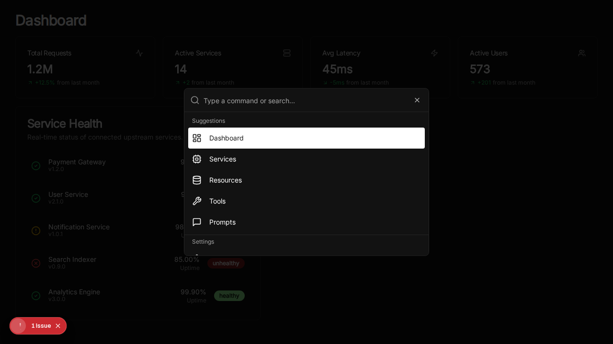

# Command Palette

**Date:** 2025-02-18
**Author:** Jules (Lead Engineer)

## Overview

We have implemented a global "Command Palette" feature to enhance navigation and provide a "Premium Enterprise" feel to the MCP Any Manager UI. This feature allows users to quickly jump between different sections of the application using the keyboard shortcut `Cmd+K` (or `Ctrl+K`).

## Features

- **Global Access:** Available from any page in the application.
- **Keyboard Shortcut:** Triggered by `Cmd+K` (Mac) or `Ctrl+K` (Windows/Linux).
- **Navigation:** Quick links to:
  - Dashboard
  - Services
  - Resources
  - Tools
  - Prompts
  - Settings
- **Design:** Uses the `cmdk` library with `shadcn/ui` styling for a polished, accessible look.

## Screenshot

## Implementation Details

- **Component:** `ui/src/components/command-menu.tsx`
- **Dependencies:** `cmdk`, `lucide-react`, `shadcn/ui` components.
- **Integration:** Added to `ui/src/app/layout.tsx`.

## Testing

- **Unit Tests:** `ui/src/tests/command-menu.test.tsx` (Vitest) verified rendering and interaction logic.
- **E2E Verification:** Manually verified using a Playwright script `ui/verify_command.py`.
