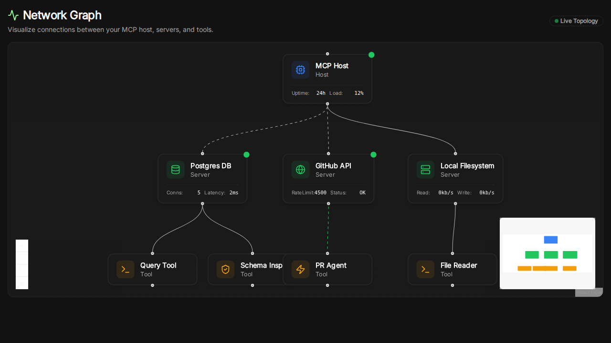

# Network Graph Feature

## Overview
The Network Graph is a new visualization tool that provides a real-time, node-link view of the MCP ecosystem. It allows users to see the relationships between the MCP Host, connected Servers, and their respective Tools.

## Key Features
- **Live Topology:** visualized using `@xyflow/react`.
- **Custom Nodes:** Rich nodes showing status, type, and real-time metrics (mocked).
- **Interactive Details:** Clicking a node reveals a slide-over panel with detailed metadata.
- **Minimap & Controls:** Easy navigation for large topologies.

## Screenshot

## Implementation Details
- **Route:** `/network`
- **Component:** `NetworkGraphClient`
- **Tech Stack:** Next.js, Tailwind CSS, React Flow, Lucide React.
