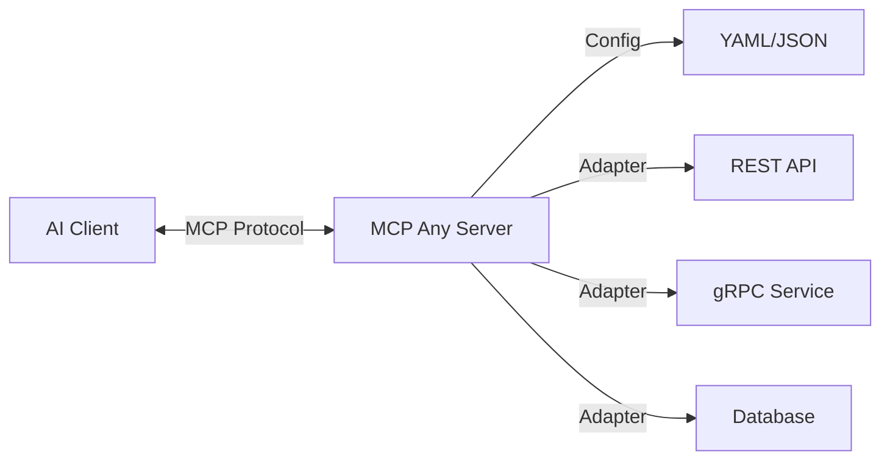

# MCP Any: Configuration-Driven MCP Server


[](https://opensource.org/licenses/Apache-2.0)
[](https://github.com/mcpany/core/actions/workflows/ci.yml)
[](https://pkg.go.dev/github.com/mcpany/core)
[](https://goreportcard.com/report/github.com/mcpany/core)

## 1. Project Identity

**What is this?**
MCP Any is a **Universal Adapter** that turns *any* API (REST, gRPC, GraphQL, Database) into a [Model Context Protocol (MCP)](https://modelcontext.protocol.ai/) compliant server through simple configuration.

**Why does it exist?**
Traditional MCP adoption requires writing and maintaining a separate server binary for every tool or service ("binary fatigue"). MCP Any solves this with a **Single Binary** approach:
1.  **Install once:** Run a single `mcpany` server instance.
2.  **Configure everything:** Load lightweight YAML/JSON configurations to capability-enable different APIs.
3.  **Run anywhere:** No need for language-specific runtimes for each tool.

It prioritizes **Configuration over Code**, allowing you to expose existing APIs to AI assistants without writing new software.

## 2. Quick Start

Follow these steps to get the server running locally in under 5 minutes.

### Prerequisites
- **Go**: Version 1.23 or higher.
- **Docker**: Optional, for running containerized workloads.

### Installation & Run

```bash
# 1. Clone the repository
git clone https://github.com/mcpany/core.git
cd core

# 2. Install dependencies and prepare the environment
make prepare

# 3. Build the server binary
make build

# 4. Run the server with a sample configuration (Weather Service)
./build/bin/server run --config-path server/examples/popular_services/wttr.in/config.yaml
```

The server is now listening on `http://localhost:50050`. You can connect your MCP client (e.g., Claude Desktop, Gemini CLI) to this endpoint.

## 3. Developer Workflow

We adhere to a strict development protocol to ensure quality and stability.

### Running Tests
Execute the full test suite (Unit, Integration, and E2E):
```bash
make test
```

### Linting & Style Checks
Ensure code quality and documentation standards:
```bash
make lint
```
*Note: This project enforces 100% documentation coverage on public interfaces.*

### Building
Compile the project artifacts:
```bash
make build
```
The binary will be output to `build/bin/server`.

## 4. Architecture

MCP Any is designed as a modular, config-driven system.

### High-Level Design

1.  **Configuration Loader:** Reads YAML/JSON files defining *Services* (upstream APIs) and *Profiles* (security rules). Supports dynamic reloading.
2.  **Service Adapters:** A plugin-based layer that translates MCP Tool calls into upstream protocol requests:
    -   **HTTP/OpenAPI:** Converts calls to REST requests.
    -   **gRPC:** Converts calls to gRPC messages (via reflection or proto definitions).
    -   **GraphQL:** Executes GraphQL queries.
    -   **Database:** Executes SQL queries safely.
3.  **MCP Protocol Layer:** Handles the JSON-RPC communication with MCP clients (AI agents).
4.  **Security & Policy Engine:** Enforces authentication, rate limiting, and access control (e.g., preventing `DELETE` operations) before requests reach the upstream.
5.  **Observability:** Built-in tracing, metrics, and audit logging to monitor AI-tool interactions.

### Component Diagram



## Documentation & Resources

- **[Developer Guide](server/docs/developer_guide.md):** Detailed contribution instructions.
- **[Configuration Reference](server/docs/reference/configuration.md):** Full list of config options.
- **[Examples](server/docs/examples.md):** Sample configurations for popular services.
- **[Roadmap](server/roadmap.md):** Future plans.

## License

Apache 2.0 - See [LICENSE](LICENSE) for details.
