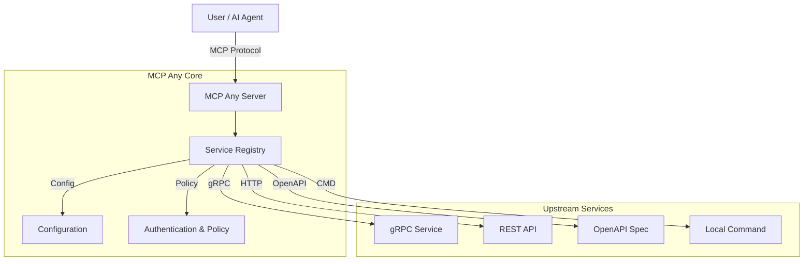

# MCP Any: Configuration-Driven MCP Server

**One server, Infinite possibilities.**

## 1. Elevator Pitch

MCP Any revolutionizes how you interact with the Model Context Protocol (MCP). It is a powerful **Universal Adapter** that turns *any* API (REST, gRPC, GraphQL, Command-line) into an MCP-compliant server through simple configuration.

Traditional MCP adoption requires running a separate server binary for every tool or service ("binary fatigue"). **MCP Any** solves this with a Single Binary approach:
*   **Install once**: Run a single `mcpany` server instance.
*   **Configure everything**: Load lightweight YAML/JSON configurations.
*   **Run anywhere**: No need for language-specific runtimes for each tool.

**Philosophy: Configuration over Code.** Don't write new code just to expose an existing API to your AI assistant.

## 2. Architecture

MCP Any acts as a centralized gateway between AI agents (via MCP Protocol) and your upstream services.

**High-Level Architecture:**



**Key Components:**
*   **Config-Driven Adapter**: Maps existing API endpoints to MCP tools via config.
*   **Dynamic Reloading**: Hot-swap registry without restarting.
*   **Safety & Policy**: Control tool exposure, rate limiting, and audit logging.
*   **Observability**: Real-time metrics and network topology visualization.

## 3. Getting Started

Follow these steps to get a "Hello World" weather service running in 5 minutes.

### Prerequisites
*   **Go** (1.23+)
*   **Docker** (optional, for containerized run)
*   **Gemini CLI** (or any MCP client like Claude Desktop)

### Step 1: Clone the Repository
```bash
git clone https://github.com/mcpany/core.git
cd core
```

### Step 2: Build the Server
```bash
make prepare
make build
```

### Step 3: Run with Example Configuration
We will use the pre-built `wttr.in` configuration.

```bash
./build/bin/server run --config-path server/examples/popular_services/wttr.in/config.yaml
```

*Alternative: Run with Docker*
```bash
docker run -d --rm --p 50050:50050 \
  ghcr.io/mcpany/server:dev-latest \
  run --config-path https://raw.githubusercontent.com/mcpany/core/main/server/examples/popular_services/wttr.in/config.yaml
```

### Step 4: Connect Your Client
Connect the Gemini CLI to your local server:
```bash
gemini mcp add --transport http --trust mcpany http://localhost:50050
```

### Step 5: Hello World
Ask the AI about the weather:
```bash
gemini -m gemini-2.5-flash -p "What is the weather in London?"
```

## 4. Development

We welcome contributions! Adhere to the following standards to ensure quality.

### Code Standards
*   **Go**: All exported symbols must have GoDoc comments. Run `go run server/tools/check_doc.go server/` to verify.
*   **TypeScript**: All exported symbols must have JSDoc comments. Run `python3 server/tools/check_ts_doc.py` to verify.
*   **Zero "Empty Calorie" Comments**: Avoid comments that strictly repeat the function name.

### Commands
*   **Test**: Run all unit and integration tests.
    ```bash
    make test
    ```
*   **Lint**: Ensure code quality and formatting.
    ```bash
    make lint
    ```
*   **Build**: Compile the server binary.
    ```bash
    make build
    ```
*   **Generate**: Regenerate Protobuf and mock files.
    ```bash
    make gen
    ```

## 5. Configuration

MCP Any is highly configurable via Environment Variables and YAML/JSON config files.

### Environment Variables
*   `MCPANY_ENABLE_FILE_CONFIG`: Set to `true` to enable file-based configuration loading.
*   `MCPANY_ALLOW_LOOPBACK_RESOURCES`: Set to `true` to allow connections to localhost (dev only).
*   `MCPANY_ALLOW_PRIVATE_NETWORK_RESOURCES`: Set to `true` to allow connections to private IPs.
*   `MCPANY_LOG_LEVEL`: Set logging level (DEBUG, INFO, WARN, ERROR).

### Secrets Management
Secrets (API keys, tokens) should not be hardcoded in config files. Use environment variable substitution (`${ENV_VAR}`) in your YAML configuration.

For a full reference of configuration options, see [server/docs/reference/configuration.md](server/docs/reference/configuration.md).

---
*License: Apache 2.0*
