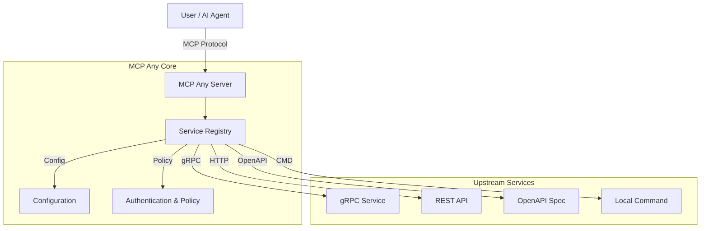

# MCP Any: The Universal MCP Adapter

**One server, Infinite possibilities.**

## 1. Project Identity (The "Elevator Pitch")

**What:** The Universal Adapter that instantly turns *any* API (REST, gRPC, GraphQL, CLI) into an MCP-compliant tool.

**Why:** To solve "Binary Fatigue." Instead of managing dozens of individual MCP servers, you run **one** `mcpany` instance. It acts as a configuration-driven gateway, unifying your entire infrastructure into a single, secure, and observable MCP endpoint for AI agents.

**Philosophy:** Code describes *How*. Configuration describes *What*. Don't write boilerplate to expose your APIs—just configure them.

## 2. Quick Start

Get up and running in seconds.

### Prerequisites
*   [Go 1.23+](https://go.dev/doc/install)
*   `make`

### Installation & Run

```bash
# 1. Clone
git clone https://github.com/mcpany/core.git
cd core

# 2. Build (installs dependencies automatically)
make build

# 3. Run with a demo configuration (Weather API)
./build/bin/server run --config-path server/examples/popular_services/wttr.in/config.yaml
```

**Verify it works:**
```bash
curl http://localhost:50050/health
# Output: {"status":"ok",...}
```

## 3. Developer Workflow

We maintain a **Gold Standard** for code quality and documentation.

*   **Test:** `make test` - Runs unit, integration, and end-to-end tests.
*   **Lint:** `make lint` - Enforces style guides and **100% documentation coverage**.
    *   **Go:** Every public symbol must have a [GoDoc](https://go.dev/blog/godoc) comment.
    *   **TypeScript:** Every exported function/component must have a [JSDoc/TSDoc](https://tsdoc.org/) comment.
*   **Build:** `make build` - Compiles the server binary and UI assets.
*   **Generate:** `make gen` - Re-generates Protocol Buffers and boilerplate code.

## 4. Architecture

MCP Any acts as a centralized middleware between AI Agents (Clients) and your Upstream Services. It is built with **Go** for high performance and concurrency, and uses a modular architecture to support various upstream protocols.

**High-Level Overview:**
1.  **Core Server**: A Go-based runtime that speaks the MCP protocol.
2.  **Service Registry**: Dynamically loads tool definitions from configuration files (local or remote).
3.  **Adapters**: Specialized modules that translate MCP requests into upstream calls (gRPC, HTTP, OpenAPI, CLI).
4.  **Policy Engine**: Enforces authentication, rate limiting, and security policies to keep your infrastructure safe.



### Key Design Patterns
*   **Adapter Pattern**: Decouples the MCP protocol from upstream API specifics.
*   **Configuration as Code**: All services are defined in declarative YAML/JSON.
*   **Sidecar/Gateway**: Can be deployed as a standalone gateway or a sidecar in Kubernetes.

## 5. Configuration

MCP Any is configured via environment variables and YAML/JSON configuration files for services.

### Environment Variables

| Variable | Description | Default |
|----------|-------------|---------|
| `MCPANY_MCP_LISTEN_ADDRESS` | MCP server's bind address (host:port) | `50050` |
| `MCPANY_CONFIG_PATH` | Paths to config files or directories (comma-separated) | `[]` |
| `MCPANY_METRICS_LISTEN_ADDRESS` | Address to expose Prometheus metrics | Disabled |
| `MCPANY_DEBUG` | Enable debug logging | `false` |
| `MCPANY_LOG_LEVEL` | Set the log level (debug, info, warn, error) | `info` |
| `MCPANY_LOG_FORMAT` | Set the log format (text, json) | `text` |
| `MCPANY_GRPC_PORT` | Port for the gRPC registration server | Disabled |
| `MCPANY_STDIO` | Enable stdio mode for JSON-RPC communication | `false` |
| `MCPANY_API_KEY` | API key for securing the MCP server | Empty (No Auth) |

### Required Secrets
Sensitive information (like upstream API keys) should **never** be hardcoded in configuration files. Instead, use environment variables referencing them.

Example Config:
```yaml
upstreamAuth:
  apiKey:
    value: "${OPENAI_API_KEY}" # References env var
```

Ensure `OPENAI_API_KEY` is set in the server's environment.

## License
This project is licensed under the terms of the [Apache 2.0 License](LICENSE).
