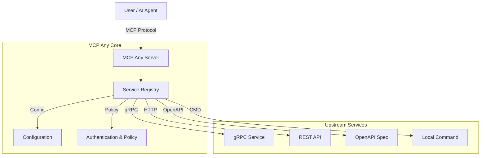

[](https://opensource.org/licenses/Apache-2.0)
[](https://github.com/mcpany/core/actions/workflows/ci.yml)
[](https://pkg.go.dev/github.com/mcpany/core)
[](https://goreportcard.com/report/github.com/mcpany/core)
[](https://codecov.io/gh/mcpany/core)

<p align="center">
  
</p>

# MCP Any: The Universal MCP Adapter

**One server, Infinite possibilities.**

## 1. Elevator Pitch

**MCP Any** is a configuration-driven **Universal Adapter** that turns *any* API (REST, gRPC, GraphQL, Command-line) into a Model Context Protocol (MCP) compliant server.

**Why does it exist?**
Traditional MCP adoption suffers from "binary fatigue"—requiring a separate server binary for every tool. MCP Any solves this by allowing you to run a single binary that acts as a gateway to multiple services, defined purely through lightweight configuration files.

**The Solution:**
Don't write code to expose your APIs to AI agents. Just configure them. MCP Any unifies your backend services into a single, secure, and observable MCP endpoint.

## 2. Architecture

MCP Any acts as a centralized middleware between AI Agents (Clients) and your Upstream Services.

**High-Level Summary:**
1.  **Core Server**: A Go-based runtime that speaks the MCP protocol.
2.  **Service Registry**: Dynamically loads tool definitions from configuration.
3.  **Adapters**: Specialized modules that translate MCP requests into upstream calls (gRPC, HTTP, OpenAPI, etc.).
4.  **Policy Engine**: Enforces authentication, rate limiting, and security policies.



### Key Features
*   **Dynamic Config Reloading**: Hot-swap registry without restarts.
*   **Broad Protocol Support**: gRPC, OpenAPI, HTTP, GraphQL, SQL, WebSocket, WebRTC.
*   **Safety Policies**: Block dangerous operations (e.g., DELETE) and limit access.
*   **Network Topology**: Visual graph of clients, services, and tools.
*   **Observability**: Real-time metrics and audit logging.
*   **Security**: Upstream authentication (API Keys, OAuth, mTLS) and multi-user profiles.

## 3. Getting Started

Follow these steps to get up and running immediately.

### Prerequisites
*   [Go 1.23+](https://go.dev/doc/install)
*   [Docker](https://docs.docker.com/get-docker/) (optional, for containerized run)

### Build from Source

```bash
# 1. Clone the repository
git clone https://github.com/mcpany/core.git
cd core

# 2. Install dependencies and build
make prepare
make build

# 3. Run the server (using the example weather config)
./build/bin/server run --config-path server/examples/popular_services/wttr.in/config.yaml
```

### Docker (Alternative)

```bash
docker run -d --rm --name mcpany-server \
  -p 50050:50050 \
  ghcr.io/mcpany/server:dev-latest \
  run --config-path https://raw.githubusercontent.com/mcpany/core/main/server/examples/popular_services/wttr.in/config.yaml
```

**Connect your Client:**
Once running, connect your MCP client (like Gemini CLI or Claude Desktop) to `http://localhost:50050`.

```bash
gemini mcp add --transport http --trust mcpany http://localhost:50050
```

## 4. Development

Use these commands to maintain code quality and build the project.

**Run Tests**
Execute all unit, integration, and end-to-end tests.
```bash
make test
```

**Lint Code**
Ensure code quality and style compliance (Go & TypeScript).
```bash
make lint
```

**Build Artifacts**
Compile the server binary and frontend assets.
```bash
make build
```

**Generate Code**
Regenerate Protocol Buffers and other auto-generated files.
```bash
make gen
```

## 5. Configuration

MCP Any uses a combination of configuration files and environment variables.

### Environment Variables

| Variable | Description | Default |
| :--- | :--- | :--- |
| `MCPANY_MCP_LISTEN_ADDRESS` | Address to listen on for MCP connections. | `0.0.0.0:50051` |
| `MCPANY_DEFAULT_HTTP_ADDR` | Address to listen on for HTTP connections. | `0.0.0.0:50050` |
| `MCPANY_LOG_LEVEL` | Logging level (`debug`, `info`, `warn`, `error`). | `info` |
| `MCPANY_ENABLE_FILE_CONFIG` | Enable loading configuration from YAML/JSON files. | `false` |
| `MCPANY_TRUST_PROXY` | Trust `X-Forwarded-*` headers (useful behind LBs). | `false` |
| `MCPANY_ADMIN_INIT_USERNAME` | Initial username for the admin user. | - |
| `MCPANY_ADMIN_INIT_PASSWORD` | Initial password for the admin user. | - |
| `MCPANY_DANGEROUS_ALLOW_LOCAL_IPS` | Allow tools to connect to local IP addresses. | `false` |
| `MCPANY_ALLOW_LOOPBACK_RESOURCES` | Allow resources from loopback addresses. | `false` |
| `MCPANY_ALLOW_PRIVATE_NETWORK_RESOURCES` | Allow resources from private networks. | `false` |
| `MCPANY_ALLOW_UNSAFE_CONFIG` | Allow usage of potentially unsafe configuration options. | `false` |

### Required Secrets

For production deployments, ensure the following secrets are set:

*   **`MCPANY_ADMIN_INIT_PASSWORD`**: Sets the initial password for the admin user.
*   **`MCPANY_API_KEY`** (Recommended): Sets a global API key to secure the server endpoint.

### Documentation

For more comprehensive documentation, including detailed architecture and contribution guidelines, please refer to the [Developer Guide](server/docs/developer_guide.md).

---

## 🔧 Troubleshooting

### Common Issues

- **Protobuf Generation Errors**: If you encounter errors related to `protoc` or missing plugins, try running `make prepare` again to ensure all tools are correctly installed in `build/env/bin`.
- **Docker Permission Denied**: If you cannot run Docker commands, ensure your user is in the `docker` group or try running with `sudo`.
- **Port Conflicts**: Ensure ports `50050` (HTTP), `50051` (gRPC), and `9002` (UI) are free before starting the server.

## Contributing

Contributions are welcome! Please feel free to open an issue or submit a pull request.

## Roadmap

Check out our Roadmap to see what we're working on and what's coming next:
- [Server Roadmap](server/roadmap.md)
- [UI Roadmap](ui/roadmap.md)

## License

This project is licensed under the terms of the [LICENSE](LICENSE) file.
