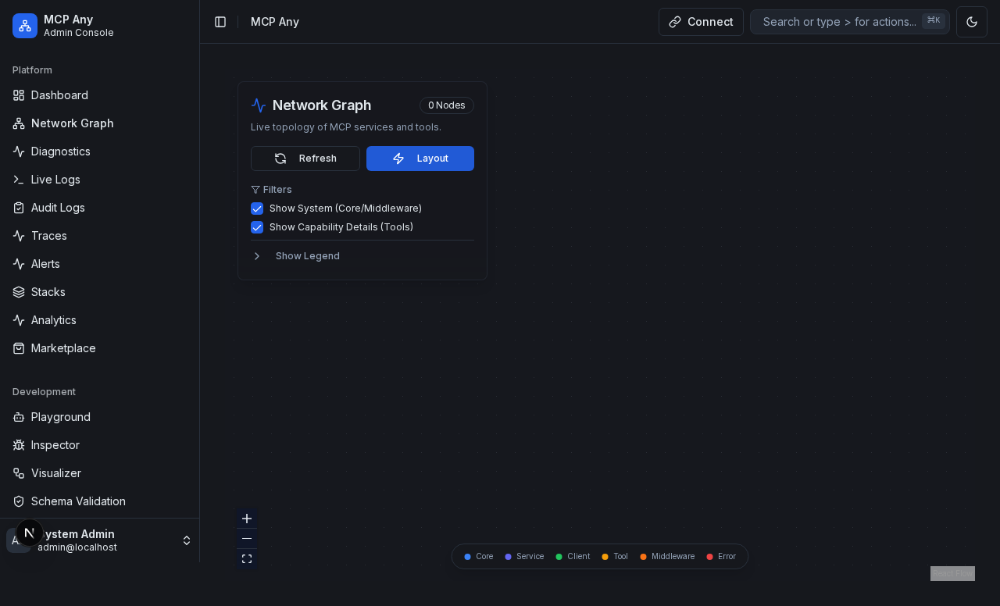
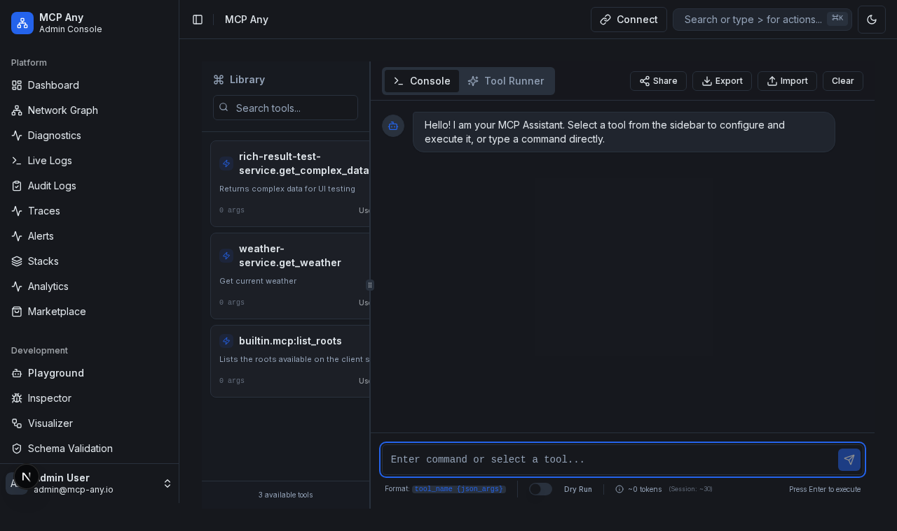

[](https://opensource.org/licenses/Apache-2.0)
[](https://github.com/mcpany/core/actions/workflows/ci.yml)
[](https://pkg.go.dev/github.com/mcpany/core)
[](https://goreportcard.com/report/github.com/mcpany/core)
[](https://codecov.io/gh/mcpany/core)

<p align="center">
  
</p>

# MCP Any: Configuration-Driven MCP Server

**One server, Infinite possibilities.**

MCP Any revolutionizes how you interact with the Model Context Protocol (MCP). It is not just another MCP proxy or aggregator—it is a powerful **Universal Adapter** that turns _any_ API into an MCP-compliant server through simple configuration.

Traditional MCP adoption requires running a separate server binary for every tool or service you want to expose. This leads to "binary fatigue," complex local setups, and maintenance nightmares.

**MCP Any solves this with a Single Binary approach:**

1.  **Install once**: Run a single `mcpany` server instance.
2.  **Configure everything**: Load lightweight YAML/JSON configurations to capability-enable different APIs (REST, gRPC, GraphQL, Command-line).
3.  **Run anywhere**: No need for `npx`, `python`, or language-specific runtimes for each tool.

## ❓ Philosophy: Configuration over Code

We believe you shouldn't have to write and maintain new code just to expose an existing API to your AI assistant.

- **Metamcp / Onemcp vs. MCP Any**: While other tools might proxy existing MCP servers (aggregator pattern), **MCP Any** creates them from scratch using your existing upstream APIs.
- **No More "Sidecar hell"**: Instead of running 10 different containers for 10 different tools, run 1 `mcpany` container loaded with 10 config files.
- **Ops Friendly**: Centralize authentication, rate limiting, and observability in one robust layer.

### Comparison with Traditional MCP Servers

Unlike traditional "Wrapper" MCP servers (like `mcp-server-postgres`, `mcp-server-github`, etc.) which are compiled binaries dedicated to a single service, **MCP Any** is a generic runtime.

| Feature           | Traditional MCP Server (e.g., `mcp-server-postgres`)                    | MCP Any                                                                         |
| :---------------- | :---------------------------------------------------------------------- | :------------------------------------------------------------------------------ |
| **Architecture**  | **Code-Driven Wrapper**: Wraps internal API calls with MCP annotations. | **Config-Driven Adapter**: Maps existing API endpoints to MCP tools via config. |
| **Deployment**    | **1 Binary per Service**: Need 10 different binaries for 10 services.   | **1 Binary for All**: One `mcpany` binary handles N services.                   |
| **Updates**       | **Recompile & Redistribute**: Internal API change = New Binary release. | **Update Config**: API change = Edit YAML/JSON file & reload.                   |
| **Maintenance**   | **High**: Manage dependencies/versions for N projects.                  | **Low**: Upgrade one core server; just swap config files.                       |
| **Extensibility** | Write code (TypeScript/Python/Go).                                      | Write JSON/YAML.                                                                |

Most "popular" MCP servers today are bespoke binaries. If the upstream API changes, you must wait for the maintainer to update the code, release a new version, and then you must redeploy. With **MCP Any**, you simply update your configuration file to match the new API signature—zero downtime, zero recompilation.

## ✨ Key Features

- **Dynamic Config Reloading**: Automatically detects changes to configuration files (including atomic saves) and hot-swaps the registry without restarting the server.
- **Dynamic Tool Registration & Auto-Discovery**: Automatically discover and register tools from various backend services. For gRPC and OpenAPI, simply provide the server URL or spec URL—MCP Any handles the rest (no manual tool definition required).
- **Multiple Service Types**: Supports a wide range of service types, including:
  - **gRPC**: Register services from `.proto` files or by using gRPC reflection.
  - **OpenAPI**: Ingest OpenAPI (Swagger) specifications to expose RESTful APIs as tools.
  - **HTTP**: Expose any HTTP endpoint as a tool.
  - **GraphQL**: Expose a GraphQL API as a set of tools, with the ability to customize the selection set for each query.
  - **SQL**: Connect to SQL databases (Postgres, SQLite, MySQL) and expose safe queries as tools.
  - **WebSocket**: Connect to WebSocket servers.
  - **WebRTC**: Connect to WebRTC services.
- **Advanced Service & Safety Policies**:
  - **Safety**: Control which tools are exposed to the AI to limit context (reduce hallucinations) and prevent dangerous actions (e.g., blocking `DELETE` operations).
  - **Performance**: Configure [Caching](server/docs/caching.md) and Rate Limiting to optimize performance and protect upstream services.
  - **Semantic Caching**: Intelligent caching using vector embeddings to serve similar requests from cache. Now supports **SQLite persistence** to survive restarts.
  - **Audit Logging**: Keep a tamper-evident record of all tool executions in a JSON file or **SQLite database** (using SHA-256 hash chaining) for compliance and security auditing.
- **Network Topology Visualization**: Visualizes your entire MCP ecosystem (Clients, Core, Services, Tools, API Calls) in a 5-level hierarchical interactive graph with real-time QPS and Latency metrics.
  
- **MCP Any Proxy**: Proxy and re-expose tools from another MCP Any instance.
- **MCP Sampling Support**: Enables upstream tools to request sampling (LLM generation) from the connected client, fully supported via `mcp.Client` options.
- **Upstream Authentication**: Securely connect to your backend services using:
  - **API Keys**
  - **Bearer Tokens**
  - **Basic Auth**
  - **mTLS**
- **Unified API**: Interact with all registered tools through a single, consistent API based on the [Model Context Protocol](https://modelcontext.protocol.ai/).
- **Multi-User & Multi-Profile**: Securely support multiple users with distinct profiles, each with its own set of enabled services and granular authentication.
- **Advanced Configuration**: Customize tool behavior with [Merge Strategies and Profile Filtering](server/docs/feature/merge_strategy.md).
- **Extensible**: Designed to be easily extended with new service types and capabilities.

## 🖥️ Management Dashboard

The **MCP Any UI** provides a powerful interface for managing your server, services, and configuration.

### Dashboard
Real-time metrics and system health at a glance.


### Services Management
Manage upstream services (HTTP, gRPC, MCP, CMD), toggle them on/off, and configure their settings.


### Interactive Playground
Test your registered tools directly from the browser with auto-generated forms.


### Configuration via UI
You can manage core configuration directly from the UI without editing YAML files:
- **General**: Configure server settings.
- **Auth**: Manage users and authentication profiles.
- **Secrets**: Securely manage API keys and credentials for upstream services.


## ⚡ Quick Start (5 Minutes)

Ready to give your AI access to real-time data? Let's connect a public Weather API to **Gemini CLI** (or any MCP client) using MCP Any.

### 1. Prerequisites

- **Go**: Ensure you have [Go](https://go.dev/doc/install) installed (1.23+ recommended).
- **Gemini CLI**: If not installed, see the [installation guide](https://docs.cloud.google.com/gemini/docs/codeassist/gemini-cli).

_(Prefer building from source? See [Getting Started](server/docs/developer_guide.md) for build instructions.)_

### 2. Configuration

We will use the pre-built `wttr.in` configuration available in the examples directory: `server/examples/popular_services/wttr.in/config.yaml`.

### Quick Start: Weather Service

1.  **Run the Server:**

    Choose one of the following methods to run the server.

    **Option 1: Remote Configuration (Recommended)**

    Fastest way to get started. No need to clone the repository.

    ```bash
    docker run -d --rm --name mcpany-server \
      -p 50050:50050 \
      ghcr.io/mcpany/server:dev-latest \
      run --config-path https://raw.githubusercontent.com/mcpany/core/main/server/examples/popular_services/wttr.in/config.yaml
    ```

    **Option 2: Local Configuration**

    Best if you want to modify the configuration or use your own. Requires cloning the repository.

    ```bash
    # Clone the repository
    git clone https://github.com/mcpany/core.git
    cd core

    # Run with local config mounted
    docker run -d --rm --name mcpany-server \
      -p 50050:50050 \
      -v $(pwd)/server/examples/popular_services/wttr.in/config.yaml:/config.yaml \
      ghcr.io/mcpany/server:dev-latest \
      run --config-path /config.yaml
    ```

    > **Tip:** Need detailed logs? Add the `--debug` flag to the end of the `run` command.

2.  **Connect Gemini CLI:**

    ```bash
    gemini mcp add --transport http --trust mcpany http://localhost:50050
    ```

3.  **Chat!**

    Ask your AI about the weather:

    ```bash
    gemini -m gemini-2.5-flash -p "What is the weather in London?"
    ```

    The AI will:

    1.  **Call** the tool (e.g., `wttrin_<hash>.get_weather`).
    2.  `mcpany` will **proxy** the request to `https://wttr.in`.
    3.  The AI receives the JSON response and answers your question!

Ask about the moon phase:

```bash
gemini -m gemini-2.5-flash -p "What is the moon phase?"
```

The AI will:

1.  **Call** the `get_moon_phase` tool.
2.  `mcpany` will **proxy** the request to `https://wttr.in/moon`.
3.  The AI receives the ASCII art response and describes it!

For more complex examples, including gRPC, OpenAPI, and authentication, check out [server/docs/reference/configuration.md](server/docs/reference/configuration.md).

## 💡 More Usage

Once the server is running, you can interact with it using its JSON-RPC API.

- For detailed configuration options, see **[Configuration Reference](server/docs/reference/configuration.md)**.
- For instructions on how to connect `mcpany` with your favorite AI coding assistant (Claude Desktop, Cursor, VS Code, JetBrains, Cline), see the **[Integration Guide](server/docs/integrations.md)**.
- For hands-on examples, see the **[Examples](server/docs/examples.md)** and the **[Profile Authentication Example](server/examples/profile_example/README.md)**.
- For monitoring metrics, see **[Monitoring](server/docs/monitoring.md)**.

## 🛠️ Development Guide

We welcome contributions to MCP Any! This section provides a brief overview of how to set up your development environment. For more detailed information, including code structure, service registration, and debugging tips, please refer to the [**Developer Guide**](server/docs/developer_guide.md).

### Prerequisites

- **Go**: Version 1.23+
- **Docker**: For running tests and building images.
- **Make**: For running build automation scripts.

### Quick Setup

1.  **Clone the repository:**
    ```bash
    git clone https://github.com/mcpany/core.git
    cd core
    ```

2.  **Install dependencies and tools:**
    Run the following command to set up your environment (installs `protoc`, linters, etc.):
    ```bash
    make prepare
    ```

### Common Commands

- **Build**: `make build` (Binary will be at `build/bin/server`)
- **Test**: `make test` (Runs unit, integration, and E2E tests)
- **Lint**: `make lint` (Runs `golangci-lint` and other checks)
- **Generate**: `make gen` (Regenerates code from Protocol Buffers)
- **Clean**: `make clean` (Removes build artifacts)

### Running Locally

After building, you can run the server locally:

```bash
./build/bin/server run --config-path server/examples/popular_services/wttr.in/config.yaml
```

### Project Structure

The project is organized as follows:

- **`server/cmd/`**: Application entry points.
  - `server/`: The main MCP Any server binary.
- **`server/pkg/`**: Core library code.
  - **`app/`**: Application lifecycle and wiring.
  - **`config/`**: Configuration loading and validation.
  - **`mcpserver/`**: Core MCP protocol implementation.
  - **`upstream/`**: Adapters for upstream services (gRPC, HTTP, OpenAPI, Filesystem, etc.).
- **`proto/`**: Protocol Buffer definitions for configuration and internal APIs.
- **`server/examples/`**: Example configuration files and demo services.
- **`server/docs/`**: Detailed documentation and guides.

### Code Standards

We strive for high code quality. Please ensure the following before submitting a PR:

- **Documentation**:
  - **Go**: All exported functions, methods, types, and constants must have complete docstrings (GoDoc style). This includes a description of the purpose, parameters, and return values.
  - **TypeScript/React**: All exported components, functions, interfaces, and types must have JSDoc comments explaining their usage, props/parameters, and return values.
  - We enforce strict documentation coverage. You can verify Go documentation coverage with:
    ```bash
    go run server/tools/check_doc.go server/
    ```
- **Testing**: Add unit tests for new functionality. Run all tests with:
  ```bash
  make test
  ```
- **Linting**: Ensure the code is linted and formatted correctly:
  ```bash
  make lint
  ```

## 🤝 Contributing

Contributions are welcome! Please feel free to open an issue or submit a pull request.

## 🗺️ Roadmap

Check out our Roadmap to see what we're working on and what's coming next:
- [Server Roadmap](server/roadmap.md)
- [UI Roadmap](ui/roadmap.md)

## 📄 License

This project is licensed under the terms of the [LICENSE](LICENSE) file.
