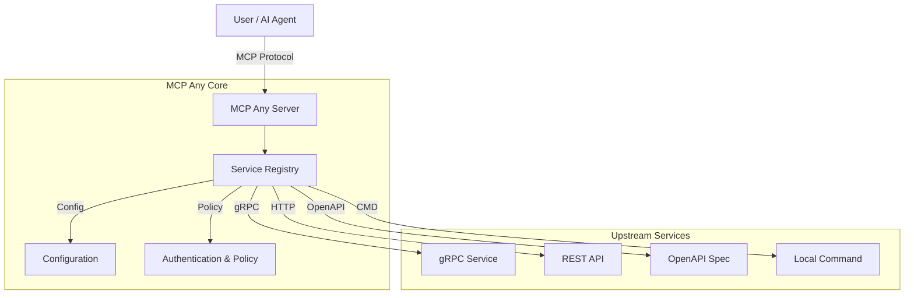

[](https://opensource.org/licenses/Apache-2.0)
[](https://github.com/mcpany/core/actions/workflows/ci.yml)
[](https://pkg.go.dev/github.com/mcpany/core)
[](https://goreportcard.com/report/github.com/mcpany/core)
[](https://codecov.io/gh/mcpany/core)

<p align="center">
  
</p>

# MCP Any: Configuration-Driven MCP Server

## 🚀 Elevator Pitch

**One server, Infinite possibilities.**

MCP Any is a **Universal Adapter** that turns _any_ API into a Model Context Protocol (MCP) compliant server through simple configuration.

Traditional MCP adoption requires running a separate server binary for every tool or service you want to expose (e.g., `mcp-server-postgres`, `mcp-server-github`). This leads to "binary fatigue," complex local setups, and maintenance nightmares.

**Why MCP Any exists:**
*   **Single Binary:** Run one `mcpany` instance instead of dozens of micro-servers.
*   **Configuration over Code:** Enable REST, gRPC, GraphQL, and CLI tools via lightweight YAML/JSON config. No new code required.
*   **Ops Friendly:** Centralized authentication, rate limiting, and observability.

## 🏗️ Architecture

MCP Any operates as a centralized gateway that adapts upstream services into the MCP protocol.

**Design Patterns:**
*   **Adapter Pattern:** Translates MCP protocol requests into upstream API calls (HTTP, gRPC, etc.).
*   **Configuration-Driven:** Behavior is defined by declarative configuration files.
*   **Pluggable Upstreams:** Easily extensible to support new protocols.

### High-Level Overview



| Feature | Traditional MCP Server | MCP Any |
| :--- | :--- | :--- |
| **Architecture** | Code-Driven Wrapper | Config-Driven Adapter |
| **Deployment** | 1 Binary per Service | 1 Binary for All |
| **Updates** | Recompile & Redistribute | Update Config & Reload |

## ⚡ Getting Started

Follow these steps to get a weather service running in 5 minutes.

### 1. Clone the Repository
```bash
git clone https://github.com/mcpany/core.git
cd core
```

### 2. Prepare the Environment
Ensure you have [Go](https://go.dev/doc/install) (1.23+) installed.
```bash
make prepare
```

### 3. Build the Server
```bash
make build
```
This produces the binary at `build/bin/server`.

### 4. Run "Hello World" (Weather Service)
We will use the example `wttr.in` configuration.

```bash
./build/bin/server run --config-path server/examples/popular_services/wttr.in/config.yaml
```

### 5. Verify
You can verify the server using the Gemini CLI or any MCP client.

```bash
# Connect Gemini CLI
gemini mcp add --transport http --trust mcpany http://localhost:50050

# Ask about the weather
gemini -m gemini-2.5-flash -p "What is the weather in London?"
```

## 🛠️ Development

We follow a strict development workflow to ensure quality.

### Running Tests
Run all unit, integration, and E2E tests:
```bash
make test
```

### Linting
Ensure code quality and style compliance:
```bash
make lint
```

### Building
Compile the project:
```bash
make build
```

### Documentation
Verify documentation coverage:
```bash
# For Go
go run server/tools/check_doc.go server/

# For TypeScript
python3 server/tools/check_ts_doc.py
```

## ⚙️ Configuration

MCP Any is configured via YAML/JSON files and Environment Variables.

### Environment Variables
Key environment variables for bootstrapping the server:

*   `MCPANY_LOG_LEVEL`: Set logging verbosity (e.g., `debug`, `info`, `warn`). Default: `info`.
*   `MCPANY_ENABLE_FILE_CONFIG`: Set to `true` to enable loading configuration from local files (read-only mode for file settings).
*   `MCPANY_PORT`: Port for the HTTP server. Default: `50050`.

### Secrets Management
Secrets (like API keys) should not be hardcoded in `config.yaml`. Use environment variable substitution:

```yaml
http_service:
  headers:
    Authorization: "Bearer ${MY_API_KEY}"
```

Then run the server with the secret exposed:
```bash
export MY_API_KEY="secret-value"
./build/bin/server run ...
```

For more detailed configuration options, see [server/docs/reference/configuration.md](server/docs/reference/configuration.md).

## ✨ Key Features

- **Dynamic Config Reloading**: Automatically detects changes to configuration files (including atomic saves) and hot-swaps the registry without restarting the server.
- **Dynamic Tool Registration & Auto-Discovery**: Automatically discover and register tools from various backend services. For gRPC and OpenAPI, simply provide the server URL or spec URL—MCP Any handles the rest (no manual tool definition required).
- **Multiple Service Types**: Supports a wide range of service types, including:
  - **gRPC**: Register services from `.proto` files or by using gRPC reflection.
  - **OpenAPI**: Ingest OpenAPI (Swagger) specifications to expose RESTful APIs as tools.
  - **HTTP**: Expose any HTTP endpoint as a tool.
  - **GraphQL**: Expose a GraphQL API as a set of tools, with the ability to customize the selection set for each query.
  - **SQL**: Connect to SQL databases (Postgres, SQLite, MySQL) and expose safe queries as tools.
  - **WebSocket**: Connect to WebSocket servers.
  - **WebRTC**: Connect to WebRTC services.
- **Advanced Service & Safety Policies**:
  - **Safety**: Control which tools are exposed to the AI to limit context (reduce hallucinations) and prevent dangerous actions (e.g., blocking `DELETE` operations).
  - **Performance**: Configure [Caching](server/docs/caching.md) and Rate Limiting to optimize performance and protect upstream services.
  - **Semantic Caching**: Intelligent caching using vector embeddings to serve similar requests from cache. Supports **SQLite persistence** to survive restarts.
  - **Audit Logging**: Keep a tamper-evident record of all tool executions in a JSON file or **SQLite database** (using SHA-256 hash chaining) for compliance and security auditing.
- **Network Topology Visualization**: Visualizes your entire MCP ecosystem (Clients, Core, Services, Tools, API Calls) in a 5-level hierarchical interactive graph with real-time QPS and Latency metrics.
  
- **MCP Any Proxy**: Proxy and re-expose tools from another MCP Any instance.
- **MCP Sampling Support**: Enables upstream tools to request sampling (LLM generation) from the connected client, fully supported via `mcp.Client` options.
- **Upstream Authentication**: Securely connect to your backend services using:
  - **API Keys**
  - **Bearer Tokens**
  - **Basic Auth**
  - **mTLS**
- **Unified API**: Interact with all registered tools through a single, consistent API based on the [Model Context Protocol](https://modelcontext.protocol.ai/).
- **Multi-User & Multi-Profile**: Securely support multiple users with distinct profiles, each with its own set of enabled services and granular authentication.
- **Advanced Configuration**: Customize tool behavior with [Merge Strategies and Profile Filtering](server/docs/feature/merge_strategy.md).
- **Extensible**: Designed to be easily extended with new service types and capabilities.

## 🖥️ Management Dashboard

The **MCP Any UI** provides a powerful interface for managing your server, services, and configuration.

### Dashboard
Real-time metrics and system health at a glance.


### Services Management
Manage upstream services (HTTP, gRPC, MCP, CMD), toggle them on/off, and configure their settings.


### Interactive Playground
Test your registered tools directly from the browser with auto-generated forms.


### Configuration via UI
You can manage core configuration directly from the UI without editing YAML files:
- **General**: Configure server settings.
- **Auth**: Manage users and authentication profiles.
- **Secrets**: Securely manage API keys and credentials for upstream services.


## 🔧 Troubleshooting

### Common Issues

- **Protobuf Generation Errors**: If you encounter errors related to `protoc` or missing plugins, try running `make prepare` again to ensure all tools are correctly installed in `build/env/bin`.
- **Docker Permission Denied**: If you cannot run Docker commands, ensure your user is in the `docker` group or try running with `sudo`.
- **Port Conflicts**: Ensure ports `50050` (HTTP), `50051` (gRPC), and `9002` (UI) are free before starting the server.

## 🤝 Contributing

Contributions are welcome! Please feel free to open an issue or submit a pull request.

## 🗺️ Roadmap

Check out our Roadmap to see what we're working on and what's coming next:
- [Server Roadmap](server/roadmap.md)
- [UI Roadmap](ui/roadmap.md)

## 📄 License

This project is licensed under the terms of the [LICENSE](LICENSE) file.
