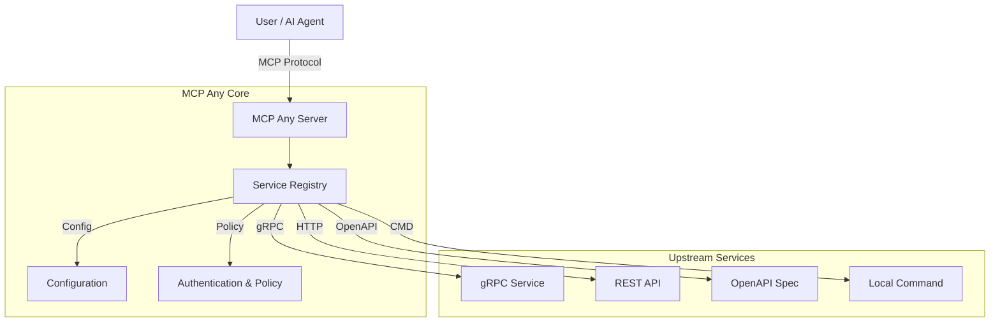

# MCP Any: The Universal MCP Adapter

**One server, Infinite possibilities.**

## 1. Elevator Pitch

**What is this project and why does it exist?**

**MCP Any** is the universal adapter that instantly transforms your existing APIs into Model Context Protocol (MCP) compliant tools. It serves as a configuration-driven gateway, bridging the gap between *any* API—whether REST, gRPC, GraphQL, or Command-line—and AI agents.

Traditional MCP adoption often suffers from "binary fatigue," requiring a separate server binary for every tool. **MCP Any** eliminates this burden by allowing you to run a single, unified binary that acts as a secure gateway to multiple services, all defined purely through lightweight configuration files.

**The Solution:** Stop writing code just to expose your APIs to AI. Configure them instead. MCP Any unifies your backend services into a single, secure, observable, and standard MCP endpoint.

## 2. Architecture

MCP Any acts as a centralized middleware between AI Agents (Clients) and your Upstream Services. Built with **Go** for high performance and concurrency, it employs a modular architecture to support diverse upstream protocols seamlessly.

**High-Level Overview:**
1.  **Core Server**: A robust Go-based runtime that speaks the MCP protocol fluently.
2.  **Service Registry**: Dynamically loads tool definitions from local or remote configuration files.
3.  **Adapters**: specialized modules that translate MCP requests into upstream calls (gRPC, HTTP, OpenAPI, CLI).
4.  **Policy Engine**: Enforces authentication, rate limiting, and security policies to protect your infrastructure.



### Key Design Patterns
*   **Adapter Pattern**: Decouples the MCP protocol from upstream API specifics, ensuring flexibility.
*   **Configuration as Code**: All services are defined in declarative YAML/JSON, enabling version control and reproducibility.
*   **Sidecar/Gateway**: Deploys flexibly as a standalone gateway or a Kubernetes sidecar.

## 3. Getting Started

Follow these steps to go from zero to a running server.

### Prerequisites
*   [Go 1.23+](https://go.dev/doc/install) (for building from source)
*   [Docker](https://docs.docker.com/get-docker/) (optional, for containerized execution)
*   `make` (for build automation)

### Installation

1.  **Clone the repository:**
    ```bash
    git clone https://github.com/mcpany/core.git
    cd core
    ```

2.  **Prepare dependencies:**
    ```bash
    make prepare
    ```

3.  **Build the server:**
    ```bash
    make build
    ```
    This generates the `server` binary in `build/bin/`.

4.  **Run with an example configuration:**
    ```bash
    ./build/bin/server run --config-path server/examples/popular_services/wttr.in/config.yaml
    ```

### Hello World
Verify the server is running and responsive:

```bash
# Check health
curl http://localhost:50050/health
```

Connect an AI client (like Claude Desktop or Gemini CLI):
```bash
gemini mcp add --transport http --trust mcpany http://localhost:50050
```

## 4. Development

We adhere to a strict development workflow to ensure code quality and stability.

### Setup
Ensure all dependencies and tools are installed before starting:
```bash
make prepare
```

### Testing
Run the comprehensive test suite to verify logic:
```bash
make test
```

### Linting
We enforce **100% documentation coverage** for the public API surface. Run the linter to verify compliance with style guides (Godoc, etc.):
```bash
make lint
```

### Building
Compile all artifacts, including the server binary and UI assets:
```bash
make build
```

### Code Generation
Regenerate Protocol Buffers and other auto-generated files if `.proto` definitions change:
```bash
make gen
```

## 5. Configuration

MCP Any is configured via environment variables and YAML/JSON configuration files for services.

### Environment Variables

| Variable | Description | Default |
|----------|-------------|---------|
| `MCPANY_MCP_LISTEN_ADDRESS` | MCP server's bind address (host:port) | `50050` |
| `MCPANY_CONFIG_PATH` | Paths to config files or directories (comma-separated) | `[]` |
| `MCPANY_METRICS_LISTEN_ADDRESS` | Address to expose Prometheus metrics | Disabled |
| `MCPANY_DEBUG` | Enable debug logging | `false` |
| `MCPANY_LOG_LEVEL` | Set the log level (debug, info, warn, error) | `info` |
| `MCPANY_LOG_FORMAT` | Set the log format (text, json) | `text` |
| `MCPANY_GRPC_PORT` | Port for the gRPC registration server | Disabled |
| `MCPANY_STDIO` | Enable stdio mode for JSON-RPC communication | `false` |
| `MCPANY_API_KEY` | API key for securing the MCP server | Empty (No Auth) |

### Required Secrets
**Security Warning:** Sensitive information (like upstream API keys) should **never** be hardcoded in configuration files. Use environment variable references instead.

**Example Config:**
```yaml
upstreamAuth:
  apiKey:
    value: "${OPENAI_API_KEY}" # References env var
```

Ensure `OPENAI_API_KEY` is set in the server's environment.

## License
This project is licensed under the terms of the [Apache 2.0 License](LICENSE).
