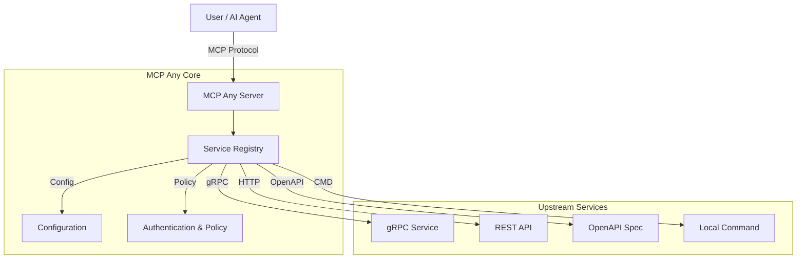

# MCP Any: The Universal MCP Adapter

**One server, Infinite possibilities.**

## 1. Elevator Pitch

**What is this project and why does it exist?**

**MCP Any** is a configuration-driven **Universal Adapter** that turns *any* API—whether REST, gRPC, GraphQL, or Command-line—into a Model Context Protocol (MCP) compliant server.

Traditional MCP adoption suffers from "binary fatigue": users must install and manage a separate server binary for every tool they wish to use. MCP Any solves this by providing a single, unified binary that acts as a gateway to multiple services, defined purely through lightweight configuration files.

**The Solution:** Don't write code to expose your APIs to AI agents. Just configure them. MCP Any unifies your backend services into a single, secure, and observable MCP endpoint.

## 2. Architecture

MCP Any acts as a centralized middleware between AI Agents (Clients) and your Upstream Services. It is built with **Go** for high performance and concurrency, and uses a modular architecture to support various upstream protocols.

**High-Level Overview:**

1.  **Core Server**: A Go-based runtime that speaks the MCP protocol, handling connection management and protocol negotiation.
2.  **Service Registry**: Dynamically loads tool definitions from configuration files (local filesystem or remote URLs).
3.  **Adapters**: Specialized modules that translate MCP requests into upstream calls (e.g., gRPC, HTTP, OpenAPI, CLI).
4.  **Policy Engine**: Enforces authentication, rate limiting, and security policies (SSRF protection, input validation) to safeguard your infrastructure.



### Key Design Patterns
*   **Adapter Pattern**: Decouples the MCP protocol from upstream API specifics.
*   **Configuration as Code**: All services are defined in declarative YAML/JSON files, enabling version control and reproducibility.
*   **Sidecar/Gateway**: Deployable as a standalone gateway or a Kubernetes sidecar.

## 3. Getting Started

Follow these steps to go from zero to a working MCP server.

### Prerequisites
*   [Go 1.23+](https://go.dev/doc/install) (Required for building from source)
*   [Docker](https://docs.docker.com/get-docker/) (Optional, for containerized execution)
*   `make` (Required for build automation)

### Installation

1.  **Clone the repository:**
    ```bash
    git clone https://github.com/mcpany/core.git
    cd core
    ```

2.  **Prepare dependencies:**
    Initialize the development environment and install tool dependencies.
    ```bash
    make prepare
    ```

3.  **Build the server:**
    Compile the server binary to `build/bin/server`.
    ```bash
    make build
    ```

4.  **Run with an example configuration:**
    Start the server using the "Weather Service" example configuration.
    ```bash
    ./build/bin/server run --config-path server/examples/popular_services/wttr.in/config.yaml
    ```

### Hello World
Once the server is running on port 50050, verify it is operational.

**Check Health:**
```bash
curl http://localhost:50050/health
```

**Connect an AI Client:**
To connect an MCP client (like Claude Desktop or Gemini CLI):
```bash
gemini mcp add --transport http --trust mcpany http://localhost:50050
```

## 4. Development

We follow a strict development workflow to ensure code quality and reliability.

### Testing
Run the comprehensive test suite, including unit, integration, and end-to-end tests.
```bash
make test
```
*Tip: Ensure Docker is running for integration tests.*

### Linting
Enforce code style and documentation standards. We use `golangci-lint` for Go and `eslint` for TypeScript.
```bash
make lint
```

### Building
Compile all artifacts, including the Server binary and UI assets.
```bash
make build
```

### Code Generation
Regenerate Protocol Buffers and other auto-generated files. Run this if you modify `.proto` definitions.
```bash
make gen
```

## 5. Configuration

MCP Any is configured via environment variables (for the runtime) and YAML/JSON files (for services).

### Environment Variables

| Variable | Description | Default |
|----------|-------------|---------|
| `MCPANY_MCP_LISTEN_ADDRESS` | TCP address for the MCP server to listen on (host:port) | `50050` |
| `MCPANY_CONFIG_PATH` | Comma-separated list of paths to config files or directories | `[]` |
| `MCPANY_METRICS_LISTEN_ADDRESS` | Address to expose Prometheus metrics (e.g., `:9090`) | Disabled |
| `MCPANY_DEBUG` | Enable verbose debug logging | `false` |
| `MCPANY_LOG_LEVEL` | Logging level (`debug`, `info`, `warn`, `error`) | `info` |
| `MCPANY_LOG_FORMAT` | Log output format (`text`, `json`) | `text` |
| `MCPANY_GRPC_PORT` | Port for the gRPC registration server (optional) | Disabled |
| `MCPANY_STDIO` | Enable stdio mode for JSON-RPC communication (useful for local agents) | `false` |
| `MCPANY_API_KEY` | API key for securing the MCP server. Clients must send `X-API-Key`. | Empty (No Auth) |

### Required Secrets
Sensitive information (like upstream API keys) must **never** be hardcoded in configuration files. Use environment variable references in your YAML config.

**Example Config (`config.yaml`):**
```yaml
upstreamAuth:
  apiKey:
    value: "${OPENAI_API_KEY}" # Resolves from environment variable
```

Ensure `OPENAI_API_KEY` is exported in the server's environment before starting.

## License
This project is licensed under the terms of the [Apache 2.0 License](LICENSE).
