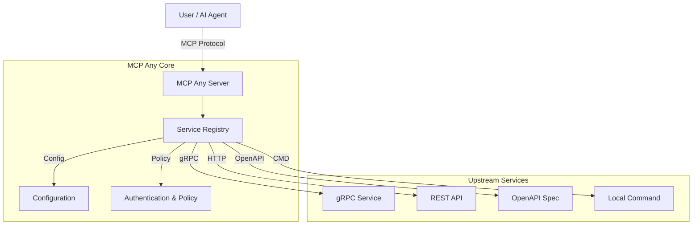

# MCP Any: The Universal MCP Adapter

**One server, Infinite possibilities.**

## 1. Elevator Pitch
**MCP Any** instantly transforms your existing APIs into Model Context Protocol (MCP) compliant tools.

It acts as a configuration-driven gateway, bridging the gap between your backend services (REST, gRPC, GraphQL, Command-line) and AI agents. Eliminate "binary fatigue" by running a single, high-performance binary that manages all your tool integrations through declarative configuration.

**Why?** Don't write bespoke code to expose your APIs to AI. Configure them once, run them everywhere.

## 2. Architecture
MCP Any functions as a centralized middleware layer. It intercepts MCP requests from AI clients, translates them into upstream API calls, and securely returns the results.

### High-Level Overview
1.  **Core Server (Go):** High-concurrency runtime handling the MCP protocol.
2.  **Service Registry:** Dynamically loads tool definitions from YAML/JSON configurations.
3.  **Adapters:** Protocol-specific modules for gRPC, HTTP, OpenAPI, and CLI execution.
4.  **Policy Engine:** Enforces authentication, rate limiting, and access control.



### Key Patterns
*   **Adapter Pattern:** Decouples MCP clients from upstream API implementation details.
*   **Configuration as Code:** All integrations are defined in version-controllable files.
*   **Gateway/Sidecar:** Deployable as a central gateway or a Kubernetes sidecar.

## 3. Getting Started

### Prerequisites
*   [Go 1.23+](https://go.dev/doc/install) (to build from source)
*   [Docker](https://docs.docker.com/get-docker/) (optional, for containerized execution)
*   `make` (for build automation)

### Installation

1.  **Clone the repository:**
    ```bash
    git clone https://github.com/mcpany/core.git
    cd core
    ```

2.  **Prepare dependencies:**
    ```bash
    make prepare
    ```

3.  **Build the server:**
    ```bash
    make build
    ```
    This generates the `server` binary in `build/bin/`.

4.  **Run with an example configuration:**
    ```bash
    ./build/bin/server run --config-path server/examples/popular_services/wttr.in/config.yaml
    ```

### Hello World
Verify the server is running:
```bash
# Check health status
curl http://localhost:50050/health
```

Connect an AI client (e.g., Gemini CLI):
```bash
gemini mcp add --transport http --trust mcpany http://localhost:50050
```

## 4. Development
We adhere to strict quality standards.

### Testing
Run the full test suite (Unit, Integration, E2E):
```bash
make test
```

### Linting
Enforce code style and documentation standards:
```bash
make lint
```

### Building
Compile artifacts (Server binary and UI assets):
```bash
make build
```

### Code Generation
Regenerate Protocol Buffers and boilerplate:
```bash
make gen
```

## 5. Configuration
MCP Any is configured via environment variables and YAML/JSON service definitions.

### Environment Variables

| Variable | Description | Default |
|----------|-------------|---------|
| `MCPANY_MCP_LISTEN_ADDRESS` | MCP server's bind address (host:port) | `50050` |
| `MCPANY_CONFIG_PATH` | Comma-separated paths to config files/directories | `[]` |
| `MCPANY_METRICS_LISTEN_ADDRESS` | Address to expose Prometheus metrics | Disabled |
| `MCPANY_DEBUG` | Enable debug logging | `false` |
| `MCPANY_LOG_LEVEL` | Log level (debug, info, warn, error) | `info` |
| `MCPANY_LOG_FORMAT` | Log format (text, json) | `text` |
| `MCPANY_GRPC_PORT` | Port for the gRPC registration server | Disabled |
| `MCPANY_STDIO` | Enable stdio mode for JSON-RPC communication | `false` |
| `MCPANY_API_KEY` | API key for securing the MCP server | Empty (No Auth) |
| `MCPANY_SHUTDOWN_TIMEOUT` | Graceful shutdown timeout duration | `5s` |
| `MCPANY_PROFILES` | Comma-separated list of active profiles | `default` |
| `MCPANY_DB_PATH` | Path to the SQLite database file | `data/mcpany.db` |

### Required Secrets
**Security Warning:** Never hardcode secrets in configuration files. Use environment variable references.

Example `config.yaml`:
```yaml
upstreamAuth:
  apiKey:
    value: "${OPENAI_API_KEY}" # References env var
```

Ensure `OPENAI_API_KEY` is set in the server's environment before starting.

## License
This project is licensed under the terms of the [Apache 2.0 License](LICENSE).
