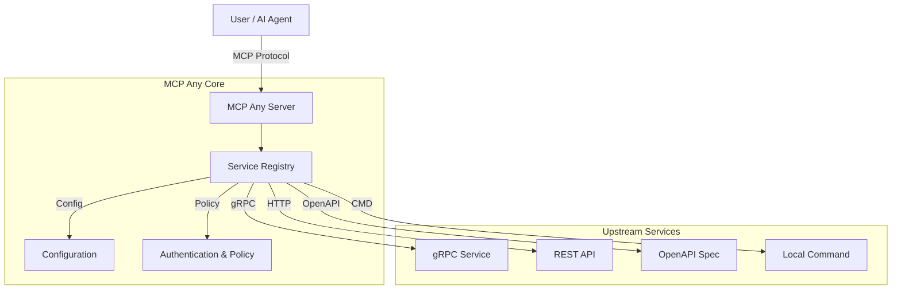

# MCP Any: The Universal MCP Adapter

**One server, Infinite possibilities.**

## 1. Project Identity

**What is this?**
MCP Any is a configuration-driven **Universal Adapter** that turns *any* API (REST, gRPC, GraphQL, Command-line) into a Model Context Protocol (MCP) compliant server.

**Why does it exist?**
Traditional MCP adoption suffers from "binary fatigue"—requiring a separate server binary for every tool. MCP Any solves this by allowing you to run a single binary that acts as a gateway to multiple services, defined purely through lightweight configuration files.

**The Solution:**
Don't write code to expose your APIs to AI agents. Just configure them. MCP Any unifies your backend services into a single, secure, and observable MCP endpoint.

## 2. Quick Start

Follow these steps to get up and running immediately.

### Prerequisites
*   [Go 1.23+](https://go.dev/doc/install) (for building from source)
*   [Docker](https://docs.docker.com/get-docker/) (optional, for containerized run)

### Build from Source

```bash
# 1. Clone the repository
git clone https://github.com/mcpany/core.git
cd core

# 2. Install dependencies and build
make prepare
make build

# 3. Run the server (using the example weather config)
./build/bin/server run --config-path server/examples/popular_services/wttr.in/config.yaml
```

### Run the UI (Dashboard)

The MCP Any Dashboard provides visualization and management capabilities.

```bash
# 1. Navigate to the UI directory
cd ui

# 2. Install dependencies
npm install

# 3. Start the development server
npm run dev
```
Open [http://localhost:9002](http://localhost:9002) to view the dashboard.

### Docker (Alternative)

```bash
docker run -d --rm --name mcpany-server \
  -p 50050:50050 \
  ghcr.io/mcpany/server:dev-latest \
  run --config-path https://raw.githubusercontent.com/mcpany/core/main/server/examples/popular_services/wttr.in/config.yaml
```

**Connect your Client:**
Once running, connect your MCP client (like Gemini CLI or Claude Desktop) to `http://localhost:50050`.

```bash
gemini mcp add --transport http --trust mcpany http://localhost:50050
```

## 3. Developer Workflow

Use these commands to maintain code quality and build the project.

**Run Tests**
Execute all unit, integration, and end-to-end tests.
```bash
make test
```

**Lint Code**
Ensure code quality and style compliance (Go & TypeScript).
```bash
make lint
```

**Build Artifacts**
Compile the server binary and frontend assets.
```bash
make build
```

**Generate Code**
Regenerate Protocol Buffers and other auto-generated files.
```bash
make gen
```

## 4. Architecture

MCP Any acts as a centralized middleware between AI Agents (Clients) and your Upstream Services.

**High-Level Summary:**
1.  **Core Server**: A Go-based runtime that speaks the MCP protocol.
2.  **Service Registry**: Dynamically loads tool definitions from configuration.
3.  **Adapters**: Specialized modules that translate MCP requests into upstream calls (gRPC, HTTP, OpenAPI, etc.).
4.  **Policy Engine**: Enforces authentication, rate limiting, and security policies.



### Key Features
*   **Dynamic Config Reloading**: Hot-swap registry without restarts.
*   **Broad Protocol Support**: gRPC, OpenAPI, HTTP, GraphQL, SQL, WebSocket, WebRTC.
*   **Safety Policies**: Block dangerous operations (e.g., DELETE) and limit access.
*   **Observability**: Real-time metrics and audit logging.

## Documentation
*   **[Developer Guide](server/docs/developer_guide.md)**: Detailed internal architecture and contribution guide.
*   **[Configuration Reference](server/docs/reference/configuration.md)**: Full syntax for defining services.

## License
This project is licensed under the terms of the [Apache 2.0 License](LICENSE).
