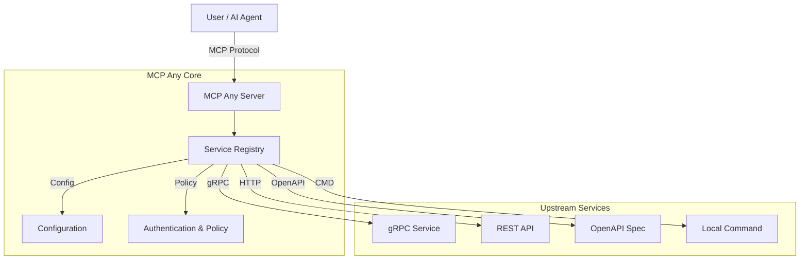

# MCP Any: The Universal MCP Adapter

**One server, Infinite possibilities.**

## 1. Elevator Pitch

**What is this?**
MCP Any is a configuration-driven **Universal Adapter** that turns *any* API (REST, gRPC, GraphQL, Command-line) into a Model Context Protocol (MCP) compliant server.

**Why does it exist?**
Traditional MCP adoption suffers from "binary fatigue"—requiring a separate server binary for every tool. MCP Any solves this by allowing you to run a single binary that acts as a gateway to multiple services, defined purely through lightweight configuration files.

**The Solution:**
Don't write code to expose your APIs to AI agents. Just configure them. MCP Any unifies your backend services into a single, secure, and observable MCP endpoint.

## 2. Architecture

MCP Any acts as a centralized middleware between AI Agents (Clients) and your Upstream Services.

**High-Level Overview:**
1.  **Core Server**: A Go-based runtime that speaks the MCP protocol.
2.  **Service Registry**: Dynamically loads tool definitions from configuration.
3.  **Adapters**: Specialized modules that translate MCP requests into upstream calls (gRPC, HTTP, OpenAPI, etc.).
4.  **Policy Engine**: Enforces authentication, rate limiting, and security policies.



### Key Features
*   **Dynamic Config Reloading**: Hot-swap registry without restarts.
*   **Broad Protocol Support**: gRPC, OpenAPI, HTTP, GraphQL, SQL, WebSocket, WebRTC.
*   **Safety Policies**: Block dangerous operations (e.g., DELETE) and limit access.
*   **Observability**: Real-time metrics and audit logging.

## 3. Getting Started

Follow these steps to get up and running immediately.

### Prerequisites
*   [Go 1.23+](https://go.dev/doc/install) (for building from source)
*   [Docker](https://docs.docker.com/get-docker/) (optional, for containerized run)

### Step 1: Clone the Repository
```bash
git clone https://github.com/mcpany/core.git
cd core
```

### Step 2: Build and Run
```bash
# Install dependencies and build
make prepare
make build

# Run the server (using the example weather config)
./build/bin/server run --config-path server/examples/popular_services/wttr.in/config.yaml
```

### Step 3: Connect your Client
Once running, connect your MCP client (like Gemini CLI or Claude Desktop) to `http://localhost:50050`.

```bash
gemini mcp add --transport http --trust mcpany http://localhost:50050
```

### Docker Alternative
```bash
docker run -d --rm --name mcpany-server \
  -p 50050:50050 \
  ghcr.io/mcpany/server:dev-latest \
  run --config-path https://raw.githubusercontent.com/mcpany/core/main/server/examples/popular_services/wttr.in/config.yaml
```

## 4. Development

Use these commands to maintain code quality and build the project.

### Run Tests
Execute all unit, integration, and end-to-end tests.
```bash
make test
```

### Lint Code
Ensure code quality and style compliance (Go & TypeScript).
```bash
make lint
```

### Build Artifacts
Compile the server binary and frontend assets.
```bash
make build
```

### Generate Code
Regenerate Protocol Buffers and other auto-generated files.
```bash
make gen
```

## 5. Configuration

MCP Any is configured via YAML files and environment variables.

### Environment Variables
| Variable | Description | Default |
|----------|-------------|---------|
| `MCPANY_MCP_LISTEN_ADDRESS` | Address for MCP server to listen on | `:50050` |
| `MCPANY_CONFIG_PATH` | Path(s) to configuration files/dirs | (empty) |
| `MCPANY_LOG_LEVEL` | Logging level (`debug`, `info`, `warn`, `error`) | `info` |
| `MCPANY_API_KEY` | Global API Key for securing the server | (empty) |
| `MCPANY_METRICS_LISTEN_ADDRESS` | Address for Prometheus metrics | (disabled) |

### Required Secrets
Secrets should be managed via environment variables referenced in your config files (e.g., `${MY_API_KEY}`).
Avoid hardcoding secrets in YAML files.

For detailed configuration syntax, see the **[Configuration Reference](server/docs/reference/configuration.md)**.

## Documentation
*   **[Developer Guide](server/docs/developer_guide.md)**: Detailed internal architecture and contribution guide.
*   **[License](LICENSE)**: Apache 2.0 License.
