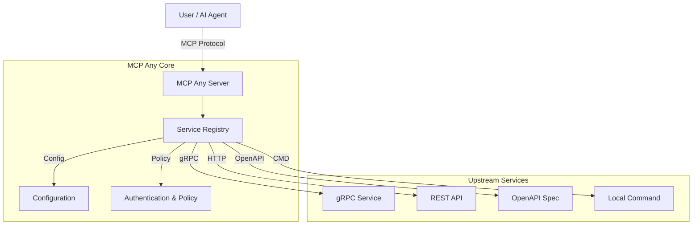

# MCP Any: The Universal MCP Adapter

**One server, Infinite possibilities.**

## 1. Elevator Pitch

**MCP Any** is the universal adapter that instantly turns your existing APIs into Model Context Protocol (MCP) compliant tools. It serves as a configuration-driven gateway, bridging the gap between *any* API (REST, gRPC, GraphQL, Command-line) and AI agents.

Traditional MCP adoption requires building and maintaining separate server binaries for every tool. **MCP Any** eliminates this overhead by providing a single, unified runtime that acts as a gateway to multiple backend services, defined purely through lightweight configuration files.

**Why MCP Any?**
*   **Zero Code:** Expose your APIs to AI agents without writing a single line of adapter code.
*   **Unified Endpoint:** Aggregate multiple upstream services into a single, secure, and observable MCP endpoint.
*   **Language Agnostic:** Integrate with services written in any language or protocol.

## 2. Architecture

MCP Any is built with performance and scalability in mind, using **Go** for the core runtime and a modular architecture to support various protocols.

**High-Level Overview:**
1.  **Core Server:** A high-performance Go runtime that speaks the MCP protocol.
2.  **Service Registry:** Dynamically loads tool definitions from local or remote configuration files.
3.  **Adapters:** Specialized modules that translate MCP requests into upstream calls (e.g., gRPC, HTTP, CLI).
4.  **Policy Engine:** Enforces authentication, rate limiting, and security policies.



## 3. Getting Started

Follow these instructions to get MCP Any up and running on your local machine.

### Prerequisites
*   [Go 1.23+](https://go.dev/doc/install)
*   [Docker](https://docs.docker.com/get-docker/) (Optional, for containerized execution)
*   `make` (For build automation)

### Installation

1.  **Clone the repository:**
    ```bash
    git clone https://github.com/mcpany/core.git
    cd core
    ```

2.  **Prepare dependencies:**
    This step installs necessary tools like `protoc` and Go linters.
    ```bash
    make prepare
    ```

3.  **Build the server:**
    Compiles the Go binary to `build/bin/server`.
    ```bash
    make build
    ```

4.  **Run with an example configuration:**
    Start the server using the provided minimal configuration.
    ```bash
    ./build/bin/server run --config-path server/config.minimal.yaml
    ```

### Hello World
Once the server is running (default port `50050`), verify it's active:

```bash
curl http://localhost:50050/health
```

To connect an AI client (e.g., Claude Desktop, Gemini CLI):
```bash
# Example for Gemini CLI
gemini mcp add --transport http --trust mcpany http://localhost:50050
```

## 4. Development

We welcome contributions! Please follow our standard development workflow.

### Testing
Run the comprehensive test suite (unit, integration, and end-to-end tests):
```bash
make test
```

### Linting
We adhere to strict style guides (Godoc for Go, TSDoc for TypeScript). Run the linter to verify your code:
```bash
make lint
```

### Building
To build both the server and the UI assets:
```bash
make build
```

### Code Generation
If you modify `.proto` files, regenerate the Go and TypeScript code:
```bash
make gen
```

## 5. Configuration

MCP Any is configured via **Environment Variables** (for the server runtime) and **YAML/JSON files** (for upstream services).

### Environment Variables

| Variable | Description | Default |
|----------|-------------|---------|
| `MCPANY_MCP_LISTEN_ADDRESS` | Bind address for the MCP server. | `50050` |
| `MCPANY_CONFIG_PATH` | Comma-separated paths to config files/dirs. | `[]` |
| `MCPANY_METRICS_LISTEN_ADDRESS` | Address to expose Prometheus metrics. | Disabled |
| `MCPANY_DEBUG` | Enable debug logging. | `false` |
| `MCPANY_LOG_LEVEL` | Logging level (`debug`, `info`, `warn`, `error`). | `info` |
| `MCPANY_API_KEY` | Optional API key for securing the server. | Empty (No Auth) |

### Required Secrets
**Security Warning:** Never hardcode secrets in configuration files. Use environment variable expansion.

**Example `config.yaml`:**
```yaml
upstreamAuth:
  apiKey:
    value: "${OPENAI_API_KEY}" # Expands from env var
```

Ensure `OPENAI_API_KEY` is exported in the server's environment before starting.

## License
This project is licensed under the terms of the [Apache 2.0 License](LICENSE).
