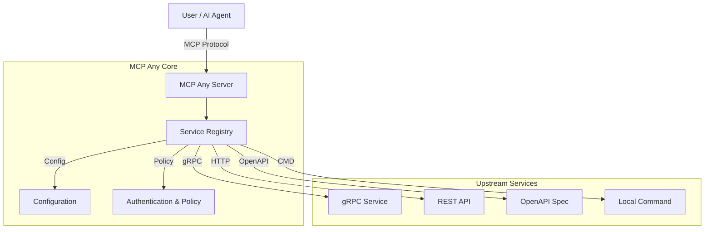

[](https://opensource.org/licenses/Apache-2.0)
[](https://github.com/mcpany/core/actions/workflows/ci.yml)
[](https://pkg.go.dev/github.com/mcpany/core)
[](https://goreportcard.com/report/github.com/mcpany/core)
[](https://codecov.io/gh/mcpany/core)

<p align="center">
  
</p>

# MCP Any: The Universal MCP Adapter

**One server, Infinite possibilities.**

## 1. Project Identity

**What is this?**
MCP Any is a configuration-driven **Universal Adapter** that turns *any* API (REST, gRPC, GraphQL, Command-line) into a Model Context Protocol (MCP) compliant server.

**Why does it exist?**
Traditional MCP adoption suffers from "binary fatigue"—requiring a separate server binary for every tool. MCP Any solves this by allowing you to run a single binary that acts as a gateway to multiple services, defined purely through lightweight configuration files.

**The Solution:**
Don't write code to expose your APIs to AI agents. Just configure them. MCP Any unifies your backend services into a single, secure, and observable MCP endpoint.

## 2. Quick Start

Get up and running with a weather service example in minutes.

### Prerequisites
*   [Go 1.23+](https://go.dev/doc/install)
*   [Docker](https://docs.docker.com/get-docker/) (optional, for containerized run)

### Commands

**Option 1: Docker (Fastest)**

```bash
docker run -d --rm --name mcpany-server \
  -p 50050:50050 \
  ghcr.io/mcpany/server:dev-latest \
  run --config-path https://raw.githubusercontent.com/mcpany/core/main/server/examples/popular_services/wttr.in/config.yaml
```

**Option 2: Build from Source**

```bash
# 1. Clone the repository
git clone https://github.com/mcpany/core.git
cd core

# 2. Install dependencies and build
make prepare
make build

# 3. Run the server (using the example weather config)
./build/bin/server run --config-path server/examples/popular_services/wttr.in/config.yaml
```

**Connect your Client:**
Once running, connect your MCP client (like Gemini CLI or Claude Desktop) to `http://localhost:50050`.

```bash
gemini mcp add --transport http --trust mcpany http://localhost:50050
```

## 3. Developer Workflow

For contributors and developers extending the core platform.

### Common Tasks

**Run Tests**
Execute all unit, integration, and end-to-end tests.
```bash
make test
```

**Lint Code**
Ensure code quality and style compliance (Go & TypeScript).
```bash
make lint
```

**Build Artifacts**
Compile the server binary and frontend assets.
```bash
make build
```

**Generate Code**
Regenerate Protocol Buffers and other auto-generated files.
```bash
make gen
```

### Code Standards

We strive for high code quality. Please ensure the following before submitting a PR:

- **Documentation**:
  - **Go**: All exported functions, methods, types, and constants must have complete docstrings (GoDoc style). The format must include:
    - **Summary**: Active-voice description of intent.
    - **Parameters**: Name, Type, and Constraints.
    - **Returns**: Type and Meaning.
  - **TypeScript/React**: All exported components, functions, interfaces, and types must have JSDoc comments explaining their usage, props/parameters, and return values.
  - **Strict Enforcement**: Documentation coverage is strictly enforced.
- **Testing**: Add unit tests for new functionality.
- **Linting**: Ensure the code is linted and formatted correctly.

## 4. Architecture

MCP Any acts as a centralized middleware between AI Agents (Clients) and your Upstream Services.

**High-Level Summary:**
1.  **Core Server**: A Go-based runtime that speaks the MCP protocol.
2.  **Service Registry**: Dynamically loads tool definitions from configuration.
3.  **Adapters**: Specialized modules that translate MCP requests into upstream calls (gRPC, HTTP, OpenAPI, etc.).
4.  **Policy Engine**: Enforces authentication, rate limiting, and security policies.



### Key Features
*   **Dynamic Config Reloading**: Hot-swap registry without restarts.
*   **Broad Protocol Support**: gRPC, OpenAPI, HTTP, GraphQL, SQL, WebSocket, WebRTC.
*   **Safety Policies**: Block dangerous operations (e.g., DELETE) and limit access.
*   **Observability**: Real-time metrics and audit logging.

### Key Documentation
*   **[Developer Guide](server/docs/developer_guide.md)**: Detailed internal architecture and contribution guide.
*   **[Configuration Reference](server/docs/reference/configuration.md)**: Full syntax for defining services.
*   **[Integrations](server/docs/integrations.md)**: How to use with Claude, Cursor, VS Code, etc.
*   **[Examples](server/docs/examples.md)**: Hands-on examples.

---

## 5. Configuration

MCP Any uses a combination of configuration files and environment variables.

### Environment Variables

| Variable | Description | Default |
| :--- | :--- | :--- |
| `MCPANY_MCP_LISTEN_ADDRESS` | Address to listen on for MCP connections. | `0.0.0.0:50051` |
| `MCPANY_DEFAULT_HTTP_ADDR` | Address to listen on for HTTP connections. | `0.0.0.0:50050` |
| `MCPANY_LOG_LEVEL` | Logging level (`debug`, `info`, `warn`, `error`). | `info` |

See [Configuration Reference](server/docs/reference/configuration.md) for full details.

## 🔧 Troubleshooting

- **Protobuf Generation Errors**: Run `make prepare` to install dependencies.
- **Docker Permission Denied**: Ensure you are in the `docker` group.

## 🤝 Contributing

Contributions are welcome! Please feel free to open an issue or submit a pull request.

## 🗺️ Roadmap

Check out our Roadmap to see what we're working on and what's coming next:
- [Server Roadmap](server/roadmap.md)
- [UI Roadmap](ui/roadmap.md)

## 📄 License

This project is licensed under the terms of the [LICENSE](LICENSE) file.
