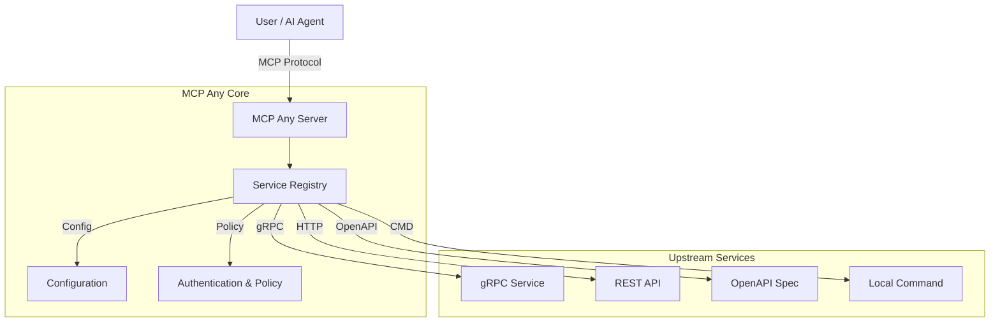

# MCP Any: The Universal MCP Adapter

**One server, Infinite possibilities.**

## 1. Elevator Pitch

**What is this project and why does it exist?**

**MCP Any** is the universal adapter that instantly turns your existing APIs into MCP-compliant tools. It is a configuration-driven gateway that bridges the gap between *any* API (REST, gRPC, GraphQL, Command-line) and the Model Context Protocol (MCP).

Traditional MCP adoption suffers from "binary fatigue"—requiring a separate server binary for every tool. MCP Any solves this by allowing you to run a single binary that acts as a gateway to multiple services, defined purely through lightweight configuration files.

**The Solution:** Don't write code to expose your APIs to AI agents. Just configure them. MCP Any unifies your backend services into a single, secure, and observable MCP endpoint.

## 2. Architecture

MCP Any acts as a centralized middleware between AI Agents (Clients) and your Upstream Services. It is built with **Go** for high performance and concurrency, and uses a modular architecture to support various upstream protocols.

**High-Level Overview:**
1.  **Core Server**: A Go-based runtime that speaks the MCP protocol.
2.  **Service Registry**: Dynamically loads tool definitions from configuration files (local or remote).
3.  **Adapters**: Specialized modules that translate MCP requests into upstream calls (gRPC, HTTP, OpenAPI, CLI).
4.  **Policy Engine**: Enforces authentication, rate limiting, and security policies to keep your infrastructure safe.



### Key Design Patterns
*   **Adapter Pattern**: Decouples the MCP protocol from upstream API specifics.
*   **Configuration as Code**: All services are defined in declarative YAML/JSON.
*   **Sidecar/Gateway**: Can be deployed as a standalone gateway or a sidecar in Kubernetes.

## 3. Getting Started

Follow these steps to get up and running immediately.

### Prerequisites
*   [Go 1.23+](https://go.dev/doc/install) (for building from source)
*   [Docker](https://docs.docker.com/get-docker/) (optional, for containerized run)
*   `make` (for build automation)

### Installation

1.  **Clone the repository:**
    ```bash
    git clone https://github.com/mcpany/core.git
    cd core
    ```

2.  **Prepare dependencies:**
    ```bash
    make prepare
    ```

3.  **Build the server:**
    ```bash
    make build
    ```
    This will create the `server` binary in `build/bin/`.

4.  **Run with an example configuration:**
    ```bash
    ./build/bin/server run --config-path server/examples/popular_services/wttr.in/config.yaml
    ```

### Hello World
Once the server is running, you can verify it using `curl` or an MCP client.
```bash
# Check health
curl http://localhost:50050/health
```

To connect an AI client (like Claude Desktop or Gemini CLI):
```bash
gemini mcp add --transport http --trust mcpany http://localhost:50050
```

## 4. Development

We follow a strict development workflow to ensure quality.

### Setup
Before running tests or building locally, ensure all dependencies and tools are installed.
```bash
make prepare
```

### Testing
Run all unit, integration, and end-to-end tests to ensure code correctness.
```bash
make test
```

### Linting
Ensure code adheres to our style guides (Godoc for Go, TSDoc for TypeScript). We strictly enforce **100% documentation coverage** for all public APIs.
Run the linter to verify your changes:
```bash
make lint
```

### Building
Compile all artifacts (Server binary and UI assets).
```bash
make all
```

Or build just the server:
```bash
make build
```

### Code Generation
Regenerate Protocol Buffers and other auto-generated files if you modify `.proto` definitions.
```bash
make gen
```

## 5. Configuration

MCP Any is configured via environment variables and YAML/JSON configuration files for services.

### Environment Variables

| Variable | Description | Default |
|----------|-------------|---------|
| `MCPANY_MCP_LISTEN_ADDRESS` | MCP server's bind address (host:port) | `50050` |
| `MCPANY_CONFIG_PATH` | Paths to config files or directories (comma-separated) | `[]` |
| `MCPANY_METRICS_LISTEN_ADDRESS` | Address to expose Prometheus metrics | Disabled |
| `MCPANY_DEBUG` | Enable debug logging | `false` |
| `MCPANY_LOG_LEVEL` | Set the log level (debug, info, warn, error) | `info` |
| `MCPANY_LOG_FORMAT` | Set the log format (text, json) | `text` |
| `MCPANY_GRPC_PORT` | Port for the gRPC registration server | Disabled |
| `MCPANY_STDIO` | Enable stdio mode for JSON-RPC communication | `false` |
| `MCPANY_API_KEY` | API key for securing the MCP server | Empty (No Auth) |

### Required Secrets
Sensitive information (like upstream API keys) should **never** be hardcoded in configuration files. Instead, use environment variables referencing them.

Example Config:
```yaml
upstreamAuth:
  apiKey:
    value: "${OPENAI_API_KEY}" # References env var
```

Ensure `OPENAI_API_KEY` is set in the server's environment.

## License
This project is licensed under the terms of the [Apache 2.0 License](LICENSE).
