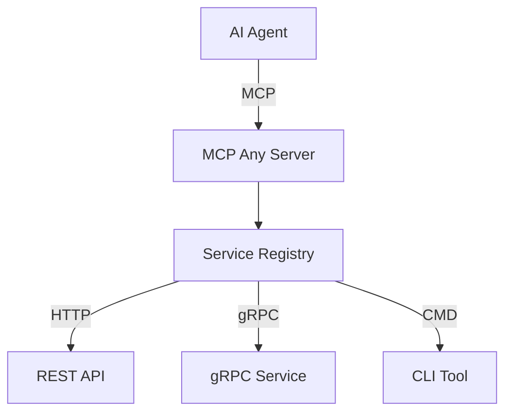

# MCP Any: The Universal MCP Adapter

**One server, Infinite possibilities.**

## 1. Project Identity

**What is this?**
**MCP Any** is the universal adapter that turns *any* API (REST, gRPC, GraphQL, Command-line) into an MCP-compliant tool instantly.

**Why does it exist?**
Traditional MCP adoption suffers from "binary fatigue"—requiring a separate server binary for every tool. MCP Any solves this by acting as a **single, configuration-driven gateway** that bridges your existing infrastructure to AI agents.

**The Elevator Pitch:** Don't write code to expose your APIs to AI. Just configure them. MCP Any unifies your backend services into a single, secure, and observable MCP endpoint.

## 2. Quick Start

Get up and running in seconds.

### Prerequisites
*   [Go 1.23+](https://go.dev/doc/install)
*   `make`

### Installation

```bash
# 1. Clone
git clone https://github.com/mcpany/core.git
cd core

# 2. Prepare dependencies
make prepare

# 3. Build
make build

# 4. Run with example config
./build/bin/server run --config-path server/examples/popular_services/wttr.in/config.yaml
```

### Verification
```bash
# Check health
curl http://localhost:50050/health
```

To connect an AI client (like Claude Desktop or Gemini CLI):
```bash
gemini mcp add --transport http --trust mcpany http://localhost:50050
```

## 3. Developer Workflow

We enforce strict quality standards.

*   **Test:** Run all unit and integration tests.
    ```bash
    make test
    ```
*   **Lint:** Ensure code style and **100% documentation coverage**.
    ```bash
    make lint
    ```
*   **Build:** Compile binaries.
    ```bash
    make build
    ```

## 4. Architecture

MCP Any is a **modular gateway** built in **Go**.

**Core Components:**
1.  **Server:** The MCP protocol termination point.
2.  **Service Registry:** Loads tool definitions from YAML/JSON configs.
3.  **Adapters:** Translates MCP requests -> Upstream calls (gRPC, HTTP, CLI).
4.  **Policy Engine:** Enforces security (Auth, Rate Limiting, DLP).



## 5. Configuration

MCP Any is configured via environment variables and YAML/JSON configuration files.

| Variable | Description | Default |
|----------|-------------|---------|
| `MCPANY_MCP_LISTEN_ADDRESS` | MCP server's bind address (host:port) | `50050` |
| `MCPANY_CONFIG_PATH` | Paths to config files or directories (comma-separated) | `[]` |
| `MCPANY_METRICS_LISTEN_ADDRESS` | Address to expose Prometheus metrics | Disabled |
| `MCPANY_DEBUG` | Enable debug logging | `false` |
| `MCPANY_LOG_LEVEL` | Set the log level (debug, info, warn, error) | `info` |
| `MCPANY_LOG_FORMAT` | Set the log format (text, json) | `text` |
| `MCPANY_GRPC_PORT` | Port for the gRPC registration server | Disabled |
| `MCPANY_STDIO` | Enable stdio mode for JSON-RPC communication | `false` |
| `MCPANY_API_KEY` | API key for securing the MCP server | Empty (No Auth) |

**Secrets:** Use `${ENV_VAR}` in configs. Never hardcode secrets.

## License
[Apache 2.0 License](LICENSE)
