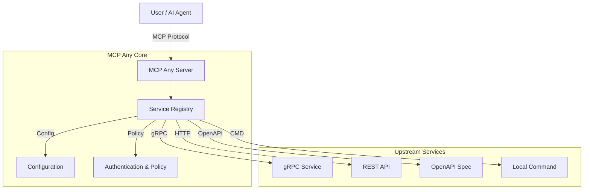

[](https://opensource.org/licenses/Apache-2.0)
[](https://github.com/mcpany/core/actions/workflows/ci.yml)
[](https://pkg.go.dev/github.com/mcpany/core)
[](https://goreportcard.com/report/github.com/mcpany/core)
[](https://codecov.io/gh/mcpany/core)

<p align="center">
  
</p>

# MCP Any: Configuration-Driven MCP Server

## Elevator Pitch

**One server, Infinite possibilities.**

MCP Any revolutionizes how you interact with the Model Context Protocol (MCP). It is not just another MCP proxy or aggregator—it is a powerful **Universal Adapter** that turns _any_ API into an MCP-compliant server through simple configuration.

Traditional MCP adoption requires running a separate server binary for every tool or service you want to expose. This leads to "binary fatigue," complex local setups, and maintenance nightmares.

**MCP Any solves this with a Single Binary approach:**

1.  **Install once**: Run a single `mcpany` server instance.
2.  **Configure everything**: Load lightweight YAML/JSON configurations to capability-enable different APIs (REST, gRPC, GraphQL, Command-line).
3.  **Run anywhere**: No need for `npx`, `python`, or language-specific runtimes for each tool.

### Philosophy: Configuration over Code

We believe you shouldn't have to write and maintain new code just to expose an existing API to your AI assistant.

-   **Metamcp / Onemcp vs. MCP Any**: While other tools might proxy existing MCP servers (aggregator pattern), **MCP Any** creates them from scratch using your existing upstream APIs.
-   **No More "Sidecar hell"**: Instead of running 10 different containers for 10 different tools, run 1 `mcpany` container loaded with 10 config files.
-   **Ops Friendly**: Centralize authentication, rate limiting, and observability in one robust layer.

## Architecture

### High-Level Architecture



### Key Features

*   **Dynamic Config Reloading**: Hot-swap configurations without restarts.
*   **Dynamic Tool Registration**: Auto-discover tools from OpenAPI, gRPC, and more.
*   **Multiple Service Types**: Supports gRPC, OpenAPI, HTTP, GraphQL, SQL, WebSocket, WebRTC.
*   **Safety Policies**: Control tool exposure, block dangerous operations, and limit context.
*   **Performance**: Built-in caching, rate limiting, and semantic caching with vector embeddings.
*   **Observability**: Audit logging and network topology visualization.
*   **Security**: Upstream authentication (API Keys, OAuth, mTLS) and multi-user support.

### Management Dashboard

The **MCP Any UI** provides a powerful interface for managing your server.

*   **Dashboard**: Real-time metrics and system health.
*   **Services Management**: Toggle and configure upstream services.
*   **Interactive Playground**: Test tools directly from the browser.
*   **Configuration**: Manage settings, users, and secrets via UI.

## Getting Started

Ready to give your AI access to real-time data? Let's connect a public Weather API to **Gemini CLI** (or any MCP client) using MCP Any.

### 1. Prerequisites

-   **Go**: [Go 1.23+](https://go.dev/doc/install) installed.
-   **Gemini CLI**: [Installation guide](https://docs.cloud.google.com/gemini/docs/codeassist/gemini-cli).

### 2. Run the Server

We will use the pre-built `wttr.in` configuration available in `server/examples/popular_services/wttr.in/config.yaml`.

**Option 1: Docker (Recommended)**

```bash
docker run -d --rm --name mcpany-server \
  -p 50050:50050 \
  ghcr.io/mcpany/server:dev-latest \
  run --config-path https://raw.githubusercontent.com/mcpany/core/main/server/examples/popular_services/wttr.in/config.yaml
```

**Option 2: Local Installation (from Source)**

```bash
# Clone the repository
git clone https://github.com/mcpany/core.git
cd core

# Install dependencies and build
make prepare
make build

# Run the server
./build/bin/server run --config-path server/examples/popular_services/wttr.in/config.yaml
```

### 3. Connect Client & Chat

```bash
# Connect Gemini CLI
gemini mcp add --transport http --trust mcpany http://localhost:50050

# Chat!
gemini -m gemini-2.5-flash -p "What is the weather in London?"
```

## Development

We welcome contributions!

### Prerequisites

-   **Go**: Version 1.23+
-   **Docker**: For running tests.
-   **Make**: For build automation.

### Quick Setup

```bash
git clone https://github.com/mcpany/core.git
cd core
make prepare
```

### Common Commands

-   **Build**: `make build` (Compiles to `build/bin/server`)
-   **Test**: `make test` (Runs unit, integration, and E2E tests)
-   **Lint**: `make lint` (Runs static analysis)
-   **Generate**: `make gen` (Regenerates Proto and Mock files)
-   **Check Docs**: `go run server/tools/check_doc.go server/`

### Project Structure

-   `server/`: Main Go server code.
-   `ui/`: Next.js management dashboard.
-   `proto/`: Protocol Buffer definitions.

## Configuration

MCP Any can be configured via Environment Variables and Configuration Files.

### Environment Variables

| Variable | Description | Default |
| :--- | :--- | :--- |
| `MCPANY_ENABLE_FILE_CONFIG` | Enable loading config from files (in addition to DB). | `false` |
| `MCPANY_DEFAULT_HTTP_ADDR` | Address to listen on for HTTP. | `localhost:8070` |
| `MCPANY_DEBUG` | Enable debug logging. | `false` |
| `MCPANY_ALLOW_LOOPBACK_RESOURCES` | Allow connections to localhost (dangerous). | `false` |
| `MCPANY_ALLOW_PRIVATE_NETWORK_RESOURCES` | Allow connections to private IPs. | `false` |
| `MCPANY_ADMIN_INIT_USERNAME` | Initial admin username. | - |
| `MCPANY_ADMIN_INIT_PASSWORD` | Initial admin password. | - |

### Required Secrets

Secrets (like API keys) should be managed via the **Secret Manager** (configured in `config.yaml` or UI) rather than hardcoded.

Example `config.yaml` snippet:

```yaml
global_settings:
  authentication:
    api_key: "your-super-secret-key"
upstream_services:
  - name: weather
    http:
      base_url: "https://wttr.in"
```

For detailed configuration options, see **[Configuration Reference](server/docs/reference/configuration.md)**.

## More Usage

-   **[Integration Guide](server/docs/integrations.md)**: Connect with Claude Desktop, Cursor, VS Code, etc.
-   **[Examples](server/docs/examples.md)**: Hands-on examples.
-   **[Monitoring](server/docs/monitoring.md)**: Metrics and observability.

## Troubleshooting

-   **Protobuf Errors**: Run `make prepare`.
-   **Docker Permission**: Ensure user is in `docker` group.
-   **Port Conflicts**: Check ports `50050`, `50051`, `9002`.

## Contributing

Please open an issue or submit a pull request. Ensure `make lint` and `make test` pass before submitting.

## Roadmap

-   [Server Roadmap](server/roadmap.md)
-   [UI Roadmap](ui/roadmap.md)

## License

[Apache 2.0](LICENSE)
