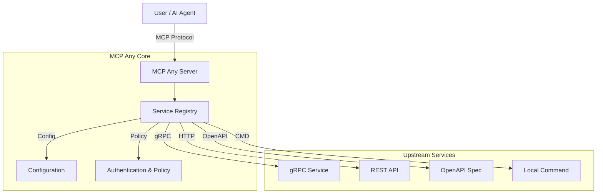

# MCP Any: The Universal MCP Adapter

**One server, Infinite possibilities.**

## Elevator Pitch

**MCP Any** is a configuration-driven **Universal Adapter** that transforms *any* API (REST, gRPC, GraphQL, Command-line) into a Model Context Protocol (MCP) compliant server.

Traditional MCP adoption requires a separate server binary for every tool, leading to "binary fatigue." MCP Any solves this by providing a single gateway binary that manages multiple services defined purely through lightweight configuration files.

**Why it exists:** To eliminate code-heavy integrations. Don't write code to expose your APIs to AI agents; configure them. MCP Any unifies your backend services into a single, secure, and observable MCP endpoint.

## Architecture

MCP Any serves as a centralized middleware between AI Agents (Clients) and Upstream Services. Built with **Go**, it prioritizes high performance and concurrency using a modular architecture.

**Components:**
1.  **Core Server**: The Go-based runtime implementing the MCP protocol.
2.  **Service Registry**: Dynamically loads tool definitions from local or remote configuration files.
3.  **Adapters**: Protocol translation modules for gRPC, HTTP, OpenAPI, and CLI.
4.  **Policy Engine**: Enforces authentication, rate limiting, and security policies.



### Design Patterns
*   **Adapter Pattern**: Decouples the MCP protocol from upstream API specifics.
*   **Configuration as Code**: Defines all services in declarative YAML/JSON.
*   **Sidecar/Gateway**: Deploys as a standalone gateway or a Kubernetes sidecar.

## Getting Started

### Prerequisites
*   [Go 1.23+](https://go.dev/doc/install) (for building from source)
*   [Docker](https://docs.docker.com/get-docker/) (optional, for containerized run)
*   `make` (for build automation)

### Installation

1.  **Clone the repository:**
    ```bash
    git clone https://github.com/mcpany/core.git
    cd core
    ```

2.  **Prepare dependencies:**
    ```bash
    make prepare
    ```

3.  **Build the server:**
    ```bash
    make build
    ```
    This creates the `server` binary in `build/bin/`.

4.  **Run with an example configuration:**
    ```bash
    ./build/bin/server run --config-path server/examples/popular_services/wttr.in/config.yaml
    ```

### Hello World
Verify the server is running:
```bash
# Check health
curl http://localhost:50050/health
```

Connect an AI client (e.g., Gemini CLI):
```bash
gemini mcp add --transport http --trust mcpany http://localhost:50050
```

## Development

We enforce a strict workflow to maintain code quality.

*   **Test**: Run unit, integration, and end-to-end tests.
    ```bash
    make test
    ```
*   **Lint**: Enforce style guides (GoDoc, TSDoc).
    ```bash
    make lint
    ```
*   **Build**: Compile server binary and UI assets.
    ```bash
    make build
    ```
*   **Generate**: Update Protocol Buffers and auto-generated files.
    ```bash
    make gen
    ```

## Configuration

Configure MCP Any via environment variables and YAML/JSON files.

### Environment Variables

| Variable | Description | Default |
|----------|-------------|---------|
| `MCPANY_MCP_LISTEN_ADDRESS` | MCP server bind address | `50050` |
| `MCPANY_CONFIG_PATH` | Comma-separated paths to config files | `[]` |
| `MCPANY_METRICS_LISTEN_ADDRESS` | Prometheus metrics address | Disabled |
| `MCPANY_DEBUG` | Enable debug logging | `false` |
| `MCPANY_LOG_LEVEL` | Log level (debug, info, warn, error) | `info` |
| `MCPANY_LOG_FORMAT` | Log format (text, json) | `text` |
| `MCPANY_GRPC_PORT` | gRPC registration server port | Disabled |
| `MCPANY_STDIO` | Enable stdio mode for JSON-RPC | `false` |
| `MCPANY_API_KEY` | API key for securing the server | Empty |

### Secrets Management
**Never** hardcode sensitive information. Use environment variable references in configuration files:

```yaml
upstreamAuth:
  apiKey:
    value: "${OPENAI_API_KEY}" # References env var
```

## License
[Apache 2.0 License](LICENSE)
