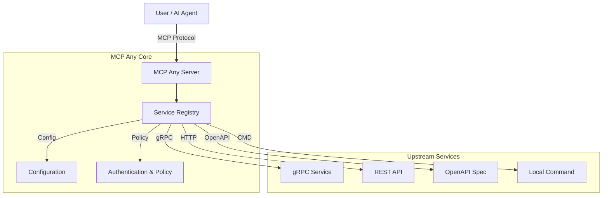

[](https://opensource.org/licenses/Apache-2.0)
[](https://github.com/mcpany/core/actions/workflows/ci.yml)
[](https://pkg.go.dev/github.com/mcpany/core)
[](https://goreportcard.com/report/github.com/mcpany/core)
[](https://codecov.io/gh/mcpany/core)

<p align="center">
  
</p>

# MCP Any: Configuration-Driven MCP Server

**One server, Infinite possibilities.**

## Project Identity

MCP Any revolutionizes how you interact with the Model Context Protocol (MCP). It is not just another MCP proxy or aggregator—it is a powerful **Universal Adapter** that turns _any_ API into an MCP-compliant server through simple configuration.

Traditional MCP adoption requires running a separate server binary for every tool or service you want to expose. This leads to "binary fatigue," complex local setups, and maintenance nightmares.

**MCP Any solves this with a Single Binary approach:**

1.  **Install once**: Run a single `mcpany` server instance.
2.  **Configure everything**: Load lightweight YAML/JSON configurations to capability-enable different APIs (REST, gRPC, GraphQL, Command-line).
3.  **Run anywhere**: No need for `npx`, `python`, or language-specific runtimes for each tool.

## ⚡ Quick Start

Ready to give your AI access to real-time data? Follow these steps to get started in minutes.

### 1. Clone and Install

```bash
# Clone the repository
git clone https://github.com/mcpany/core.git
cd core

# Install dependencies and build the binary
make prepare
make build
```

### 2. Run the Server

We will use the pre-built `wttr.in` configuration available in the examples directory.

```bash
# Run the server with the example configuration
./build/bin/server run --config-path server/examples/popular_services/wttr.in/config.yaml
```

### 3. Connect and Chat

You can now connect any MCP client (like Gemini CLI, Claude Desktop, etc.) to `http://localhost:50050`.

```bash
# Example with Gemini CLI
gemini mcp add --transport http --trust mcpany http://localhost:50050
gemini -m gemini-2.5-flash -p "What is the weather in London?"
```

For more deployment options (Docker, etc.), see the [Usage Guide](server/docs/reference/configuration.md).

## 🛠️ Developer Workflow

If you are contributing to MCP Any, here is how to work with the codebase.

### Prerequisites
- **Go**: Version 1.23+
- **Docker**: For running tests.
- **Make**: For build automation.

### Commands

- **Build**: Compile the server binary.
    ```bash
    make build
    ```
- **Test**: Run all unit, integration, and E2E tests.
    ```bash
    make test
    ```
- **Lint**: Run static analysis to ensure code quality.
    ```bash
    make lint
    ```
- **Generate**: Regenerate Go and TypeScript code from Protocol Buffers.
    ```bash
    make gen
    ```

## 🏗️ Architecture

MCP Any acts as a bridge between MCP clients and upstream services.



### Key Components
- **Service Registry**: Manages the lifecycle of upstream service connections.
- **Adapters**: Translate MCP tool calls into upstream API calls (gRPC, HTTP, etc.).
- **Policy Engine**: Enforces authentication, rate limiting, and access control.

## ❓ Philosophy: Configuration over Code

We believe you shouldn't have to write and maintain new code just to expose an existing API to your AI assistant.

- **Metamcp / Onemcp vs. MCP Any**: While other tools might proxy existing MCP servers (aggregator pattern), **MCP Any** creates them from scratch using your existing upstream APIs.
- **No More "Sidecar hell"**: Instead of running 10 different containers for 10 different tools, run 1 `mcpany` container loaded with 10 config files.
- **Ops Friendly**: Centralize authentication, rate limiting, and observability in one robust layer.

## ✨ Key Features

- **Dynamic Config Reloading**: Hot-swap configuration without restarts.
- **Dynamic Tool Registration**: Auto-discovery from OpenAPI, gRPC reflection, etc.
- **Multiple Service Types**: gRPC, OpenAPI, HTTP, GraphQL, SQL, WebSocket, WebRTC.
- **Advanced Policies**: Safety checks, Caching, Rate Limiting.
- **Audit Logging**: Secure recording of all tool executions.
- **Management Dashboard**: Web UI for monitoring and configuration.

## 🖥️ Management Dashboard

The **MCP Any UI** provides a powerful interface for managing your server.


To develop the UI:
```bash
cd ui
npm install
npm run dev
```

## 🤝 Contributing

We welcome contributions! Please verify your changes before submitting:

1.  **Documentation**: Ensure all public symbols have docstrings.
2.  **Testing**: Add unit tests for new functionality.
3.  **Linting**: Ensure `make lint` passes.

## 📄 License

This project is licensed under the terms of the [LICENSE](LICENSE) file.
