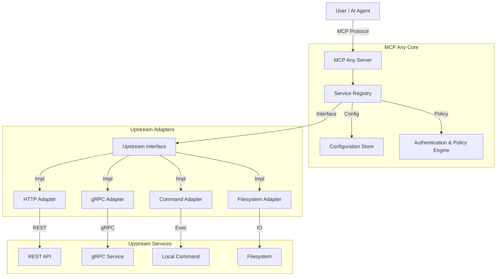

# MCP Any

[](https://github.com/mcpany/core)
[](LICENSE)

## 1. Elevator Pitch

**MCP Any** is a universal adapter that instantly turns your existing APIs into [Model Context Protocol (MCP)](https://modelcontextprotocol.io/) compliant tools. It acts as a configuration-driven gateway, bridging the gap between your backend services (REST, gRPC, OpenAPI, Command-line) and AI agents.

**Why does it exist?**
Traditional MCP adoption often requires writing a separate server binary for every tool, leading to "binary fatigue" and significant maintenance overhead. MCP Any solves this problem by providing a single, unified server that acts as a gateway to multiple services, defined purely through lightweight configuration files. It unifies your infrastructure into a single, secure, and observable MCP endpoint, allowing you to focus on capabilities rather than plumbing.

## 2. Architecture

**High-Level Overview**
MCP Any utilizes a modular, adapter-based architecture to decouple the MCP protocol from upstream API specifics. Built with Go for performance and concurrency, it serves as a robust middleware between AI clients and your infrastructure.

**Core Components**
*   **Core Server:** A high-performance Go runtime that handles the MCP protocol (JSON-RPC) and manages client sessions.
*   **Service Registry:** The central nervous system. It implements the `ServiceRegistryInterface` to manage the lifecycle, dynamic loading, and health checking of upstream services.
*   **Upstream Adapters:** specialized implementations of the `Upstream` interface that translate MCP requests into protocol-specific calls:
    *   **HTTP:** Proxies requests to REST/JSON APIs with parameter mapping.
    *   **gRPC:** Uses reflection to invoke methods dynamically.
    *   **Command:** Safely executes local CLI tools.
    *   **Filesystem:** Provides secure access to local or remote filesystems.
*   **Policy Engine & Middleware:** Enforces authentication, rate limiting, and audit logging.


```mermaid
graph TD
    User[User / AI Agent] -->|MCP Protocol| Server[MCP Any Server]

    subgraph "MCP Any Core"
        Server --> Registry[Service Registry]
        Registry -->|Config| Config[Configuration Store]
        Registry -->|Policy| Auth[Authentication & Policy Engine]
    end

    subgraph "Upstream Adapters"
        Registry -->|Interface| Upstream[Upstream Interface]
        Upstream -->|Impl| HTTP[HTTP Adapter]
        Upstream -->|Impl| GRPC[gRPC Adapter]
        Upstream -->|Impl| CMD[Command Adapter]
        Upstream -->|Impl| FS[Filesystem Adapter]
    end

    subgraph "Upstream Services"
        HTTP -->|REST| ServiceB[REST API]
        GRPC -->|gRPC| ServiceA[gRPC Service]
        CMD -->|Exec| ServiceD[Local Command]
        FS -->|IO| ServiceE[Filesystem]
    end
```

**Design Patterns**
*   **Adapter Pattern:** The `Upstream` interface abstracts backend protocols.
*   **Configuration as Code:** Services are defined declaratively in YAML/JSON.
*   **Gateway/Sidecar:** Deployable as a central gateway or Kubernetes sidecar.

## 3. Getting Started

Follow these steps to go from zero to a running MCP server.

### Prerequisites
*   [Go 1.23+](https://go.dev/doc/install) (for building from source)
*   `make` (for automation)
*   [Docker](https://docs.docker.com/get-docker/) (optional)

### Step-by-Step Instructions

1.  **Clone the Repository**
    ```bash
    git clone https://github.com/mcpany/core.git
    cd core
    ```

2.  **Prepare Dependencies**
    ```bash
    make prepare
    ```
    *Installs required tools (protoc, linter) into `build/env/bin`.*

3.  **Build the Server**
    ```bash
    make build
    ```
    *Compiles the source and outputs the binary to `build/bin/server`.*

4.  **Run with Example Configuration**
    ```bash
    ./build/bin/server run --config-path server/config.minimal.yaml
    ```

### Hello World

Once running, verify the server is active:

1.  **Check Health**
    ```bash
    curl http://localhost:50050/health
    ```

2.  **Connect an AI Client** (e.g., using a CLI tool)
    ```bash
    gemini mcp add --transport http --trust mcpany http://localhost:50050
    ```

3.  **Ask a Question**
    > "What is the weather?"

    *The agent will use the `get_weather` tool exposed by the default configuration.*

## 4. Development

We adhere to strict quality standards. Ensure your environment is set up to run the following commands.

*   **Testing:** Run all unit and integration tests.
    ```bash
    make test
    ```
*   **Linting:** We enforce **100% documentation coverage** and strict style guides.
    ```bash
    make lint
    ```
*   **Building:** Compile the binary.
    ```bash
    make build
    ```
*   **Code Generation:** Regenerate Protocol Buffers if `.proto` files change.
    ```bash
    make gen
    ```

## 5. Configuration

MCP Any is configured via environment variables and YAML/JSON files.

### Environment Variables

| Variable | Description | Default |
|----------|-------------|---------|
| `MCPANY_MCP_LISTEN_ADDRESS` | MCP server's bind address (host:port) | `50050` |
| `MCPANY_CONFIG_PATH` | Comma-separated paths to config files/dirs | `[]` |
| `MCPANY_METRICS_LISTEN_ADDRESS` | Address to expose Prometheus metrics | Disabled |
| `MCPANY_GRPC_PORT` | Port for the gRPC registration server | Disabled |
| `MCPANY_STDIO` | Enable stdio mode for JSON-RPC communication | `false` |
| `MCPANY_DEBUG` | Enable debug logging | `false` |
| `MCPANY_LOG_LEVEL` | Log level (debug, info, warn, error) | `info` |
| `MCPANY_LOG_FORMAT` | Log format (text, json) | `text` |
| `MCPANY_API_KEY` | Master API key for securing the server | Empty (No Auth) |
| `MCPANY_PROFILES` | Comma-separated list of active profiles | `default` |
| `MCPANY_DB_PATH` | Path to the SQLite database file | `data/mcpany.db` |
| `MCPANY_SHUTDOWN_TIMEOUT` | Graceful shutdown timeout | `5s` |
| `MCPANY_ALLOWED_ENV` | Comma-separated list of allowed env vars for config expansion | Empty |
| `MCPANY_STRICT_ENV_MODE` | Block all env vars unless whitelisted | `false` |

### Required Secrets

**Security Warning:** Never hardcode secrets in configuration files. Use environment variable substitution.

**Example Config:**
```yaml
upstreamAuth:
  apiKey:
    value: "${OPENAI_API_KEY}" # References env var
```
Ensure `OPENAI_API_KEY` is exported in the server's environment.

## License

This project is licensed under the terms of the [Apache 2.0 License](LICENSE).
