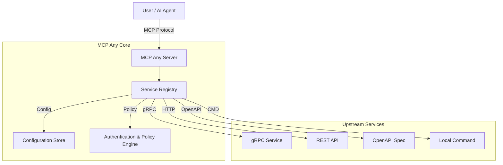

# MCP Any

[](https://github.com/mcpany/core)

## 1. Project Identity

**What is MCP Any?**
**MCP Any** is a universal adapter that instantly transforms existing APIs into [Model Context Protocol (MCP)](https://modelcontextprotocol.io/) compliant tools. It serves as a configuration-driven gateway, bridging the gap between backend services (REST, gRPC, OpenAPI, Command-line) and AI agents.

**Why does it exist?**
Traditional MCP adoption often necessitates writing and maintaining separate server binaries for each tool, leading to "binary fatigue" and operational overhead. MCP Any eliminates this by providing a single, unified server that acts as a gateway to multiple services. Defined purely through lightweight configuration files, it unifies infrastructure into a single, secure, and observable MCP endpoint.

## 2. Quick Start

Follow these steps to get up and running immediately.

### Prerequisites
*   [Go 1.23+](https://go.dev/doc/install) (for building from source)
*   `make` (for build automation)
*   [Docker](https://docs.docker.com/get-docker/) (optional, for containerized execution)

### Installation

1.  **Clone the repository:**
    ```bash
    git clone https://github.com/mcpany/core.git
    cd core
    ```

2.  **Prepare dependencies:**
    ```bash
    make prepare
    ```
    This command installs necessary build tools (protoc, linter, hooks) into `build/env/bin`.

3.  **Build the server:**
    ```bash
    make build
    ```
    This compiles the `server` binary and places it in `build/bin/`.

4.  **Run with an example configuration:**
    ```bash
    ./build/bin/server run --config-path server/examples/popular_services/wttr.in/config.yaml
    ```

### Hello World
Once the server is running, verify its health:
```bash
curl http://localhost:50050/health
```

To connect an AI client (e.g., Claude Desktop or Gemini CLI):
```bash
gemini mcp add --transport http --trust mcpany http://localhost:50050
```

## 3. Developer Workflow

We adhere to a strict development workflow to ensure code quality and maintainability.

### Running Tests
Execute all unit and integration tests to ensure code correctness.
```bash
make test
```

### Linting & Formatting
Ensure code adheres to our style guides (Godoc for Go, JSDoc for TypeScript). We enforce **100% documentation coverage**.
```bash
make lint
```

### Building the Project
Compile the server binary and UI assets.
```bash
make build
```

### Code Generation
Regenerate Protocol Buffers and other auto-generated files if you modify `.proto` definitions.
```bash
make gen
```

## 4. Architecture

**High-Level Overview**

MCP Any utilizes a modular, adapter-based architecture to decouple the MCP protocol from upstream API specifics. Built with Go, it is designed for performance and concurrency.

1.  **Core Server**: A Go-based runtime that handles the MCP protocol (JSON-RPC) and manages client sessions.
2.  **Service Registry**: Dynamically loads tool definitions from configuration files (local filesystem or remote/DB).
3.  **Adapters**: Specialized modules that translate MCP tool execution requests into upstream calls (gRPC, HTTP, OpenAPI, CLI).
4.  **Policy Engine & Middleware**: Enforces authentication, rate limiting, DLP (Data Loss Prevention), and audit logging.


```mermaid
graph TD
    User[User / AI Agent] -->|MCP Protocol| Server[MCP Any Server]

    subgraph "MCP Any Core"
        Server --> Registry[Service Registry]
        Registry -->|Config| Config[Configuration Store]
        Registry -->|Policy| Auth[Authentication & Policy Engine]
    end

    subgraph "Upstream Services"
        Registry -->|gRPC| ServiceA[gRPC Service]
        Registry -->|HTTP| ServiceB[REST API]
        Registry -->|OpenAPI| ServiceC[OpenAPI Spec]
        Registry -->|CMD| ServiceD[Local Command]
    end
```

**Design Patterns:**
*   **Adapter Pattern**: Translates MCP requests to upstream protocols.
*   **Configuration as Code**: Services are defined declaratively.
*   **Gateway/Sidecar**: Can be deployed as a central gateway or a Kubernetes sidecar.

## 5. Configuration

MCP Any is configured via environment variables and YAML/JSON configuration files.

### Environment Variables

| Variable | Description | Default |
|----------|-------------|---------|
| `MCPANY_MCP_LISTEN_ADDRESS` | MCP server's bind address (host:port) | `50050` |
| `MCPANY_CONFIG_PATH` | Comma-separated paths to config files/dirs | `[]` |
| `MCPANY_METRICS_LISTEN_ADDRESS` | Address to expose Prometheus metrics | Disabled |
| `MCPANY_DEBUG` | Enable debug logging | `false` |
| `MCPANY_LOG_LEVEL` | Log level (debug, info, warn, error) | `info` |
| `MCPANY_API_KEY` | Master API key for securing the server | Empty (No Auth) |

### Required Secrets
Sensitive information (like upstream API keys) must **never** be hardcoded. Use environment variable references in configuration files.

**Example Config:**
```yaml
upstreamAuth:
  apiKey:
    value: "${OPENAI_API_KEY}" # References env var
```

Ensure `OPENAI_API_KEY` is set in the server's environment.

## License
This project is licensed under the terms of the [Apache 2.0 License](LICENSE).
