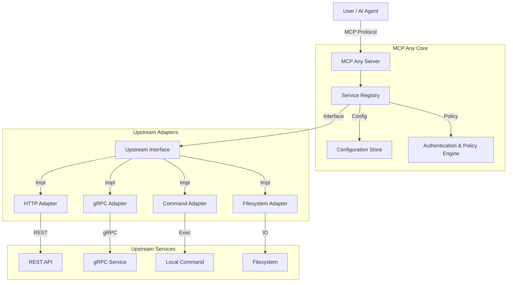

# MCP Any

[](https://github.com/mcpany/core)
[](LICENSE)

## Project Identity

**What is this?**
**MCP Any** is a universal adapter that instantly turns your existing APIs into [Model Context Protocol (MCP)](https://modelcontextprotocol.io/) compliant tools. It acts as a configuration-driven gateway, bridging the gap between your backend services (REST, gRPC, OpenAPI, Command-line) and AI agents.

**Why does it exist?**
Traditional MCP adoption often requires writing a separate server binary for every tool, leading to "binary fatigue" and significant maintenance overhead. MCP Any solves this problem by providing a single, unified server that acts as a gateway to multiple services, defined purely through lightweight configuration files. It unifies your infrastructure into a single, secure, and observable MCP endpoint, allowing you to focus on capabilities rather than plumbing.

## Quick Start

Follow these steps to get up and running with MCP Any immediately.

### Prerequisites
*   [Go 1.23+](https://go.dev/doc/install) (for building from source)
*   `make` (for build automation)
*   [Docker](https://docs.docker.com/get-docker/) (optional, for containerized run)

### Installation & Run

1.  **Clone the repository:**
    ```bash
    git clone https://github.com/mcpany/core.git
    cd core
    ```

2.  **Prepare dependencies:**
    ```bash
    make prepare
    ```

3.  **Build the server:**
    ```bash
    make build
    ```

4.  **Run with an example configuration:**
    ```bash
    ./build/bin/server run --config-path server/examples/popular_services/wttr.in/config.yaml
    ```

### Verify

**Check Health:**
```bash
curl http://localhost:50050/health
```

**Connect an AI Client:**
```bash
gemini mcp add --transport http --trust mcpany http://localhost:50050
```

## Developer Workflow

We adhere to a strict development workflow to ensure code quality and maintainability.

### Testing
Run all unit and integration tests to ensure code correctness.
```bash
make test
```

### Linting
We enforce **100% documentation coverage** and strict style guides.
```bash
make lint
```

### Building
Compile the server binary and UI assets.
```bash
make build
```

## Architecture

**High-Level Overview**
MCP Any utilizes a modular, adapter-based architecture to decouple the MCP protocol from upstream API specifics. Built with Go for performance and concurrency, it serves as a robust middleware between AI clients and your infrastructure.

**Core Components:**
1.  **Core Server**: A high-performance Go runtime that handles the MCP protocol (JSON-RPC) and manages client sessions.
2.  **Service Registry**: Manages the lifecycle of upstream services (dynamic loading, hot-reloading, health checking).
3.  **Upstream Adapters**: Translates MCP requests into protocol-specific calls (HTTP, gRPC, Command, Filesystem).
4.  **Policy Engine & Middleware**: Enforces security (authentication, rate limiting, DLP, audit logging).


```mermaid
graph TD
    User[User / AI Agent] -->|MCP Protocol| Server[MCP Any Server]

    subgraph "MCP Any Core"
        Server --> Registry[Service Registry]
        Registry -->|Config| Config[Configuration Store]
        Registry -->|Policy| Auth[Authentication & Policy Engine]
    end

    subgraph "Upstream Adapters"
        Registry -->|Interface| Upstream[Upstream Interface]
        Upstream -->|Impl| HTTP[HTTP Adapter]
        Upstream -->|Impl| GRPC[gRPC Adapter]
        Upstream -->|Impl| CMD[Command Adapter]
        Upstream -->|Impl| FS[Filesystem Adapter]
    end

    subgraph "Upstream Services"
        HTTP -->|REST| ServiceB[REST API]
        GRPC -->|gRPC| ServiceA[gRPC Service]
        CMD -->|Exec| ServiceD[Local Command]
        FS -->|IO| ServiceE[Filesystem]
    end
```

## Configuration

MCP Any is configured via environment variables and YAML/JSON configuration files. This allows for flexible deployment across different environments.

### Environment Variables

| Variable | Description | Default |
|----------|-------------|---------|
| `MCPANY_MCP_LISTEN_ADDRESS` | MCP server's bind address (host:port) | `50050` |
| `MCPANY_CONFIG_PATH` | Comma-separated paths to config files/dirs | `[]` |
| `MCPANY_METRICS_LISTEN_ADDRESS` | Address to expose Prometheus metrics | Disabled |
| `MCPANY_GRPC_PORT` | Port for the gRPC registration server | Disabled |
| `MCPANY_STDIO` | Enable stdio mode for JSON-RPC communication | `false` |
| `MCPANY_DEBUG` | Enable debug logging | `false` |
| `MCPANY_LOG_LEVEL` | Log level (debug, info, warn, error) | `info` |
| `MCPANY_LOG_FORMAT` | Log format (text, json) | `text` |
| `MCPANY_API_KEY` | Master API key for securing the server | Empty (No Auth) |
| `MCPANY_PROFILES` | Comma-separated list of active profiles | `default` |
| `MCPANY_DB_PATH` | Path to the SQLite database file | `data/mcpany.db` |
| `MCPANY_SHUTDOWN_TIMEOUT` | Graceful shutdown timeout | `5s` |

### Required Secrets

Sensitive information (like upstream API keys) must **never** be hardcoded in configuration files. Instead, use environment variable references.

**Example Config:**
```yaml
upstreamAuth:
  apiKey:
    value: "${OPENAI_API_KEY}" # References env var
```

Ensure `OPENAI_API_KEY` (or your specific secret) is set in the server's environment before starting.

## License

This project is licensed under the terms of the [Apache 2.0 License](LICENSE).
