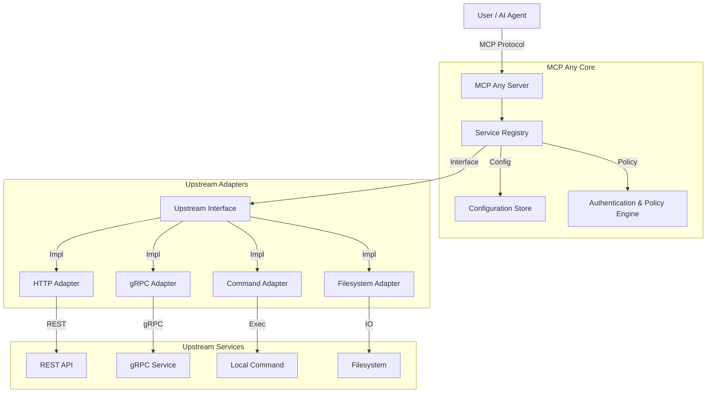

# MCP Any

[](https://github.com/mcpany/core)
[](LICENSE)

## 1. Project Identity

**What is this?**

**MCP Any** is a universal adapter that instantly turns your existing APIs into [Model Context Protocol (MCP)](https://modelcontextprotocol.io/) compliant tools. It acts as a configuration-driven gateway, bridging the gap between your backend services (REST, gRPC, OpenAPI, Command-line) and AI agents.

**Why does it exist?**

Traditional MCP adoption often requires writing a separate server binary for every tool, leading to "binary fatigue" and significant maintenance overhead. MCP Any solves this problem by providing a single, unified server that acts as a gateway to multiple services, defined purely through lightweight configuration files. It unifies your infrastructure into a single, secure, and observable MCP endpoint, allowing you to focus on capabilities rather than plumbing.

## 2. Quick Start

Follow these steps to get up and running immediately.

### Prerequisites

*   [Go 1.23+](https://go.dev/doc/install) (for building from source)
*   `make` (for build automation)
*   [Docker](https://docs.docker.com/get-docker/) (optional, for containerized run)

### Installation & Run

1.  **Clone the repository:**
    ```bash
    git clone https://github.com/mcpany/core.git
    cd core
    ```

2.  **Prepare dependencies:**
    ```bash
    make prepare
    ```
    This installs necessary tools (protoc, linter, hooks) into `build/env/bin`.

3.  **Build the server:**
    ```bash
    make build
    ```
    This compiles the source and places the `server` binary in `build/bin/`.

4.  **Run with an example configuration:**
    ```bash
    ./build/bin/server run --config-path server/config.minimal.yaml
    ```

Once running, verify health at `http://localhost:50050/health`.

## 3. Developer Workflow

We adhere to strict quality standards. Use the following commands during development.

### Testing
Run all unit and integration tests to ensure code correctness.
```bash
make test
```

### Linting
We enforce **100% documentation coverage** and strict style guides.
```bash
make lint
```

### Building
Compile the server binary and UI assets.
```bash
make build
```

### Code Generation
Regenerate Protocol Buffers and other auto-generated files if you modify `.proto` definitions.
```bash
make gen
```

## 4. Architecture

**High-Level Overview**

MCP Any utilizes a modular, adapter-based architecture to decouple the MCP protocol from upstream API specifics. Built with Go for performance and concurrency, it serves as a robust middleware between AI clients and your infrastructure.

**Core Components:**

1.  **Core Server**: A high-performance Go runtime handling the MCP protocol (JSON-RPC) and managing client sessions.
2.  **Service Registry**: The central nervous system that manages the lifecycle of upstream services (dynamic loading, hot-reloading, health checking).
3.  **Upstream Adapters**: Specialized implementations translating MCP requests into protocol-specific calls:
    *   **HTTP**: Proxies requests to REST/JSON APIs with powerful parameter mapping.
    *   **gRPC**: Uses reflection to dynamically discover and invoke methods.
    *   **Command**: Safely executes local CLI tools or scripts.
    *   **Filesystem**: Provides secure access to local or remote filesystems.
4.  **Policy Engine & Middleware**: A security layer enforcing authentication, rate limiting, DLP, and audit logging.


```mermaid
graph TD
    User[User / AI Agent] -->|MCP Protocol| Server[MCP Any Server]

    subgraph "MCP Any Core"
        Server --> Registry[Service Registry]
        Registry -->|Config| Config[Configuration Store]
        Registry -->|Policy| Auth[Authentication & Policy Engine]
    end

    subgraph "Upstream Adapters"
        Registry -->|Interface| Upstream[Upstream Interface]
        Upstream -->|Impl| HTTP[HTTP Adapter]
        Upstream -->|Impl| GRPC[gRPC Adapter]
        Upstream -->|Impl| CMD[Command Adapter]
        Upstream -->|Impl| FS[Filesystem Adapter]
    end

    subgraph "Upstream Services"
        HTTP -->|REST| ServiceB[REST API]
        GRPC -->|gRPC| ServiceA[gRPC Service]
        CMD -->|Exec| ServiceD[Local Command]
        FS -->|IO| ServiceE[Filesystem]
    end
```

**Request Flow:**

1.  **Client Request:** An AI agent sends a JSON-RPC request to the Core Server.
2.  **Authentication & Policy:** The server validates the request (API Key, DLP rules).
3.  **Routing:** The Service Registry resolves the tool to an Upstream Adapter.
4.  **Adaptation:** The adapter transforms the MCP request into the target protocol.
5.  **Execution:** The upstream service is invoked.
6.  **Response Transformation:** The response is transformed back to MCP format and returned.

## 5. Configuration

Configuration is managed via environment variables and YAML/JSON files.

### Key Environment Variables

| Variable | Description | Default |
|----------|-------------|---------|
| `MCPANY_MCP_LISTEN_ADDRESS` | MCP server bind address | `50050` |
| `MCPANY_CONFIG_PATH` | Path to config files | `[]` |
| `MCPANY_LOG_LEVEL` | Log level (debug, info, warn, error) | `info` |

See `server/config.minimal.yaml` for a complete example.

## License

Apache 2.0 License - see [LICENSE](LICENSE) for details.
