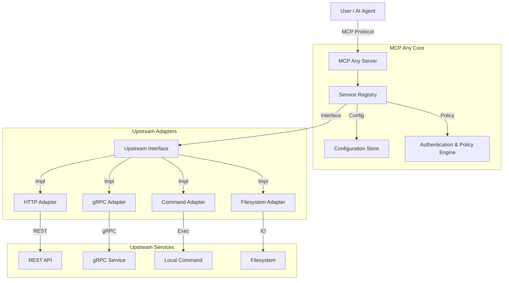

# MCP Any

[](https://github.com/mcpany/core)
[](LICENSE)

## 1. Elevator Pitch

**What is this project?**

**MCP Any** is a universal adapter that instantly turns your existing APIs into [Model Context Protocol (MCP)](https://modelcontextprotocol.io/) compliant tools. It acts as a configuration-driven gateway, bridging the gap between your backend services (REST, gRPC, OpenAPI, Command-line) and AI agents.

**Why does it exist?**

Traditional MCP adoption often requires writing a separate server binary for every tool, leading to "binary fatigue" and significant maintenance overhead. MCP Any solves this problem by providing a single, unified server that acts as a gateway to multiple services, defined purely through lightweight configuration files. It unifies your infrastructure into a single, secure, and observable MCP endpoint, allowing you to focus on capabilities rather than plumbing.

## 2. Architecture

**High-Level Overview**

MCP Any utilizes a modular, adapter-based architecture to decouple the MCP protocol from upstream API specifics. Built with Go for performance and concurrency, it serves as a robust middleware between AI clients and your infrastructure.

**Core Components:**

1.  **Core Server**: A high-performance Go runtime that handles the MCP protocol (JSON-RPC) and manages client sessions.
2.  **Service Registry**: The central nervous system of MCP Any. It implements the `ServiceRegistryInterface` to manage the lifecycle of upstream services. It handles dynamic loading, hot-reloading, and health checking of services defined in configuration.
3.  **Upstream Adapters**: Specialized implementations of the `Upstream` interface that translate MCP requests into protocol-specific calls:
    *   **HTTP**: Proxies requests to REST/JSON APIs with powerful parameter mapping and transformation templates.
    *   **gRPC**: Uses reflection to dynamically discover and invoke methods on gRPC services without generating code.
    *   **Command**: Safely executes local CLI tools or scripts in a controlled environment.
    *   **Filesystem**: Provides secure access to local or remote (S3, GCS) filesystems.
4.  **Policy Engine & Middleware**: A security layer that enforces authentication, rate limiting, DLP (Data Loss Prevention), and audit logging.


```mermaid
graph TD
    User[User / AI Agent] -->|MCP Protocol| Server[MCP Any Server]

    subgraph "MCP Any Core"
        Server --> Registry[Service Registry]
        Registry -->|Config| Config[Configuration Store]
        Registry -->|Policy| Auth[Authentication & Policy Engine]
    end

    subgraph "Upstream Adapters"
        Registry -->|Interface| Upstream[Upstream Interface]
        Upstream -->|Impl| HTTP[HTTP Adapter]
        Upstream -->|Impl| GRPC[gRPC Adapter]
        Upstream -->|Impl| CMD[Command Adapter]
        Upstream -->|Impl| FS[Filesystem Adapter]
    end

    subgraph "Upstream Services"
        HTTP -->|REST| ServiceB[REST API]
        GRPC -->|gRPC| ServiceA[gRPC Service]
        CMD -->|Exec| ServiceD[Local Command]
        FS -->|IO| ServiceE[Filesystem]
    end
```

**Request Flow:**

1.  **Client Request:** An AI agent (e.g., Claude) sends a JSON-RPC request (e.g., `tools/call`) to the MCP Any Core Server.
2.  **Authentication:** The server verifies the request's API Key or Session Token.
3.  **Policy Check:** The Policy Engine evaluates the request against active Profiles and DLP rules. Blocked requests are rejected immediately.
4.  **Routing:** The Service Registry resolves the requested tool to a specific Upstream Adapter.
5.  **Adaptation:** The Upstream Adapter transforms the MCP request into the target protocol (e.g., constructs an HTTP request or gRPC message).
6.  **Execution:** The adapter communicates with the upstream service.
7.  **Response Transformation:** The upstream response is received, transformed back into MCP format (e.g., `CallToolResult`), and returned to the client.

**Design Patterns:**

*   **Adapter Pattern**: The `Upstream` interface abstracts away the complexity of different backend protocols, providing a uniform interface for the Core Server.
*   **Configuration as Code**: Services and capabilities are defined declaratively in YAML/JSON, enabling version control and CI/CD for your agent capabilities.
*   **Gateway/Sidecar**: Deployable as a central gateway or a Kubernetes sidecar for maximum flexibility.

## 3. Getting Started

Follow these steps to get up and running with MCP Any immediately.

### Prerequisites

*   [Go 1.23+](https://go.dev/doc/install) (for building from source)
*   `make` (for build automation)
*   [Docker](https://docs.docker.com/get-docker/) (optional, for containerized run)

### Installation

1.  **Clone the repository:**
    ```bash
    git clone https://github.com/mcpany/core.git
    cd core
    ```

2.  **Prepare dependencies:**
    ```bash
    make prepare
    ```
    This command installs necessary tools (protoc, linter, hooks) into `build/env/bin`.

3.  **Build the server:**
    ```bash
    make build
    ```
    This compiles the source and places the `server` binary in `build/bin/`.

4.  **Run with an example configuration:**
    ```bash
    ./build/bin/server run --config-path server/config.minimal.yaml
    ```

### Hello World

Once the server is running, you can verify its health and connect a client.

**Verify Health:**
```bash
curl http://localhost:50050/health
```

**Connect an AI Client:**
To connect an AI client (like Claude Desktop or Gemini CLI):
```bash
# Example assuming you have a compatible client
gemini mcp add --transport http --trust mcpany http://localhost:50050
```

**Try it out:**
Ask your agent:
> "What is the weather?"

The agent will use the `get_weather` tool exposed by MCP Any (configured in `config.minimal.yaml`) to fetch the simulated data.

## 4. Development

We adhere to a strict development workflow to ensure code quality and maintainability.

### Testing
Run all unit and integration tests to ensure code correctness. We practice proactive testing and continuous integration.
```bash
make test
```

### Linting
We enforce **100% documentation coverage** and strict style guides.
*   **Go:** We use `golangci-lint` with `revive` and `check-go-doc` to enforce GoDoc standards.
*   **TypeScript:** We use `eslint` and `check-ts-doc` to ensure all exported components, hooks, and types have high-quality TSDoc comments.
*   **Protocol:** We check for breaking changes in `.proto` files.

To run linters:
```bash
make lint
```

### Building
Compile the server binary and UI assets.
```bash
make build
```

### Code Generation
Regenerate Protocol Buffers and other auto-generated files if you modify `.proto` definitions.
```bash
make gen
```

## 5. Configuration

MCP Any is configured via environment variables and YAML/JSON configuration files. This allows for flexible deployment across different environments.

### Environment Variables

| Variable | Description | Default |
|----------|-------------|---------|
| `MCPANY_MCP_LISTEN_ADDRESS` | MCP server's bind address (host:port) | `50050` |
| `MCPANY_CONFIG_PATH` | Comma-separated paths to config files/dirs | `[]` |
| `MCPANY_METRICS_LISTEN_ADDRESS` | Address to expose Prometheus metrics | Disabled |
| `MCPANY_GRPC_PORT` | Port for the gRPC registration server | Disabled |
| `MCPANY_STDIO` | Enable stdio mode for JSON-RPC communication | `false` |
| `MCPANY_DEBUG` | Enable debug logging | `false` |
| `MCPANY_LOG_LEVEL` | Log level (debug, info, warn, error) | `info` |
| `MCPANY_LOG_FORMAT` | Log format (text, json) | `text` |
| `MCPANY_API_KEY` | Master API key for securing the server | Empty (No Auth) |
| `MCPANY_PROFILES` | Comma-separated list of active profiles | `default` |
| `MCPANY_DB_PATH` | Path to the SQLite database file | `data/mcpany.db` |
| `MCPANY_DB_DSN` | DSN for the database connection (if using non-SQLite) | Empty |
| `MCPANY_DB_DRIVER` | Database driver (e.g., `sqlite3`, `postgres`) | `sqlite3` |
| `MCPANY_SHUTDOWN_TIMEOUT` | Graceful shutdown timeout | `5s` |
| `MCPANY_ALLOWED_ENV` | Comma-separated list of allowed env vars for config expansion | Empty |
| `MCPANY_STRICT_ENV_MODE` | Block all env vars unless whitelisted | `false` |

### Required Secrets

Sensitive information (like upstream API keys) must **never** be hardcoded in configuration files. Instead, use environment variable references.

**Example Config:**
```yaml
upstreamAuth:
  apiKey:
    value: "${OPENAI_API_KEY}" # References env var
```

Ensure `OPENAI_API_KEY` (or your specific secret) is set in the server's environment before starting.

## License

This project is licensed under the terms of the [Apache 2.0 License](LICENSE).
