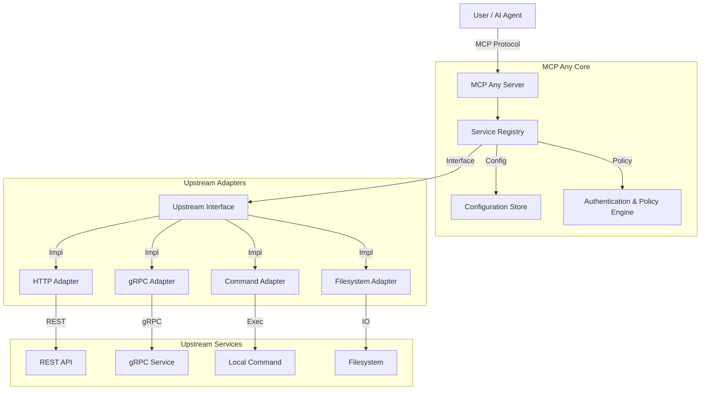

# MCP Any

[](https://github.com/mcpany/core)
[](LICENSE)

## 1. Project Identity

**What is this project?**

**MCP Any** is a universal adapter that instantly turns your existing APIs into [Model Context Protocol (MCP)](https://modelcontextprotocol.io/) compliant tools. It acts as a configuration-driven gateway, bridging the gap between your backend services (REST, gRPC, OpenAPI, Command-line) and AI agents.

**Why does it exist?**

Traditional MCP adoption often requires writing a separate server binary for every tool, leading to "binary fatigue" and significant maintenance overhead. MCP Any solves this problem by providing a single, unified server that acts as a gateway to multiple services, defined purely through lightweight configuration files. It unifies your infrastructure into a single, secure, and observable MCP endpoint, allowing you to focus on capabilities rather than plumbing.

## 2. Quick Start

Follow these steps to get up and running with MCP Any immediately.

### Prerequisites

*   [Go 1.23+](https://go.dev/doc/install) (for building from source)
*   `make` (for build automation)
*   [Docker](https://docs.docker.com/get-docker/) (optional, for containerized run)

### Installation & Run

1.  **Clone the repository:**
    ```bash
    git clone https://github.com/mcpany/core.git
    cd core
    ```

2.  **Prepare dependencies:**
    ```bash
    make prepare
    ```

3.  **Build the server:**
    ```bash
    make build
    ```

4.  **Run with an example configuration:**
    ```bash
    ./build/bin/server run --config-path server/examples/popular_services/wttr.in/config.yaml
    ```

Once running, verify health:
```bash
curl http://localhost:50050/health
```

## 3. Developer Workflow

We adhere to a strict development workflow to ensure code quality and maintainability.

### Testing
Run all unit and integration tests to ensure code correctness. We practice proactive testing.
```bash
make test
```

### Linting
We enforce **100% documentation coverage** and strict style guides.
*   **Go:** We use `golangci-lint` with `revive` and `check-go-doc` to enforce GoDoc standards.
*   **Protocol:** We check for breaking changes in `.proto` files.

To run linters:
```bash
make lint
```

### Building
Compile the server binary and UI assets.
```bash
make build
```

### Code Generation
Regenerate Protocol Buffers and other auto-generated files if you modify `.proto` definitions.
```bash
make gen
```

## 4. Architecture

**High-Level Overview**

MCP Any utilizes a modular, adapter-based architecture to decouple the MCP protocol from upstream API specifics. Built with Go for performance and concurrency, it serves as a robust middleware between AI clients and your infrastructure.

**Core Components:**

1.  **Core Server**: A high-performance Go runtime that handles the MCP protocol (JSON-RPC) and manages client sessions.
2.  **Service Registry**: The central nervous system of MCP Any. It implements the `ServiceRegistryInterface` to manage the lifecycle of upstream services. It handles dynamic loading, hot-reloading, and health checking of services defined in configuration.
3.  **Upstream Adapters**: Specialized implementations of the `Upstream` interface that translate MCP requests into protocol-specific calls:
    *   **HTTP**: Proxies requests to REST/JSON APIs with powerful parameter mapping and transformation templates.
    *   **gRPC**: Uses reflection to dynamically discover and invoke methods on gRPC services without generating code.
    *   **Command**: Safely executes local CLI tools or scripts in a controlled environment.
    *   **Filesystem**: Provides secure access to local or remote (S3, GCS) filesystems.
4.  **Policy Engine & Middleware**: A security layer that enforces authentication, rate limiting, DLP (Data Loss Prevention), and audit logging.


```mermaid
graph TD
    User[User / AI Agent] -->|MCP Protocol| Server[MCP Any Server]

    subgraph "MCP Any Core"
        Server --> Registry[Service Registry]
        Registry -->|Config| Config[Configuration Store]
        Registry -->|Policy| Auth[Authentication & Policy Engine]
    end

    subgraph "Upstream Adapters"
        Registry -->|Interface| Upstream[Upstream Interface]
        Upstream -->|Impl| HTTP[HTTP Adapter]
        Upstream -->|Impl| GRPC[gRPC Adapter]
        Upstream -->|Impl| CMD[Command Adapter]
        Upstream -->|Impl| FS[Filesystem Adapter]
    end

    subgraph "Upstream Services"
        HTTP -->|REST| ServiceB[REST API]
        GRPC -->|gRPC| ServiceA[gRPC Service]
        CMD -->|Exec| ServiceD[Local Command]
        FS -->|IO| ServiceE[Filesystem]
    end
```

**Design Patterns:**

*   **Adapter Pattern**: The `Upstream` interface abstracts away the complexity of different backend protocols, providing a uniform interface for the Core Server.
*   **Configuration as Code**: Services and capabilities are defined declaratively in YAML/JSON, enabling version control and CI/CD for your agent capabilities.
*   **Gateway/Sidecar**: Deployable as a central gateway or a Kubernetes sidecar for maximum flexibility.
