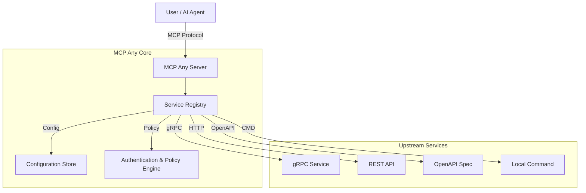

# MCP Any

[](https://github.com/mcpany/core)

## 1. Project Identity

**What is this?**
**MCP Any** is a universal adapter that instantly turns your existing APIs into [Model Context Protocol (MCP)](https://modelcontextprotocol.io/) compliant tools. It acts as a configuration-driven gateway, bridging the gap between your backend services (REST, gRPC, OpenAPI, Command-line) and AI agents.

**Why does it exist?**
Traditional MCP adoption often requires writing a separate server binary for every tool, leading to "binary fatigue" and maintenance overhead. MCP Any solves this by providing a single, unified server that acts as a gateway to multiple services, defined purely through lightweight configuration files. It unifies your infrastructure into a single, secure, and observable MCP endpoint.

## 2. Quick Start

Follow these exact commands to clone, install dependencies, and run the app.

### Prerequisites
*   [Go 1.23+](https://go.dev/doc/install)
*   `make`

### Installation & Run

1.  **Clone the repository:**
    ```bash
    git clone https://github.com/mcpany/core.git
    cd core
    ```

2.  **Install dependencies and prepare environment:**
    ```bash
    make prepare
    ```

3.  **Build the server:**
    ```bash
    make build
    ```

4.  **Run with an example configuration:**
    ```bash
    ./build/bin/server run --config-path server/examples/popular_services/wttr.in/config.yaml
    ```

5.  **Verify it works:**
    ```bash
    curl http://localhost:50050/health
    ```

## 3. Developer Workflow

We follow a strict development workflow to ensure quality.

### Testing
Run all unit and integration tests to ensure code correctness.
```bash
make test
```

### Linting
Ensure code adheres to our style guides and documentation standards.
```bash
make lint
```

### Building
Compile the server binary and UI assets.
```bash
make build
```

### Code Generation
Regenerate Protocol Buffers and other auto-generated files if you modify `.proto` definitions.
```bash
make gen
```

## 4. Architecture

**High-Level Summary**

MCP Any uses a modular, adapter-based architecture to decouple the MCP protocol from upstream API specifics. It is built with Go for performance and concurrency.

1.  **Core Server**: A Go-based runtime that handles the MCP protocol (JSON-RPC) and manages client sessions.
2.  **Service Registry**: Dynamically loads tool definitions from configuration files (local or remote/DB).
3.  **Adapters**: Specialized modules that translate MCP tool execution requests into upstream calls (gRPC, HTTP, OpenAPI, CLI).
4.  **Policy Engine & Middleware**: Enforces authentication, rate limiting, DLP (Data Loss Prevention), and audit logging.


```mermaid
graph TD
    User[User / AI Agent] -->|MCP Protocol| Server[MCP Any Server]

    subgraph "MCP Any Core"
        Server --> Registry[Service Registry]
        Registry -->|Config| Config[Configuration Store]
        Registry -->|Policy| Auth[Authentication & Policy Engine]
    end

    subgraph "Upstream Services"
        Registry -->|gRPC| ServiceA[gRPC Service]
        Registry -->|HTTP| ServiceB[REST API]
        Registry -->|OpenAPI| ServiceC[OpenAPI Spec]
        Registry -->|CMD| ServiceD[Local Command]
    end
```

## Configuration

MCP Any is configured via environment variables and YAML/JSON configuration files.

| Variable | Description | Default |
|----------|-------------|---------|
| `MCPANY_MCP_LISTEN_ADDRESS` | MCP server's bind address (host:port) | `50050` |
| `MCPANY_CONFIG_PATH` | Comma-separated paths to config files/dirs | `[]` |
| `MCPANY_LOG_LEVEL` | Log level (debug, info, warn, error) | `info` |

See `server/examples/` for more configuration examples.

## License
Apache 2.0 License.
