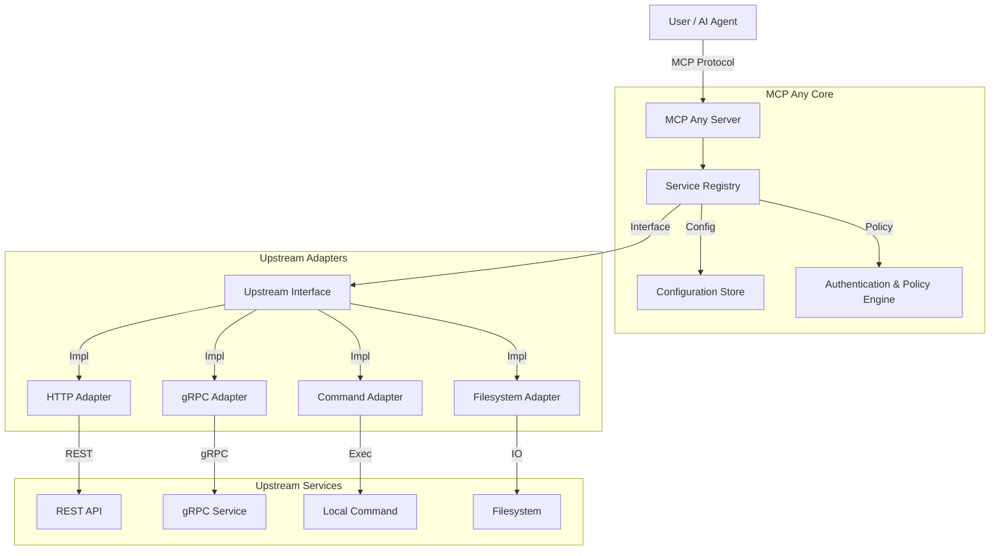

# MCP Any

[](https://github.com/mcpany/core)
[](LICENSE)
[](https://github.com/mcpany/core/actions)

## 1. Elevator Pitch

**What is MCP Any?**

**MCP Any** is the universal adapter for the AI era. It instantly transforms your existing infrastructure—REST APIs, gRPC services, databases, and CLI tools—into [Model Context Protocol (MCP)](https://modelcontextprotocol.io/) compliant tools usable by AI agents like Claude, Gemini, and others.

**Why does it exist?**

Connecting AI to real-world systems shouldn't require rewriting them. Traditional MCP adoption forces you to build and maintain separate servers for every tool, leading to "binary fatigue" and operational nightmares. MCP Any solves this by acting as a single, configuration-driven gateway. It unifies your entire backend into a secure, observable, and hot-reloadable MCP endpoint, letting you focus on **capabilities**, not plumbing.

## 2. Key Features

*   **Universal Connectivity**: Connect to anything. Native adapters for HTTP/REST, gRPC, Command-line, and Filesystems.
*   **Zero-Code Adaptation**: Turn an OpenAPI spec or a Proto file into an AI tool with just a few lines of YAML.
*   **Enterprise Security**: Built-in Policy Engine for granular access control, rate limiting, and Data Loss Prevention (DLP).
*   **Dynamic Discovery**: Auto-detects changes in upstream services and hot-reloads capabilities without restarting.
*   **Multi-Tenancy**: Support multiple users and profiles, isolating sensitive tools and data.
*   **Observability**: Integrated audit logging and metrics to track exactly what AI agents are doing with your systems.

## 3. Architecture

**High-Level Overview**

MCP Any is built on a modular, adapter-based architecture designed for performance and extensibility. Written in Go, it serves as a high-concurrency bridge between the MCP JSON-RPC protocol and your diverse upstream services.


```mermaid
graph TD
    User[User / AI Agent] -->|MCP Protocol| Server[MCP Any Server]

    subgraph "MCP Any Core"
        Server --> Registry[Service Registry]
        Registry -->|Config| Config[Configuration Store]
        Registry -->|Policy| Auth[Authentication & Policy Engine]
    end

    subgraph "Upstream Adapters"
        Registry -->|Interface| Upstream[Upstream Interface]
        Upstream -->|Impl| HTTP[HTTP Adapter]
        Upstream -->|Impl| GRPC[gRPC Adapter]
        Upstream -->|Impl| CMD[Command Adapter]
        Upstream -->|Impl| FS[Filesystem Adapter]
    end

    subgraph "Upstream Services"
        HTTP -->|REST| ServiceB[REST API]
        GRPC -->|gRPC| ServiceA[gRPC Service]
        CMD -->|Exec| ServiceD[Local Command]
        FS -->|IO| ServiceE[Filesystem]
    end
```

**Core Components:**

1.  **Core Server**: Handles the MCP protocol lifecycle, connection management, and session state.
2.  **Service Registry**: The central nervous system that manages the lifecycle of upstream services, ensuring tools are always up-to-date.
3.  **Upstream Adapters**: Protocol-specific translators that convert abstract tool calls into concrete network requests (e.g., gRPC Invoke, HTTP POST).
4.  **Policy Engine**: A security layer that intercepts every call to enforce RBAC, rate limits, and content filtering.

**Request Flow:**

1.  **Request**: AI Agent sends an MCP `tools/call` request.
2.  **Auth & Policy**: Request is authenticated and checked against active policies.
3.  **Routing**: The Service Registry directs the call to the correct Upstream Adapter.
4.  **Adaptation**: The Adapter transforms the request (e.g. JSON -> Protobuf).
5.  **Execution**: The upstream service is invoked.
6.  **Response**: The result is transformed back to MCP format and returned to the agent.

## 4. Getting Started

Get up and running with a fully functional MCP gateway in minutes.

### Prerequisites

*   [Go 1.23+](https://go.dev/doc/install)
*   `make`
*   [Docker](https://docs.docker.com/get-docker/) (optional)

### Installation

1.  **Clone the repository:**
    ```bash
    git clone https://github.com/mcpany/core.git
    cd core
    ```

2.  **Prepare dependencies:**
    ```bash
    make prepare
    ```
    *Installs necessary build tools and linters into `build/env/bin`.*

3.  **Build the server:**
    ```bash
    make build
    ```
    *Compiles the server binary to `build/bin/server`.*

4.  **Run with example configuration:**
    ```bash
    ./build/bin/server run --config-path server/config.minimal.yaml
    ```

### Hello World

Once running, verify the server is healthy and ready to serve tools.

**Check Health:**
```bash
curl http://localhost:50050/health
```

**Connect an AI Client:**
Use an MCP-compliant client (like Claude Desktop or a CLI tool) to connect:
```bash
# Example using a generic MCP CLI
mcp-cli connect http://localhost:50050
```

**Test a Tool:**
Ask your agent: *"What is the weather?"*. The server will route this request to the configured weather service in `config.minimal.yaml`.

## 5. Development

We adhere to a strict **"Gold Standard"** development workflow to ensure reliability and maintainability.

### Testing
Run the comprehensive test suite to verify logic and catch regressions.
```bash
make test
```

### Linting
We enforce 100% documentation coverage and strict style guides. Code without docs is broken code.
```bash
make lint
```

### Building
Compile the project artifacts.
```bash
make build
```

### Code Generation
Regenerate Protocol Buffers and boilerplate if schema changes.
```bash
make gen
```

## 6. Configuration

MCP Any is configured via **Environment Variables** (for infrastructure settings) and **YAML/JSON files** (for capabilities).

### Environment Variables

| Variable | Description | Default |
|----------|-------------|---------|
| `MCPANY_MCP_LISTEN_ADDRESS` | MCP server bind address | `50050` |
| `MCPANY_CONFIG_PATH` | Path to config files/dirs | `[]` |
| `MCPANY_API_KEY` | Master API Key | Empty |
| `MCPANY_LOG_LEVEL` | Log verbosity (debug, info, warn, error) | `info` |
| `MCPANY_DB_PATH` | SQLite database path | `data/mcpany.db` |
| `MCPANY_DB_DSN` | Database connection string (Postgres) | Empty |
| `MCPANY_DB_DRIVER` | Database driver (`sqlite3`, `postgres`) | `sqlite3` |

### Required Secrets

**Security First:** Never hardcode secrets in configuration files. Use environment variable substitution.

**Example `config.yaml`:**
```yaml
upstreamAuth:
  apiKey:
    value: "${OPENAI_API_KEY}" # Injected from env
```

Ensure `OPENAI_API_KEY` is set in the server's environment before starting.

## License

This project is licensed under the [Apache 2.0 License](LICENSE).
