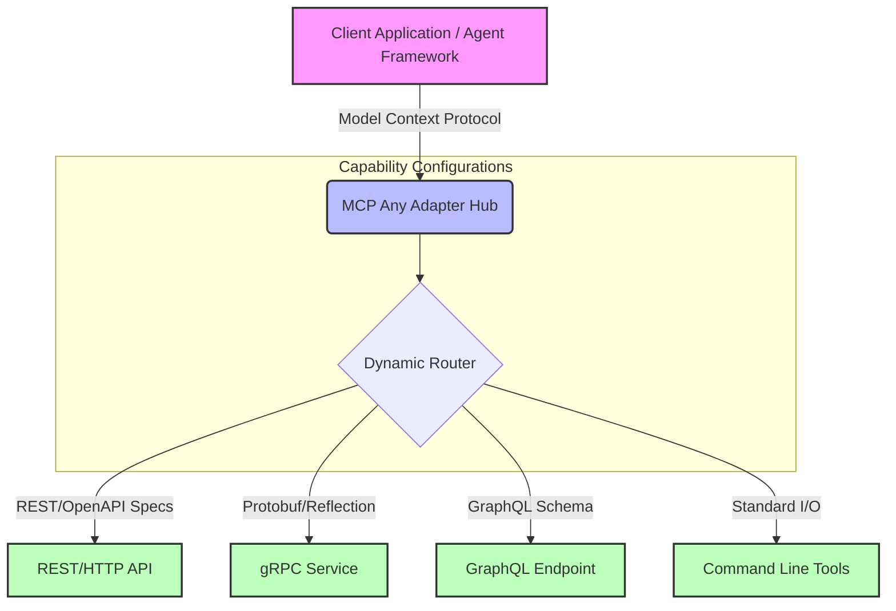

# MCP Any: The Universal Adapter for AI Agents

## Elevator Pitch
MCP Any is the Universal Adapter for AI agents, acting as the ultimate bridge between diverse, unstandardized APIs and the autonomous systems that need to consume them. By providing a single, configuration-driven binary that translates REST, gRPC, GraphQL, and CLI tools into standardized Model Context Protocol (MCP) capabilities, it eliminates the need for developers to write boilerplate integration code. This allows teams to safely and rapidly expose enterprise capabilities to AI without modifying existing infrastructure.

## Architecture
MCP Any is designed around a robust "Configuration over Code" paradigm. Rather than compiling custom adapters for each new service, developers define their API surfaces using lightweight YAML/JSON configurations. At its core, the dynamic router reads these definitions at runtime and handles bidirectional translation between the Model Context Protocol (MCP) and the underlying protocols.

Key Design Patterns & Features include:
- **Dynamic Tool Registration**: Capabilities can be hot-reloaded and modified purely via configuration.
- **Safety Policies**: Built-in strict egress controls, safety engines, and validation layers restrict arbitrary code execution and contain side-effects.
- **Upstream Authentication**: Out-of-the-box identity federation supports mTLS, API keys, Bearer tokens, and OAuth2, shielding the AI from raw credentials.
- **Multi-Tenant Isolation**: Safe-by-default execution spaces maintain boundary domains between differing agent systems through profiles.

### High-Level Flow

```mermaid
graph TD
    classDef agent fill:#f9f,stroke:#333,stroke-width:2px;
    classDef core fill:#bbf,stroke:#333,stroke-width:2px;
    classDef target fill:#bfb,stroke:#333,stroke-width:2px;

    A[Client Application / Agent Framework]:::agent -->|Model Context Protocol| B(MCP Any Adapter Hub):::core

    subgraph Config [Capability Configurations]
        B --> C{Dynamic Router}
    end

    C -->|REST/OpenAPI Specs| D[REST/HTTP API]:::target
    C -->|Protobuf/Reflection| E[gRPC Service]:::target
    C -->|GraphQL Schema| F[GraphQL Endpoint]:::target
    C -->|Standard I/O| G[Command Line Tools]:::target
```

## Getting Started
Getting an instance of MCP Any running is straightforward. Here are the steps to initialize a basic server:

1. **Clone the repository:**
   ```bash
   git clone https://github.com/mcpany/core.git
   cd core
   ```

2. **Install requirements:**
   Ensure you have `bazelisk` and `make` installed and available in your system's `PATH`.

3. **Run the Hello World example:**
   Start the adapter using the provided test configuration:
   ```bash
   bazelisk run //server/cmd/mcpany -- -config examples/hello_world.yaml
   ```

## Development
Maintaining a clean and tested repository is critical. We use `make` for common workflow tasks and `bazelisk` for deterministic builds.

- To verify formatting and ensure all codebase documentation adheres to the "Gold Standard" conventions, run the linter:
  ```bash
  make lint
  ```

- To run the test suite and ensure no regressions or logic breaks have occurred:
  ```bash
  make test
  ```

- To build the main binary:
  ```bash
  bazelisk build //server/cmd/mcpany
  ```

## Configuration
MCP Any secures its environment and adjusts its behavior using environment variables and configuration files. While specific setups vary, the following variables are core to the runtime:

- `MCPANY_CONFIG_PATH`: The absolute or relative path to the YAML/JSON service definitions (e.g. `/etc/mcpany/config.yaml`).
- `MCPANY_LOG_LEVEL`: Adjusts the verbosity of application logging. Valid options are `debug`, `info`, `warn`, and `error` (Defaults to `info`).
- `MCPANY_ALLOW_LOOPBACK_RESOURCES`: Controls whether loopback resources are permitted. Set to `true` to enable (Defaults to `false`).
