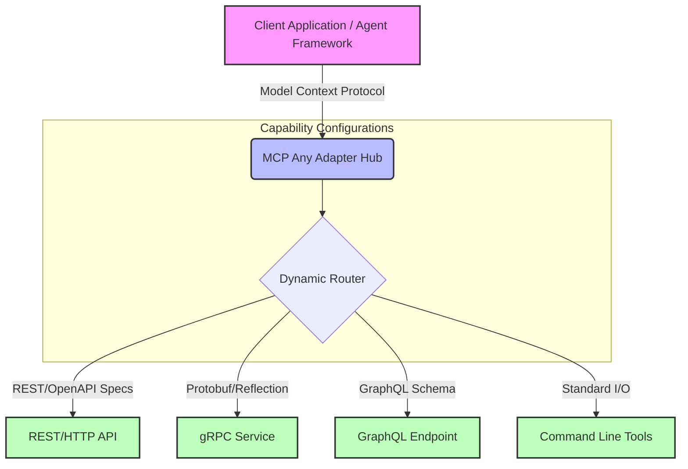

# MCP Any

## Project Identity
**What is this?** MCP Any is the Universal Adapter for AI agents.
**Why does it exist?** It empowers developers to build secure, capability-enabled APIs (REST, gRPC, GraphQL, Command-line) through lightweight YAML/JSON configurations, serving as an ultimate universal bridge and eliminating the need to write custom boilerplate adapters. It acts as the backbone of interoperable autonomous systems.

## Quick Start
Follow these step-by-step instructions to get a "Hello World" instance running locally:

1. **Clone the repository:**
   ```bash
   git clone https://github.com/mcpany/core.git
   cd core
   ```

2. **Ensure dependencies:**
   Make sure you have `bazelisk` and `make` installed and available in your `PATH`.

3. **Run a Hello World example:**
   ```bash
   bazelisk run //server/cmd/mcpany -- -config examples/hello_world.yaml
   ```

## Developer Workflow
We use `make` and `bazelisk` for our development workflow. Maintaining a clean and tested repository is critical to the "Gold Standard".

```bash
# Run the test suite to ensure no code logic breaks
make test

# Run the linter to verify formatting and documentation conventions
make lint

# Build the main binary
bazelisk build //server/cmd/mcpany
```

## Architecture
MCP Any relies on a "Configuration over Code" pattern. Users deploy a single binary which reads dynamically loaded capability definitions. The architecture supports gRPC, OpenAPI, HTTP, GraphQL, and CLI tools seamlessly without touching the underlying source code.

**Key Design Patterns & Features:**
- **Dynamic Tool Registration**: Add and modify capabilities purely via configuration files at runtime.
- **Safety Policies**: Robust constraint engines and safety layers designed to restrict arbitrary code execution and contain side effects safely.
- **Upstream Authentication**: Out-of-the-box identity federation with various standard identity providers.
- **Multi-Tenant Isolation**: Safe-by-default execution spaces that maintain boundary domains between differing agent systems.

### High-Level Flow

```mermaid
graph TD
    classDef agent fill:#f9f,stroke:#333,stroke-width:2px;
    classDef core fill:#bbf,stroke:#333,stroke-width:2px;
    classDef target fill:#bfb,stroke:#333,stroke-width:2px;

    A[Client Application / Agent Framework]:::agent -->|Model Context Protocol| B(MCP Any Adapter Hub):::core

    subgraph Config [Capability Configurations]
        B --> C{Dynamic Router}
    end

    C -->|REST/OpenAPI Specs| D[REST/HTTP API]:::target
    C -->|Protobuf/Reflection| E[gRPC Service]:::target
    C -->|GraphQL Schema| F[GraphQL Endpoint]:::target
    C -->|Standard I/O| G[Command Line Tools]:::target
```

## Configuration
MCP Any uses environment variables and secrets to configure the runtime environment safely. Required configurations vary based on deployment scenarios, but here are the core variables:

- `MCPANY_ALLOW_LOOPBACK_RESOURCES`: Set to `true` to allow loopback resources. (Default: `false`)
- `MCPANY_CONFIG_PATH`: Path to the YAML/JSON definitions. (e.g. `/etc/mcpany/config.yaml`)
- `MCPANY_LOG_LEVEL`: Adjust the verbosity of application logging. Options: `debug`, `info`, `warn`, `error`. (Default: `info`)
