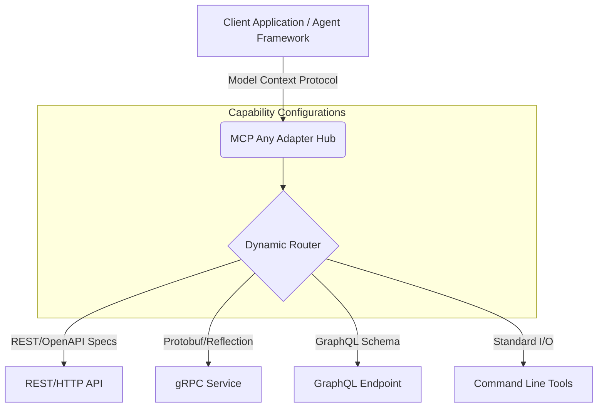

# MCP Any - The Universal Adapter for AI Agents

## Elevator Pitch
**What is this project and why does it exist?**
MCP Any is the ultimate Universal Adapter for AI agents. It exists to solve the "adapter fatigue" problem in the AI ecosystem. Instead of writing custom boilerplate code to connect AI agents to every new tool or service, developers can use MCP Any to build secure, capability-enabled APIs (REST, gRPC, GraphQL, Command-line) through lightweight YAML/JSON configurations. It acts as the backbone of interoperable autonomous systems, eliminating the need for custom coding.

## Architecture
MCP Any relies on a "Configuration over Code" pattern. Users deploy a single binary which reads dynamically loaded capability definitions.

**Stack and Design Patterns:**
- **Dynamic Tool Registration**: Add and modify capabilities purely via configuration files at runtime without rebuilding the server.
- **Safety Policies**: Robust constraint engines and safety layers designed to restrict arbitrary code execution and contain side effects securely.
- **Upstream Authentication**: Out-of-the-box identity federation with various standard identity providers.
- **Multi-Tenant Isolation**: Safe-by-default execution spaces that maintain clear boundary domains between differing agent systems.

### High-Level Flow

```mermaid
graph TD
    A[Client Application / Agent Framework] -->|Model Context Protocol| B(MCP Any Adapter Hub)
    subgraph Config [Capability Configurations]
        B --> C{Dynamic Router}
    end
    C -->|REST/OpenAPI Specs| D[REST/HTTP API]
    C -->|Protobuf/Reflection| E[gRPC Service]
    C -->|GraphQL Schema| F[GraphQL Endpoint]
    C -->|Standard I/O| G[Command Line Tools]
```

## Getting Started
Follow these step-by-step instructions from `git clone` to a `Hello World` execution.

1. **Clone the repository:**
   ```bash
   git clone https://github.com/mcpany/core.git
   cd core
   ```

2. **Ensure dependencies are installed:**
   Ensure `bazelisk` and `make` are installed and available in your `PATH`. For UI components, ensure `node` and `npm` are available.

3. **Run a Hello World example:**
   ```bash
   bazelisk run //server/cmd/mcpany -- -config examples/hello_world.yaml
   ```
   This will start the server and load the basic capabilities.

## Development
Maintaining a clean and tested repository is critical to our "Gold Standard". Here is how to run the core development tasks:

```bash
# Run the test suite to ensure no code logic breaks
make test

# Run the linter to verify formatting and documentation conventions
make lint

# Build the main binary
bazelisk build //server/cmd/mcpany
```

## Configuration
MCP Any uses environment variables and secrets to configure the runtime environment safely.

**Required Secrets and Environment Variables:**
- `MCPANY_ALLOW_LOOPBACK_RESOURCES`: Set to `true` to allow loopback resources. (Default: `false`)
- `MCPANY_CONFIG_PATH`: Absolute path to the YAML/JSON definitions. (e.g. `/etc/mcpany/config.yaml`)
- `MCPANY_LOG_LEVEL`: Adjust the verbosity of application logging. Options: `debug`, `info`, `warn`, `error`. (Default: `info`)
- `MCPANY_JWT_SECRET`: (Required for auth) The secret key used to sign and verify JSON Web Tokens.
