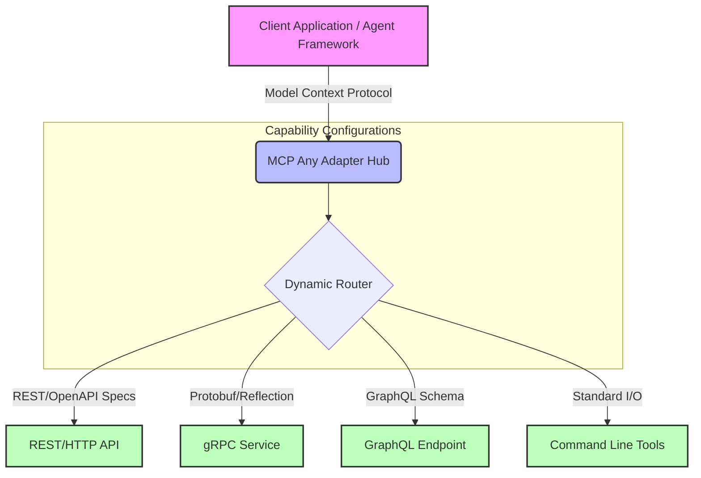

# MCP Any

## Elevator Pitch
**What is this?** MCP Any is the Universal Adapter for AI agents.
**Why does it exist?** It empowers developers to build secure, capability-enabled APIs (REST, gRPC, GraphQL, Command-line) through lightweight YAML/JSON configurations, serving as an ultimate universal bridge and eliminating the need to write custom boilerplate adapters.

## Architecture
MCP Any relies on a "Configuration over Code" pattern. Users deploy a single binary which reads dynamically loaded capability definitions. The architecture supports gRPC, OpenAPI, HTTP, GraphQL, and CLI tools.
Features include:
- Dynamic Tool Registration.
- Safety Policies.
- Upstream Authentication.
- Multi-Tenant isolation.

### High-Level Flow

```mermaid
graph TD
    classDef agent fill:#f9f,stroke:#333,stroke-width:2px;
    classDef core fill:#bbf,stroke:#333,stroke-width:2px;
    classDef target fill:#bfb,stroke:#333,stroke-width:2px;

    A[Client Application / Agent Framework]:::agent -->|Model Context Protocol| B(MCP Any Adapter Hub):::core

    subgraph Config [Capability Configurations]
        B --> C{Dynamic Router}
    end

    C -->|REST/OpenAPI Specs| D[REST/HTTP API]:::target
    C -->|Protobuf/Reflection| E[gRPC Service]:::target
    C -->|GraphQL Schema| F[GraphQL Endpoint]:::target
    C -->|Standard I/O| G[Command Line Tools]:::target
```

## Getting Started
Follow these steps to get a "Hello World" instance running locally:

```bash
git clone https://github.com/mcpany/core.git
cd core

# Run a hello world example
# Ensure `bazelisk` is installed and available in your `PATH`.
bazelisk run //server/cmd/mcpany -- -config examples/hello_world.yaml
```

## Development
We use `make` and `bazelisk` for our development workflow.

```bash
# Run the test suite
make test

# Run the linter
make lint

# Build the main binary
bazelisk build //server/cmd/mcpany
```

## Configuration
MCP Any uses environment variables and secrets to configure the runtime environment.

- `MCPANY_ALLOW_LOOPBACK_RESOURCES`: Set to `true` to allow loopback resources.
