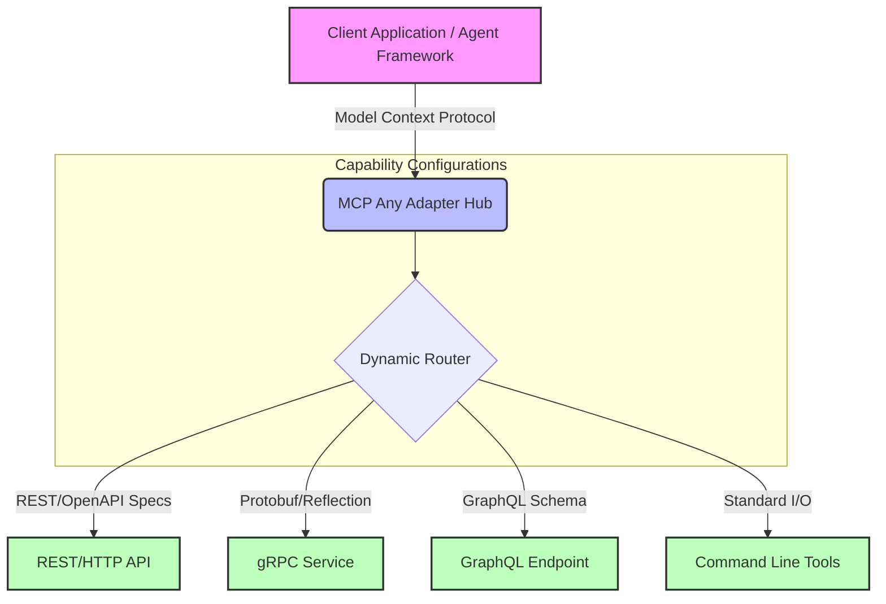

# MCP Any

## Elevator Pitch
MCP Any is the Universal Adapter for AI agents. It acts as an intelligent bridge, enabling seamless, secure, and capability-driven interactions between modern AI models and disparate APIs (REST, gRPC, GraphQL, Command-line) using lightweight YAML/JSON configurations. It entirely eliminates the boilerplate necessary to glue different systems to AI Agent frameworks.

## Architecture
MCP Any follows a "Configuration over Code" pattern, dynamically loading service definitions via configuration files instead of hardcoded adapters.
- **Universal Adapter Hub**: Receives connections from the Client Application (Agent Framework) using the Model Context Protocol (MCP).
- **Dynamic Router**: Dynamically translates and routes agent intents into the target protocol (REST, gRPC, CLI, etc.).
- **Security & Multi-Tenant**: Provides deep safety policies, access controls, upstream authentication, and strict multi-tenant isolation.
- **Traceability**: Offers comprehensive debug visibility via Agent Chain Tracer and audit logs.

### High-Level Flow

```mermaid
graph TD
    classDef agent fill:#f9f,stroke:#333,stroke-width:2px;
    classDef core fill:#bbf,stroke:#333,stroke-width:2px;
    classDef target fill:#bfb,stroke:#333,stroke-width:2px;

    A[Client Application / Agent Framework]:::agent -->|Model Context Protocol| B(MCP Any Adapter Hub):::core

    subgraph Config [Capability Configurations]
        B --> C{Dynamic Router}
    end

    C -->|REST/OpenAPI Specs| D[REST/HTTP API]:::target
    C -->|Protobuf/Reflection| E[gRPC Service]:::target
    C -->|GraphQL Schema| F[GraphQL Endpoint]:::target
    C -->|Standard I/O| G[Command Line Tools]:::target
```

## Getting Started
To get the project up and running:

1. **Clone the Repository**
   ```bash
   git clone https://github.com/mcpany/core.git
   cd core
   ```

2. **Run Hello World Example**
   Ensure `bazelisk` is installed and available in your `PATH`.
   ```bash
   bazelisk run //server/cmd/mcpany -- -config examples/hello_world.yaml
   ```

## Development
This project utilizes a `Makefile` and `bazelisk` for common build workflows:

- **Run Tests:** `make test` executes the test suite.
- **Run Linter:** `make lint` verifies code style and docstrings.
- **Build Server:** `bazelisk build //server/cmd/mcpany` compiles the core binary.

## Configuration
MCP Any requires specific environment variables and configuration for integration:
- Deploy using a `config.yaml` specifying resources, capabilities, and safety properties.
- Environment variables like `OPENAI_API_KEY` or `ANTHROPIC_API_KEY` may be needed depending on the underlying agent connection testing paths.
- For a comprehensive list of secrets, see the detailed configuration documentation within `docs/`.
