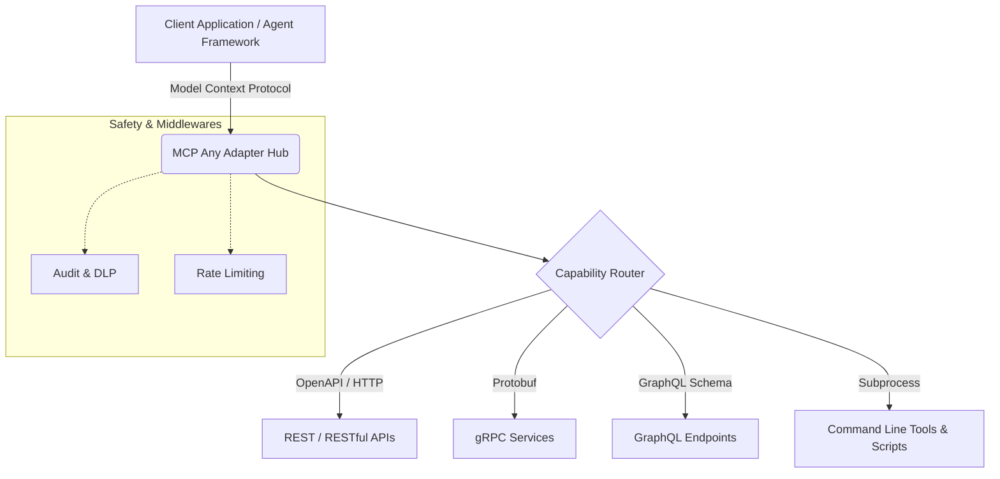

# MCP Any - The Universal Agent Infrastructure

## Project Identity

**What is MCP Any?**
MCP Any is the ultimate developer entry point and Universal Adapter. It is designed to completely eliminate the need to implement custom Model Context Protocol (MCP) servers for API integrations.

**Why does it exist?**
In a world of rapidly expanding AI capabilities, writing custom boilerplate for every new API or internal service is unscalable. MCP Any solves this by embracing a "Configuration over Code" philosophy. By simply providing lightweight YAML or JSON configurations, you can capability-enable APIs (REST, gRPC, GraphQL, Command-line) instantly. A single `mcpany` server instance acts as a secure, universal bridge between your LLM clients and your infrastructure.

## Architecture & Design Principles

MCP Any dynamically loads capability definitions and routes requests seamlessly. It eliminates the friction between modern AI agents and legacy systems.

**Key capabilities:**
- **Dynamic Tool Registration**: Discovers tools instantly from Proto descriptors, OpenAPI specs, or dynamic reflection.
- **Enterprise-Grade Safety**: Pluggable middlewares enforce strict boundaries (Audit Logs, DLP, Rate Limiting).
- **Transparent Authentication**: Automatically handles API keys, mTLS, and Bearer tokens for upstream services without leaking them to the LLM.
- **Multi-Tenant Isolation**: Natively supports complex multi-user and multi-profile environments.

### System Topology


```mermaid
graph TD
    A[Client Application / Agent Framework] -->|Model Context Protocol| B(MCP Any Adapter Hub)
    B --> C{Capability Router}

    C -->|OpenAPI / HTTP| D[REST / RESTful APIs]
    C -->|Protobuf| E[gRPC Services]
    C -->|GraphQL Schema| F[GraphQL Endpoints]
    C -->|Subprocess| G[Command Line Tools & Scripts]

    subgraph Safety & Middlewares
    B -.-> H[Audit & DLP]
    B -.-> I[Rate Limiting]
    end
```

## Quick Start (Getting Started)

Follow these steps to go from `git clone` to executing your first capability.

### 1. Clone the repository
```bash
git clone https://github.com/mcpany/core.git
cd core
```

### 2. Install Dependencies
Ensure `bazelisk` is installed and available in your system's `PATH`. We strictly use Bazel for all build and test execution to ensure reproducible environments.

### 3. Build & Run the Server
Launch the universal server using the included Hello World example configuration:
```bash
bazelisk run //server/cmd/mcpany -- -config examples/hello_world.yaml
```
*The server will initialize dynamically. You can now connect any standard MCP-compatible client to your local instance.*

## Developer Workflow

We rely exclusively on `bazelisk` to guarantee consistency across our Go and TypeScript layers. Manual build scripts or other runners (npm, go test) are strictly prohibited.

- **Run all verification tests (Unit, Integration, E2E):**
  ```bash
  bazelisk test //...
  ```

- **Build the core binary:**
  ```bash
  bazelisk build //...
  ```

## Configuration Guide

MCP Any is driven entirely by declarative configurations:

- **Capability Configs:** Place new API integrations in the `./configs` directory. These files define the surface area exposed to connected agents.
- **Secret Management:** Never hardcode secrets. Expose them via secure environment variables (e.g., `OPENAI_API_KEY`) and reference them in your YAML configs to maintain absolute security boundaries.
- **Global Settings:** Configure global limits, allowed origins, and telemetry via the central configuration structure or dynamic CLI flags.
