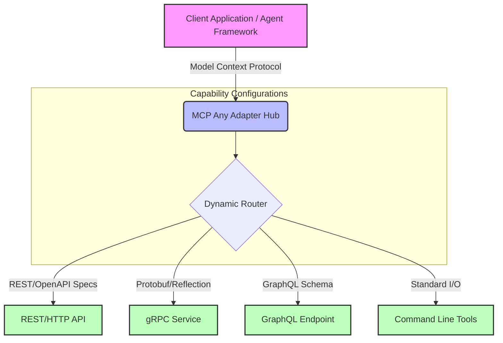

# MCP Any

## Elevator Pitch
**What is this?** MCP Any is the ultimate Universal Adapter for AI agents, designed from the ground up for massive scale and extensibility.
**Why does it exist?** It empowers developers to build secure, capability-enabled APIs (REST, gRPC, GraphQL, Command-line) through lightweight YAML/JSON configurations. Serving as an ultimate universal bridge, it eliminates the need to write custom boilerplate adapters and acts as the crucial backbone of interoperable, next-generation autonomous systems.

## Architecture
MCP Any relies on a strict "Configuration over Code" pattern. Users deploy a single, highly-optimized binary which dynamically reads and loads capability definitions. The architecture natively supports gRPC, OpenAPI, HTTP, GraphQL, and CLI tools seamlessly without ever needing to touch or recompile the underlying source code.

**Key Design Patterns & Features:**
- **Dynamic Tool Registration**: Instantly add, remove, and modify capabilities purely via configuration files at runtime without downtime.
- **Safety Policies**: Robust constraint engines and safety layers meticulously designed to restrict arbitrary code execution and contain side effects safely within bounded execution contexts.
- **Upstream Authentication**: Out-of-the-box identity federation with various standard identity providers, ensuring zero-trust security.
- **Multi-Tenant Isolation**: Safe-by-default execution spaces that maintain rigorous boundary domains between differing agent systems.

### High-Level Flow

```mermaid
graph TD
    classDef agent fill:#f9f,stroke:#333,stroke-width:2px;
    classDef core fill:#bbf,stroke:#333,stroke-width:2px;
    classDef target fill:#bfb,stroke:#333,stroke-width:2px;

    A[Client Application / Agent Framework]:::agent -->|Model Context Protocol| B(MCP Any Adapter Hub):::core

    subgraph Config [Capability Configurations]
        B --> C{Dynamic Router}
    end

    C -->|REST/OpenAPI Specs| D[REST/HTTP API]:::target
    C -->|Protobuf/Reflection| E[gRPC Service]:::target
    C -->|GraphQL Schema| F[GraphQL Endpoint]:::target
    C -->|Standard I/O| G[Command Line Tools]:::target
```

## Getting Started
Follow these simple, step-by-step instructions to get a "Hello World" instance running locally in seconds:

1. **Clone the repository:**
   ```bash
   git clone https://github.com/mcpany/core.git
   cd core
   ```

2. **Ensure dependencies:**
   Make sure you have `bazelisk` and `make` installed and available in your `PATH` for seamless building.

3. **Run a Hello World example:**
   ```bash
   bazelisk run //server/cmd/mcpany -- -config examples/hello_world.yaml
   ```

## Development
We use `make` and `bazelisk` for our development workflow. Maintaining a clean and fully-tested repository is absolutely critical to upholding our "Gold Standard".

```bash
# Run the complete test suite to ensure no code logic breaks
make test

# Run the strict linter to verify formatting and documentation conventions
make lint

# Build the main binary
bazelisk build //server/cmd/mcpany
```

## Configuration
MCP Any uses environment variables and secure secrets to configure the runtime environment safely. Required configurations vary based on deployment scenarios, but here are the core variables to get started:

- `MCPANY_ALLOW_LOOPBACK_RESOURCES`: Set to `true` to explicitly allow loopback resources for local testing. (Default: `false`)
- `MCPANY_CONFIG_PATH`: Absolute path to the YAML/JSON capability definitions. (e.g., `/etc/mcpany/config.yaml`)
- `MCPANY_LOG_LEVEL`: Adjust the verbosity of application logging. Options: `debug`, `info`, `warn`, `error`. (Default: `info`)
