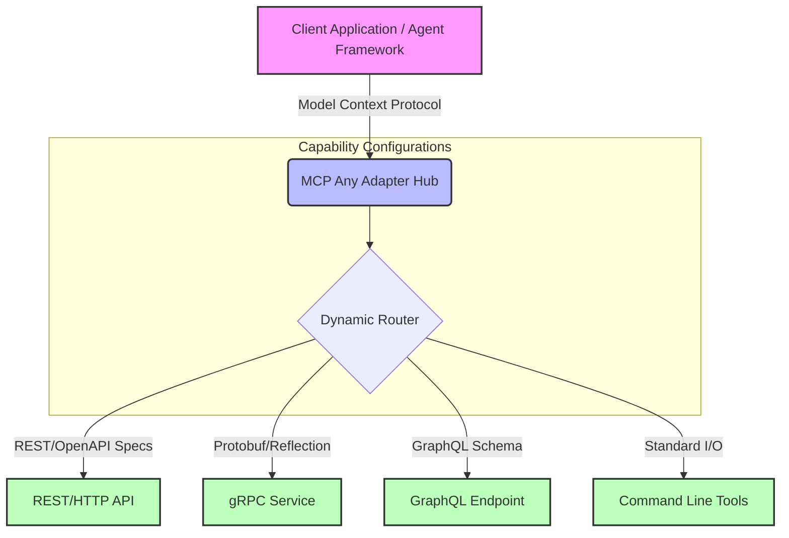

# MCP Any

## Elevator Pitch
**What is this project and why does it exist?**
MCP Any serves as the Universal Adapter for AI agents. It exists to empower developers to build secure, capability-enabled APIs (REST, gRPC, GraphQL, Command-line) through lightweight YAML/JSON configurations. By serving as the ultimate universal bridge, it eliminates the need to write custom boilerplate adapters, acting as the backbone of interoperable autonomous systems.

## Architecture
**High-level overview of the stack and design patterns:**
MCP Any relies on a "Configuration over Code" pattern. Users deploy a single Go-based binary that dynamically loads capability definitions at runtime. The architecture supports gRPC, OpenAPI, HTTP, GraphQL, and CLI tools seamlessly without touching the underlying source code.

**Key Design Patterns:**
- **Dynamic Tool Registration**: Capabilities are added and modified purely via configuration files at runtime.
- **Safety Policies**: Robust constraint engines and safety layers restrict arbitrary code execution to contain side effects safely.
- **Upstream Authentication**: Out-of-the-box identity federation with various standard identity providers.
- **Multi-Tenant Isolation**: Safe-by-default execution spaces maintain strict domain boundaries between differing agent systems.

### High-Level Flow

```mermaid
graph TD
    classDef agent fill:#f9f,stroke:#333,stroke-width:2px;
    classDef core fill:#bbf,stroke:#333,stroke-width:2px;
    classDef target fill:#bfb,stroke:#333,stroke-width:2px;

    A[Client Application / Agent Framework]:::agent -->|Model Context Protocol| B(MCP Any Adapter Hub):::core

    subgraph Config [Capability Configurations]
        B --> C{Dynamic Router}
    end

    C -->|REST/OpenAPI Specs| D[REST/HTTP API]:::target
    C -->|Protobuf/Reflection| E[gRPC Service]:::target
    C -->|GraphQL Schema| F[GraphQL Endpoint]:::target
    C -->|Standard I/O| G[Command Line Tools]:::target
```

## Getting Started
**Step-by-step instructions from `git clone` to `Hello World`:**

1. **Clone the repository:**
   ```bash
   git clone https://github.com/mcpany/core.git
   cd core
   ```

2. **Install dependencies:**
   Ensure that you have `bazelisk` and `make` installed and accessible in your system's `PATH`.

3. **Run the Hello World instance:**
   Start the local instance by pointing the binary to the example configuration:
   ```bash
   bazelisk run //server/cmd/mcpany -- -config examples/hello_world.yaml
   ```

## Development
**How to run tests (`make test`), lint (`make lint`), and build:**

To maintain our "Gold Standard" of codebase quality, please follow the standard development workflow:

- **Run Tests:** Ensure no logic changes break existing functionality.
  ```bash
  make test
  ```
- **Run Lint:** Verify that your formatting and documentation conventions align with the Style Guide.
  ```bash
  make lint
  ```
- **Build the binary:** Compile the main entrypoint for the application.
  ```bash
  bazelisk build //server/cmd/mcpany
  ```

## Configuration
**Environment variables and required secrets:**

MCP Any uses a 12-factor app approach, relying on environment variables and secrets to configure the runtime environment securely.

- `MCPANY_ALLOW_LOOPBACK_RESOURCES`: Set to `true` to allow loopback resources for testing. (Default: `false`)
- `MCPANY_CONFIG_PATH`: The absolute or relative path to your YAML/JSON tool definitions. (e.g., `/etc/mcpany/config.yaml`)
- `MCPANY_LOG_LEVEL`: Adjusts the verbosity of application logging. Options include: `debug`, `info`, `warn`, `error`. (Default: `info`)
- `MCPANY_SECRET_KEY`: *[Required in Prod]* The primary cryptographic secret used to sign and verify internal tokens.
