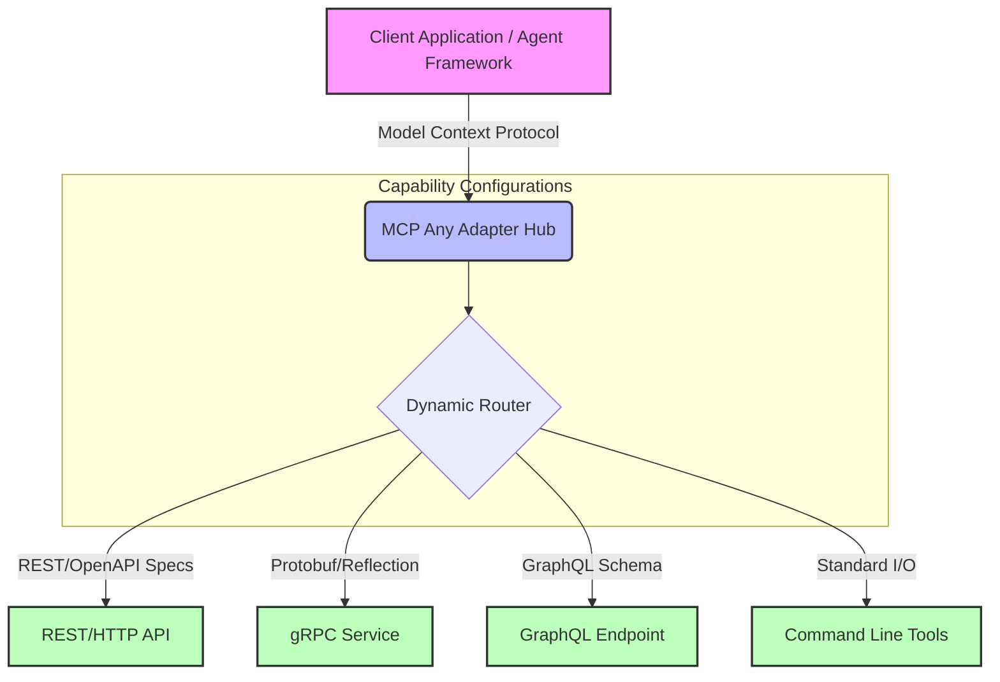

# MCP Any

## Elevator Pitch
**What is this?** MCP Any is the Universal Adapter for AI agents.
**Why does it exist?** It empowers developers to build secure, capability-enabled APIs (REST, gRPC, GraphQL, Command-line) through lightweight YAML/JSON configurations. Serving as an ultimate universal bridge, it completely eliminates the need to write custom boilerplate adapters or maintain multiple standalone MCP servers. It acts as the backbone of interoperable autonomous systems, allowing you to focus on configuring capabilities rather than writing connection logic.

## Architecture
MCP Any relies entirely on a "Configuration over Code" pattern. Users deploy a single binary which reads dynamically loaded capability definitions. The architecture supports gRPC, OpenAPI, HTTP, GraphQL, and CLI tools seamlessly without touching the underlying source code.

**Key Design Patterns & Features:**
- **Dynamic Tool Registration**: Add, discover, and modify capabilities purely via configuration files (YAML/JSON) at runtime.
- **Safety Policies**: Robust constraint engines and safety layers designed to restrict arbitrary code execution, prevent command injections, and contain side effects safely with strict egress policies.
- **Upstream Authentication**: Out-of-the-box identity federation with various standard identity providers, safely propagating API keys and Bearer tokens without exposing them to the AI agent.
- **Multi-Tenant Isolation**: Safe-by-default execution spaces that maintain boundary domains between differing agent systems through multi-user and multi-profile setups.

### High-Level Flow

```mermaid
graph TD
    classDef agent fill:#f9f,stroke:#333,stroke-width:2px;
    classDef core fill:#bbf,stroke:#333,stroke-width:2px;
    classDef target fill:#bfb,stroke:#333,stroke-width:2px;

    A[Client Application / Agent Framework]:::agent -->|Model Context Protocol| B(MCP Any Adapter Hub):::core

    subgraph Config [Capability Configurations]
        B --> C{Dynamic Router}
    end

    C -->|REST/OpenAPI Specs| D[REST/HTTP API]:::target
    C -->|Protobuf/Reflection| E[gRPC Service]:::target
    C -->|GraphQL Schema| F[GraphQL Endpoint]:::target
    C -->|Standard I/O| G[Command Line Tools]:::target
```

## Getting Started
Follow these step-by-step instructions to get a "Hello World" instance up and running locally without writing any Go or Python code:

1. **Clone the repository:**
   Begin by cloning the core repository to your local machine.
   ```bash
   git clone https://github.com/mcpany/core.git
   cd core
   ```

2. **Ensure dependencies:**
   Make sure you have `bazelisk` and `make` installed and available in your system's `PATH`. These are essential for building and running the project reliably.

3. **Run a Hello World example:**
   Execute the pre-configured example. This command will compile the universal binary and launch it using the sample YAML configuration.
   ```bash
   bazelisk run //server/cmd/mcpany -- -config examples/hello_world.yaml
   ```

## Development
We use `make` and `bazelisk` to orchestrate our development workflow. Maintaining a clean and extensively tested repository is critical to achieving the "Gold Standard" we demand.

```bash
# Run the complete test suite to ensure no code logic breaks and regressions are prevented
make test

# Run the linter to verify formatting, documentation conventions, and structural integrity
make lint

# Build the main binary for local testing or deployment preparation
bazelisk build //server/cmd/mcpany
```

## Configuration
MCP Any uses environment variables and secrets to configure the runtime environment securely. Required configurations vary based on deployment scenarios, but here are the core variables you need to know:

- `MCPANY_ALLOW_LOOPBACK_RESOURCES`: Set to `true` to allow loopback resources for local testing. (Default: `false`)
- `MCPANY_CONFIG_PATH`: Path to the YAML/JSON definition files that dictate the enabled capabilities. (e.g. `/etc/mcpany/config.yaml`)
- `MCPANY_LOG_LEVEL`: Adjust the verbosity of application logging. Options: `debug`, `info`, `warn`, `error`. (Default: `info`)
