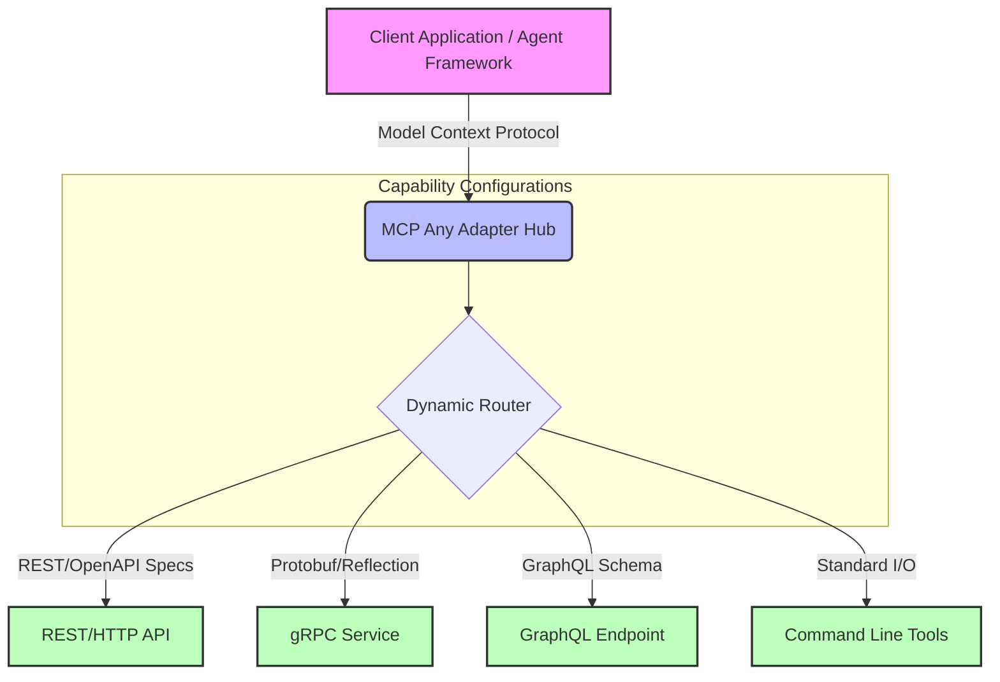

# MCP Any - Universal Agent Infrastructure

## Elevator Pitch
MCP Any is the definitive, "Gold Standard" Universal Adapter for AI agents. It completely eliminates the need to implement custom Model Context Protocol (MCP) servers for individual API integrations. MCP Any empowers developers to build secure, capability-enabled APIs (REST, gRPC, GraphQL, Command-line) through lightweight YAML/JSON configurations. A single `mcpany` instance serves as your ultimate, universal bridge. Forget writing boilerplate adapters—configure MCP Any and let it handle tool discovery, routing, and safety policies autonomously.

## Architecture
MCP Any relies on a "Configuration over Code" pattern. Users deploy a single binary which reads dynamically loaded capability definitions. The architecture supports gRPC, OpenAPI, HTTP, GraphQL, and CLI tools.

Key architectural features include:
- **Dynamic Tool Registration**: Discovers tools automatically from Proto, OpenAPI specs, or Reflection.
- **Safety Policies**: Pluggable middlewares that block dangerous operations or restrict URL access (e.g. Audit, DLP, Rate Limiting).
- **Upstream Authentication**: Handles authentication transparently to connected capabilities (API keys, mTLS, Bearer tokens).
- **Multi-Tenant**: Supports complex multi-user/multi-profile isolation.

### High-Level Flow

```mermaid
graph TD
    classDef agent fill:#f9f,stroke:#333,stroke-width:2px;
    classDef core fill:#bbf,stroke:#333,stroke-width:2px;
    classDef target fill:#bfb,stroke:#333,stroke-width:2px;

    A[Client Application / Agent Framework]:::agent -->|Model Context Protocol| B(MCP Any Adapter Hub):::core

    subgraph Config [Capability Configurations]
        B --> C{Dynamic Router}
    end

    C -->|REST/OpenAPI Specs| D[REST/HTTP API]:::target
    C -->|Protobuf/Reflection| E[gRPC Service]:::target
    C -->|GraphQL Schema| F[GraphQL Endpoint]:::target
    C -->|Standard I/O| G[Command Line Tools]:::target
```

## Getting Started

### 1. Clone the repository
```bash
git clone https://github.com/mcpany/core.git
cd core
```

### 2. Install Dependencies
Ensure `bazelisk` is installed and available in your `PATH`. We strictly use Bazel via `bazelisk` for all builds and tests.

### 3. Run the App
Run the server with the included Hello World example configuration:
```bash
bazelisk run //server/cmd/mcpany -- -config examples/hello_world.yaml
```
*The server will start and you can connect your MCP-compatible client to the local instance.*

## Development
We enforce the use of `bazelisk` for all common development tasks.

- **Run the tests:**
  Execute all unit, integration, and E2E tests using Make:
  ```bash
  make test
  ```

- **Run lint:**
  Execute all linters using Make:
  ```bash
  make lint
  ```

- **Build the binary:**
  Build the server executable:
  ```bash
  bazelisk build //server/cmd/mcpany
  ```

## Configuration
MCP Any requires configurations to be provided via YAML/JSON.

- **Configs:** Place capability configurations in the `./configs` directory. These define what upstream capabilities your MCP Any server exposes.
- **Environment Variables:** Set any secret values in environment variables (e.g., `OPENAI_API_KEY`) and reference them dynamically in your config files to ensure security boundaries are maintained.
- **Global Settings:** Important settings (like allowed IPs, logging level, rate limits) can be provided through a global configuration structure or CLI flags.
