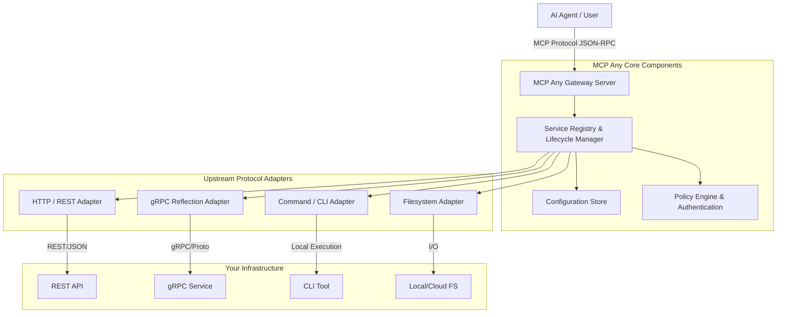

# MCP Any - Gold Standard Universal Adapter

[](https://github.com/mcpany/core)
[](LICENSE)
[](https://github.com/mcpany/core/actions)
[](https://goreportcard.com/report/github.com/mcpany/core)

## Identity & Mission

**MCP Any** is the ultimate universal adapter that instantly elevates your existing APIs into [Model Context Protocol (MCP)](https://modelcontextprotocol.io/) compliant tools. It serves as a unified, configuration-driven gateway bridging the gap between legacy/modern backend services (REST, gRPC, OpenAPI, Command-line) and cutting-edge AI agents.

By eliminating "binary fatigue", MCP Any unifies your entire infrastructure under a single, secure, and fully observable MCP endpoint, allowing you to focus purely on business capabilities rather than repetitive plumbing.

## Architecture & System Flow

MCP Any utilizes a modular, adapter-based architecture built for high concurrency in Go. It acts as robust middleware between AI clients and your infrastructure, translating JSON-RPC protocol messages seamlessly.


```mermaid
graph TD
    User[AI Agent / User] -->|MCP Protocol JSON-RPC| Server[MCP Any Gateway Server]

    subgraph "MCP Any Core Components"
        Server --> Registry[Service Registry & Lifecycle Manager]
        Registry --> Config[Configuration Store]
        Registry --> Auth[Policy Engine & Authentication]
    end

    subgraph "Upstream Protocol Adapters"
        Registry --> HTTP[HTTP / REST Adapter]
        Registry --> GRPC[gRPC Reflection Adapter]
        Registry --> CMD[Command / CLI Adapter]
        Registry --> FS[Filesystem Adapter]
    end

    subgraph "Your Infrastructure"
        HTTP -->|REST/JSON| ServiceB[REST API]
        GRPC -->|gRPC/Proto| ServiceA[gRPC Service]
        CMD -->|Local Execution| ServiceD[CLI Tool]
        FS -->|I/O| ServiceE[Local/Cloud FS]
    end
```

### Core Components:

1.  **Core Server**: High-performance Go runtime managing JSON-RPC client sessions.
2.  **Service Registry**: Implements `ServiceRegistryInterface` to manage dynamic loading, hot-reloading, and health checking.
3.  **Policy Engine & Middleware**: Enforces authentication, rate limiting, DLP (Data Loss Prevention), and audit logging.
4.  **Upstream Adapters**: Translates MCP requests into protocol-specific upstream calls (HTTP templates, gRPC reflection, secure CLI execution, FS operations).

## Getting Started

Deploy MCP Any to your environment instantly.

### Prerequisites

*   [Bazelisk](https://github.com/bazelbuild/bazelisk) (Provides automated Bazel versioning and execution)
*   [Docker](https://docs.docker.com/get-docker/) (Optional, for containerized environments)

### One-Shot Setup

Clone the repository and launch the server using `bazelisk`:

```bash
git clone https://github.com/mcpany/core.git
cd core
bazelisk build //...
bazelisk run //server/cmd/mcpany -- run --config-path server/config.minimal.yaml
```

### Hello World

Verify the server health:
```bash
curl http://localhost:50050/health
```

Connect an AI Client (e.g., Gemini CLI):
```bash
gemini mcp add --transport http --trust mcpany http://localhost:50050
```

Try it out:
> "What is the weather?"

## Developer Workflow

We adhere to a strict "Gold Standard" development workflow to ensure code quality, observability, and maintainability.

### Building & Testing
Run all unit and integration tests to ensure code correctness:
```bash
bazelisk build //...
bazelisk test //...
```

### Linting & Documentation
We enforce **100% documentation coverage** and strict style guides across Go and TS layers.
*   **Go:** We require structured docstrings (`Summary`, `Parameters`, `Returns`, `Errors`, `Side Effects`) for all public APIs.
*   **TypeScript:** We enforce the same strict docstring requirements in JSDoc format for all UI components and library functions.

See [AGENTS.md](server/AGENTS.md) for detailed coding guidelines.

### UI Development
To work on the frontend dashboard (Next.js):
```bash
cd ui
npm install
npm run dev
```

## Configuration

Services and capabilities are defined declaratively in YAML/JSON, enabling version control and CI/CD for your agent capabilities.

### Environment Variables

| Variable | Description | Default |
|----------|-------------|---------|
| `MCPANY_MCP_LISTEN_ADDRESS` | MCP server's bind address (host:port) | `50050` |
| `MCPANY_CONFIG_PATH` | Comma-separated paths to config files/dirs | `[]` |
| `MCPANY_METRICS_LISTEN_ADDRESS` | Address to expose Prometheus metrics | Disabled |
| `MCPANY_DEBUG` | Enable debug logging | `false` |
| `MCPANY_API_KEY` | Master API key for securing the server | Empty (No Auth) |

*Refer to the full documentation for comprehensive configuration details.*

## Contributing

We welcome contributions! Please review our coding standards, documentation requirements, and development workflow before submitting pull requests.

## License

This project is licensed under the terms of the [Apache 2.0 License](LICENSE).
