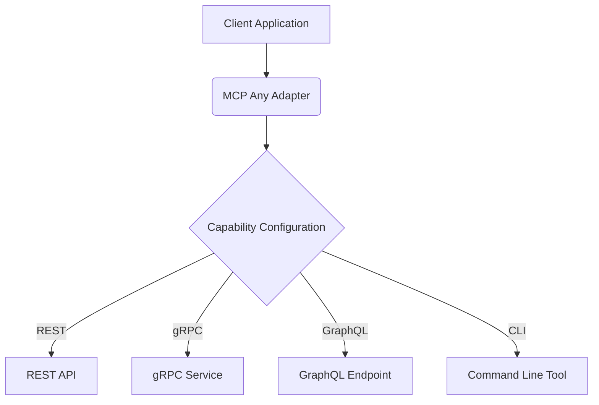

# MCP Any - Universal Agent Infrastructure

## Elevator Pitch

**What is this?** MCP Any is the ultimate developer entry point and Universal Adapter designed to eliminate the requirement to implement new MCP servers for doing API calls.

**Why does it exist?** It allows you to configure everything through lightweight YAML/JSON configurations to capability-enable different APIs (REST, gRPC, GraphQL, Command-line) and run a single `mcpany` server instance that acts as a secure, universal bridge. Instead of writing code to create a new MCP server, users can share configurations publicly, allowing others to use the same capabilities without managing binaries or dependencies.

## Architecture

MCP Any relies on a **"Configuration over Code"** pattern. Users deploy a single binary which reads dynamically loaded capability definitions. The architecture supports gRPC, OpenAPI, HTTP, GraphQL, and CLI tools. Key architectural features include:

- **Dynamic Tool Registration**: Discovers tools automatically from Proto, OpenAPI specs, or Reflection.
- **Safety Policies**: Pluggable middlewares that block dangerous operations (e.g., `DELETE`) or restrict URL access. We enforce Strict Egress Policy to control where the server can connect, Context Propagation for secure auth passing, and Input Validation to ensure safe execution.
- **Upstream Authentication**: Handles authentication transparently (API keys, Bearer tokens, and mTLS) so the AI doesn't have to see them.
- **Multi-Tenant**: Supports complex multi-user/multi-profile isolation.


```mermaid
graph TD
    A[Client Application] --> B(MCP Any Adapter)
    B --> C{Capability Configuration}
    C -->|REST| D[REST API]
    C -->|gRPC| E[gRPC Service]
    C -->|GraphQL| F[GraphQL Endpoint]
    C -->|CLI| G[Command Line Tool]
```

## Getting Started

Follow these step-by-step instructions from clone to "Hello World".

1. **Clone the repository:**
   ```bash
   git clone https://github.com/mcpany/core.git
   cd core
   ```

2. **Install Dependencies:**
   Ensure `bazelisk` and `make` are in your PATH.

3. **Run the App:**
   ```bash
   bazelisk run //server/cmd/mcpany -- -config examples/hello_world.yaml
   ```

## Development

To set up your development environment, verify code, and build:

- **Lint the code:**
  Run the configured linters to ensure formatting and docstring compliance.
  ```bash
  make lint
  ```

- **Run the tests:**
  Run the test suite to verify code functionality.
  ```bash
  make test
  # Or via bazelisk: bazelisk test //...
  ```

- **Build the binary:**
  Compile the main `mcpany` binary.
  ```bash
  bazelisk build //server/cmd/mcpany
  ```

## Configuration

MCP Any requires configurations to be provided via YAML/JSON.

- **Environment Variables:** Set any secret values in environment variables (e.g., `OPENAI_API_KEY`) and reference them in your config files.
- **Configs:** Place capability configurations in the `./configs` directory. Required secrets must be resolved dynamically to ensure security boundaries are maintained.
