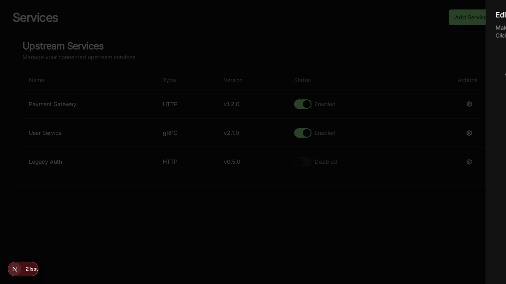
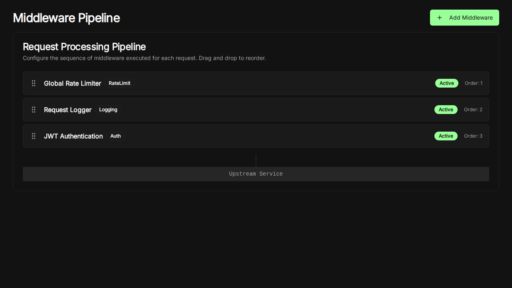
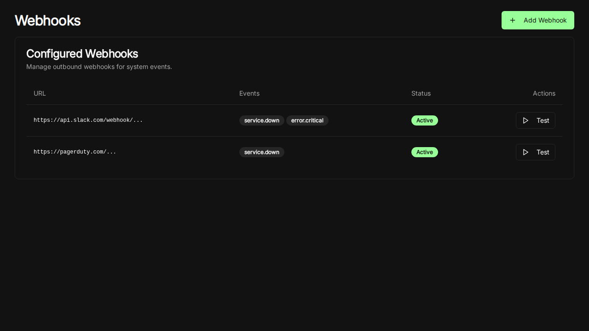

# MCP Any UI Overhaul

**Version:** 2.0
**Date:** 2025-12-22
**Status:** Released

---

## Overview

The MCP Any management console has been overhauled to provide a modern, enterprise-grade experience. This update focuses on observability, ease of management, and advanced configuration capabilities, all wrapped in a premium, responsive design.

## Features

### 1. Dashboard & Observability

The new dashboard provides immediate visibility into the health and performance of your MCP infrastructure.

*   **Real-time Metrics:** key performance indicators including Request Volume, Active Services, Latency, and Active Users.
*   **Service Health:** Live status monitoring for all connected upstream services.

### 2. Core Service Management

Manage your upstream services with precision.

*   **Service Listing:** View all registered services with their type, version, and status.
*   **One-click Toggles:** Enable or disable services instantly.
*   **Quick Editing:** Modify service configurations via a slide-over panel without leaving the context.

### 3. Middleware Pipeline

Visual management of the request processing pipeline.

*   **Drag-and-Drop Ordering:** (Coming soon) Easily reorder middleware components.
*   **Status Indicators:** Quickly see which middleware components are active.
*   **Type Classification:** Clear distinction between Authentication, Logging, and Rate Limiting middleware.

### 4. Webhooks Configuration

Configure and test outbound webhooks for system events.

*   **Event Subscription:** Subscribe to specific events like `service.down` or `error.critical`.
*   **Status Management:** Enable or disable webhooks as needed.
*   **Testing:** Trigger test events to verify connectivity (Coming soon).

---

## Technical Details

*   **Framework:** Next.js with TypeScript
*   **Styling:** Tailwind CSS with `shadcn/ui` components
*   **Testing:** Comprehensive E2E testing with Playwright
