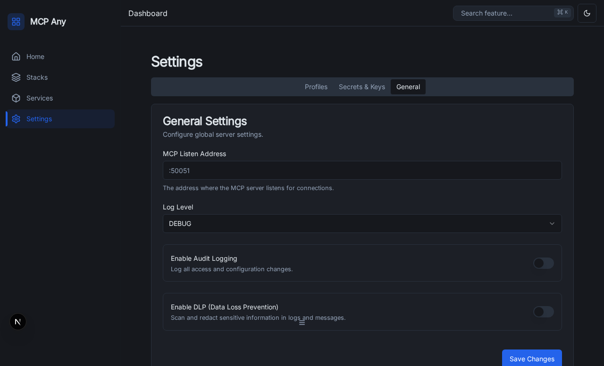

# Audit Logging

MCP Any provides a built-in audit logging capability to record details about every tool execution. This is essential for compliance, security monitoring, and debugging.

## Overview

When enabled, the audit logger intercepts every tool execution request and records structured data about the event to a specified file.

The audit log captures:
- **Timestamp**: When the execution started.
- **Tool Name**: The name of the tool being executed.
- **User ID**: The ID of the authenticated user (if available).
- **Profile ID**: The ID of the active profile (if available).
- **Duration**: How long the execution took.
- **Arguments**: The input arguments provided to the tool (optional).
- **Result**: The result returned by the tool (optional).
- **Error**: Any error that occurred during execution.

## Configuration

Audit logging is configured in the `GlobalSettings` section of your MCP Any configuration file.

### Example Configuration

```yaml
global_settings:
  audit:
    enabled: true
    storage_type: "STORAGE_TYPE_FILE" # or STORAGE_TYPE_SQLITE, STORAGE_TYPE_POSTGRES, STORAGE_TYPE_SPLUNK, STORAGE_TYPE_DATADOG
    output_path: "audit.log"
    log_arguments: true
    log_results: false
    splunk:
      hec_url: "https://splunk.example.com:8088/services/collector/event"
      token: "your-splunk-hec-token"
      index: "main"
      source: "mcpany"
      sourcetype: "_json"
    datadog:
      api_key: "your-datadog-api-key"
      site: "datadoghq.com"
      service: "mcpany"
      tags: "env:prod,region:us-east-1"
```

### Configuration Options

| Option | Type | Default | Description |
| :--- | :--- | :--- | :--- |
| `enabled` | `bool` | `false` | Enables or disables audit logging. |
| `storage_type` | `string` | `STORAGE_TYPE_FILE` | The storage backend to use: `STORAGE_TYPE_FILE`, `STORAGE_TYPE_SQLITE`, `STORAGE_TYPE_POSTGRES`, `STORAGE_TYPE_SPLUNK`, or `STORAGE_TYPE_DATADOG`. |
| `output_path` | `string` | `""` | Path to the log file or database connection string (for File/SQL). |
| `log_arguments` | `bool` | `false` | If true, logs the input arguments. **Warning:** May log sensitive data. |
| `log_results` | `bool` | `false` | If true, logs the execution result. **Warning:** May log sensitive data. |
| `splunk` | `object` | `nil` | Configuration for Splunk HEC. |
| `datadog` | `object` | `nil` | Configuration for Datadog Logs. |

### Splunk Configuration

To use Splunk, set `storage_type` to `STORAGE_TYPE_SPLUNK` and provide the `splunk` configuration:

- `hec_url`: The full URL to the Splunk HTTP Event Collector (e.g., `https://splunk.example.com:8088/services/collector/event`).
- `token`: Your Splunk HEC token.
- `index`: The Splunk index to send events to.
- `source`: The source value for the events.
- `sourcetype`: The sourcetype value for the events.

### Datadog Configuration

To use Datadog, set `storage_type` to `STORAGE_TYPE_DATADOG` and provide the `datadog` configuration:

- `api_key`: Your Datadog API Key.
- `site`: The Datadog site (e.g., `datadoghq.com` or `datadoghq.eu`).
- `service`: The service name to attach to logs.
- `tags`: A comma-separated list of tags (e.g., `env:prod,version:1.0`).

### UI Configuration

You can also enable or disable audit logging directly from the UI:

1. Navigate to **Settings > General**.
2. Toggle the **Enable Audit Logging** switch.
3. Click **Save Changes**.



## Log Format

If `storage_type` is `STORAGE_TYPE_FILE`, audit logs are written as newline-delimited JSON (NDJSON). Each line represents a single tool execution event.
If using SQLite or Postgres, logs are written to an `audit_logs` table.

### Example Log Entry

```json
{
  "timestamp": "2023-10-27T10:00:00.123Z",
  "tool_name": "weather_get_forecast",
  "user_id": "alice",
  "profile_id": "prod",
  "duration": "150ms",
  "duration_ms": 150,
  "arguments": {
    "city": "London"
  },
  "result": {
    "temperature": 15,
    "unit": "C"
  }
}
```

## Security Considerations

- **Sensitive Data**: By default, `log_arguments` and `log_results` are disabled. Enable them with caution, as they may expose API keys, PII, or other sensitive information handled by your tools.
- **File Permissions**: Ensure that the `output_path` is writable by the MCP Any server process and readable only by authorized personnel.
