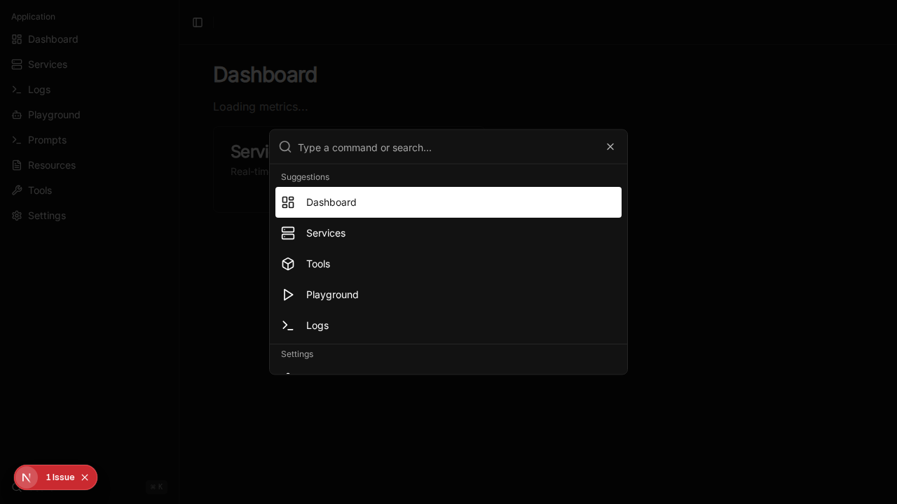

# Global Search (Command Palette)

## Overview

The Global Search (Command Palette) provides a keyboard-centric interface to quickly navigate the MCP Any management console. It allows users to jump to specific pages, services, tools, and change settings without leaving their keyboard.

## Features

- **Keyboard Shortcut**: Accessible via `Cmd+K` (macOS) or `Ctrl+K` (Windows/Linux).
- **Navigation**: Quickly jump to Dashboard, Services, Tools, Playground, logs, etc.
- **Theme Switching**: Toggle between Light, Dark, and System themes.
- **Sidebar Integration**: Trigger accessible from the sidebar footer.
- **Filtering**: Real-time filtering of commands.

## Usage

1. Press `Cmd+K` or click the "Search" button in the sidebar.
2. Type to filter commands (e.g., "Services", "Logs").
3. Use `Up`/`Down` arrows to navigate.
4. Press `Enter` to execute the selected command.

## Screenshot

