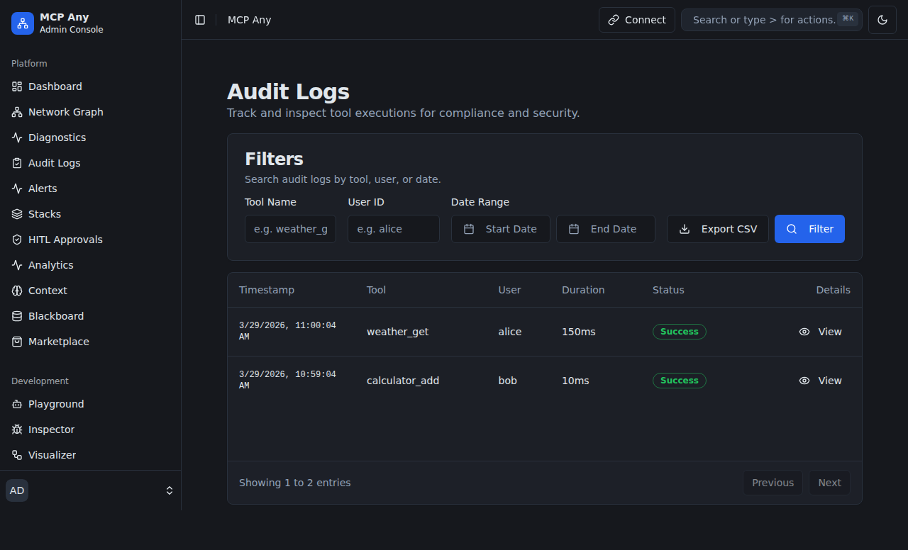

# Design Doc: Dynamic Mesh Resilience (DMR) Hub
**Status:** Draft
**Created:** 2026-07-11

## 1. Context and Scope
As AI agent swarms move toward large-scale production deployments, the reliability of the coordination mesh becomes paramount. Current architectures often follow a "Fail-Stop" model, where a single node failure or hardware-attestation breach can halt the entire mission. This leads to significant "Coordination Stall" and potential data loss in deep reasoning chains.

The Dynamic Mesh Resilience (DMR) Hub evolves MCP Any from a static gateway into a fail-operational resilience broker. It manages the automatic re-sharding and migration of "Entangled State" (shared mailbox shards, context fragments) between physical nodes, ensuring that a mission can survive the loss of individual subagents or infrastructure nodes without manual intervention.

## 2. Goals & Non-Goals
* **Goals:**
    * Implement a decentralized heartbeat monitor for subagent liveness and hardware attestation.
    * Provide sub-100ms state migration between physical nodes in the mesh.
    * Integrate with the Entangled State Broker (ESB) to ensure cryptographic continuity during migration.
    * Automate the re-sharding of teammate mailboxes upon detection of node churn.
* **Non-Goals:**
    * Implementing general-purpose VM or container migration (focus is strictly on agent state and coordination shards).
    * Solving for network partitions (assumes a reliable backbone between mesh nodes).

## 3. Critical User Journey (CUJ)
* **User Persona:** High-Availability Swarm Architect
* **Primary Goal:** Ensure a 24/7 code-generation mission survives a local hardware failure on one of the specialist nodes.
* **The Happy Path (Tasks):**
    1. The swarm is executing a deep refactoring mission across 5 nodes.
    2. Node 3 (hosting the "Database Specialist") experiences a kernel panic.
    3. The DMR Hub detects the heartbeat loss and immediate attestation expiry.
    4. The Hub triggers the "Emergency State Migration" protocol.
    5. The "Entangled State" shard for Node 3 is re-mapped to Node 5 (which has idle capacity).
    6. The "Database Specialist" is re-spawned on Node 5, resumes context from the DMR-migrated shard, and continues the mission with <500ms total downtime.

## 4. Design & Architecture
* **System Flow:**
    ```mermaid
    graph TD
        NodeA[Mesh Node A] -->|Heartbeat| DMR[DMR Hub]
        NodeB[Mesh Node B] -->|Heartbeat| DMR
        DMR -->|Failure Detect| Migrator[State Migrator]
        Migrator -->|Pull State| ESB[Entangled State Broker]
        ESB -->|Inject State| NodeB
        NodeB -->|Resume| Subagent[Re-spawned Subagent]
    ```
* **APIs / Interfaces:**
    * `POST /dmr/heartbeat`: High-frequency liveness and attestation signal.
    * `POST /dmr/migrate`: Trigger manual or automated shard migration.
    * `GET /dmr/mesh/health`: Real-time status of all nodes and state shards.
* **Data Storage/State:**
    * State fragments are stored in "Resilience Shards" across the physical mesh, utilizing the Lock-Free Sharded Mailbox Hub for synchronization.

## 5. Alternatives Considered
* **Static Redundancy (Active-Passive):** Rejected due to the 2x resource overhead and slow failover times for stateful agents.
* **Global Checkpointing:** Rejected due to the "Stop-the-World" latency impact on real-time coordination.

## 6. Cross-Cutting Concerns
* **Security (Zero Trust):** State migration must be hardware-attested. A destination node must prove its TPM integrity before receiving a migrated mission shard.
* **Observability:** Migration events are logged with nanosecond precision in the Mesh Audit Log.



## 7. Evolutionary Changelog
* **2026-07-11:** Initial Document Creation.
