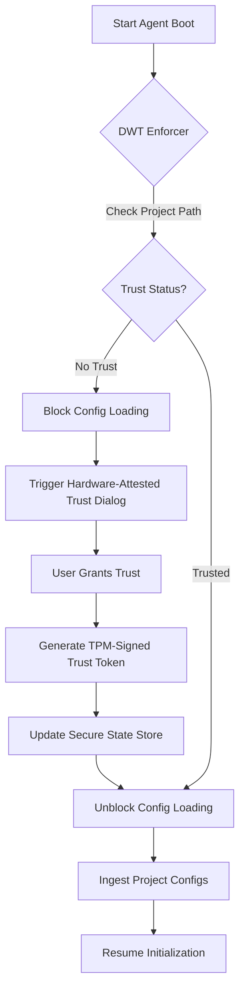

# Design Doc: Deterministic Workspace Trust (DWT) Enforcer

**Status:** Draft
**Created:** 2026-07-09

## 1. Context and Scope
The emergence of configuration-based exploits in AI agent tools, most notably the **Claude Code Workspace Trust Bypass (CVE-2026-33068)**, reveals a critical flaw in current agent initialization logic. Malicious repositories can include settings files (e.g., `.claude/settings.json`) that are loaded and applied *before* the user has authorized the workspace. This allows attackers to grant themselves elevated permissions or execute malicious hooks before the security perimeter is established.

The **Deterministic Workspace Trust (DWT) Enforcer** is a security-critical component for MCP Any that ensures a "Trust-First" loading sequence. It prevents any project-local configurations, environment overrides, or automated hooks from being parsed or executed until a hardware-attested workspace trust decision is finalized by the user.

## 2. Goals & Non-Goals
* **Goals:**
    * Intercept the agent boot sequence to mandate a trust decision.
    * Prevent the ingestion of `.mcpany/config.yaml` or framework-specific settings (like `.claude/settings.json`) until trust is granted.
    * Use hardware-attested (TPM/SEP) session tokens to bind the trust decision to the current environment.
    * Provide a "Zero-Knowledge Pre-flight" mode where only the existence of a trust file is checked without reading its content.
* **Non-Goals:**
    * This system will NOT manage the long-term storage of user identity (delegated to the FSI Provider).
    * This system will NOT perform behavioral analysis of the hooks themselves (delegated to the Ghost Shell Profiler).

## 3. Critical User Journey (CUJ)
* **User Persona:** Security-Conscious Developer
* **Primary Goal:** Safely explore a third-party repository using an AI agent without risking RCE via malicious configuration.
* **The Happy Path (Tasks):**
    1. The user points MCP Any to a new project directory.
    2. MCP Any detects project-local configuration files but immediately blocks their ingestion.
    3. The DWT Enforcer triggers a "Workspace Trust" dialog in the UI/CLI.
    4. The user reviews the source origin and grants "Trust" for this session.
    5. MCP Any performs a hardware-bound attestation of the trust decision.
    6. Only after attestation is complete, the Boot-Sequence Interceptor allows the configuration loader to proceed.

## 4. Design & Architecture
* **System Flow:**

* **APIs / Interfaces:**
    * `GET /v1/trust/status?path=[project_path]` -> Returns `trusted: boolean`.
    * `POST /v1/trust/authorize` -> Accepts `path`, `hardware_attestation`. Returns `session_token`.
    * Middleware hook: `PreLoadConfig(context, path)` -> Error if untrusted.
* **Data Storage/State:**
    * Trust decisions are stored in the secure `Blackboard` but are physically pinned to the hardware Inode of the project root to prevent symlink swapping (SIR defense).

## 5. Alternatives Considered
* **Passive Guarding:** Scanning files for "dangerous" keys before loading. Rejected because attackers can use natural language or polyglot payloads to hide intent until the LLM parses the file.
* **Sandbox-Only Loading:** Loading the config in a detached sandbox. Rejected because the config itself often defines the sandbox boundaries, creating a "chicken-and-egg" security problem.

## 6. Cross-Cutting Concerns
* **Security (Zero Trust):** The DWT Enforcer acts as the primary "Decision Point" in the boot sequence. It follows the principle of "Implicit Deny" for all local filesystem data.
* **Observability:** Every trust decision and blocked loading event is logged in the Local Security Audit Log with a SHA-256 hash of the blocked config.

## 7. Evolutionary Changelog
* **2026-07-09:** Initial Document Creation.
