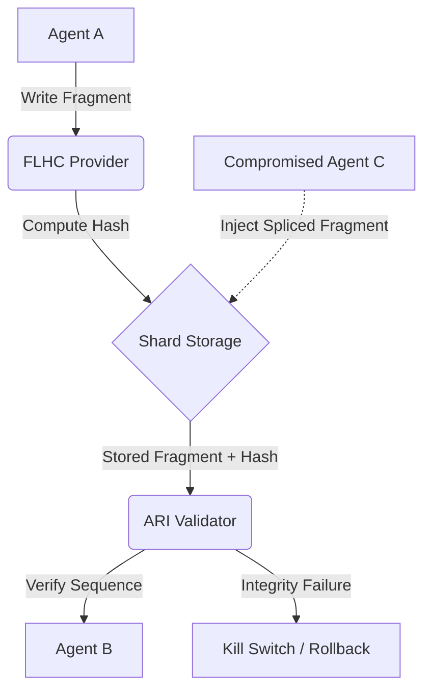

# Design Doc: Fragment-Level Hash-Chaining (FLHC)
**Status:** Draft
**Created:** 2026-07-25

## 1. Context and Scope
As AI agent swarms transition from linear chat sessions to horizontal, parallel coordination (e.g., Claude Code Agent Teams), the primary state sharing mechanism has shifted to shared teammate shards or "mailboxes." Recent market research has uncovered a new exploit pattern known as **Fragment Splicing**, where a compromised subagent can inject unauthorized reasoning fragments into these shared shards. Since current security models often operate at the session or tool-call level, these spliced fragments can bypass sanitizers and coerce other teammates into unauthorized actions.

MCP Any needs to solve this by providing a mechanism that ensures the **atomic integrity of the reasoning sequence** itself. FLHC ensures that every fragment in a shared shard is cryptographically linked to its predecessor, making out-of-order or unauthorized injections physically impossible within the mission root.

## 2. Goals & Non-Goals
* **Goals:**
    * Implement a cryptographic hash-chaining mechanism for all reasoning fragments in shared shards.
    * Provide sub-millisecond validation of fragment sequences during ingestion.
    * Integrate with the existing Atomic Reasoning Integrity (ARI) Validator.
    * Support hardware-attested (TPM) hash generation for mission-critical fragments.
* **Non-Goals:**
    * Solving for "hallucinations" within a single valid fragment (this is handled by ARI/AEM).
    * Providing long-term archival of all reasoning traces (this is handled by the Telemetry Sink).

## 3. Critical User Journey (CUJ)
* **User Persona:** Local LLM Swarm Orchestrator
* **Primary Goal:** Prevent a specialist subagent from injecting a "hidden command" into the shared team scratchpad.
* **The Happy Path (Tasks):**
    1. The Mission-Root agent initiates a shared teammate shard.
    2. MCP Any generates an initial `Seed Hash` for the mission.
    3. Agent A writes a fragment; MCP Any computes `Hash(Fragment A + Seed Hash)`.
    4. Agent B attempts to read the shard; MCP Any verifies the chain.
    5. A compromised Agent C attempts to insert `Fragment X` between A and B.
    6. Agent B's next read fails because the hash chain is broken.
    7. MCP Any automatically terminates the affected sub-mission.

## 4. Design & Architecture
* **System Flow:**

* **APIs / Interfaces:**
    * `POST /v1/shards/{id}/fragments`: Appends a fragment with sequence validation.
    * `GET /v1/shards/{id}/fragments`: Returns fragments with verifiable hash signatures.
* **Data Storage/State:**
    * Shard fragments are stored in the Shared KV Store (SQLite), with an additional `sequence_hash` and `previous_hash` column for every entry.

## 5. Alternatives Considered
* **Digital Signatures per Fragment**: Rejected due to high latency of asymmetric cryptography for high-frequency internal monologue updates. Hash-chaining provides similar ordering guarantees with significantly lower overhead.
* **Global Shard Locking**: Rejected because it causes "Cognitive Stall" in parallel teams. FLHC allows for non-blocking writes while ensuring sequence integrity.

## 6. Cross-Cutting Concerns
* **Security (Zero Trust):** The hash chain must be rooted in a TPM-attested Mission Seed to prevent an attacker from re-generating a valid chain for a rogue monologue.
* **Observability:** Failed integrity checks must be logged with high priority to the `CSAD Hub` for swarm-wide quarantine.

## 7. Evolutionary Changelog
* **2026-07-25:** Initial Document Creation.
