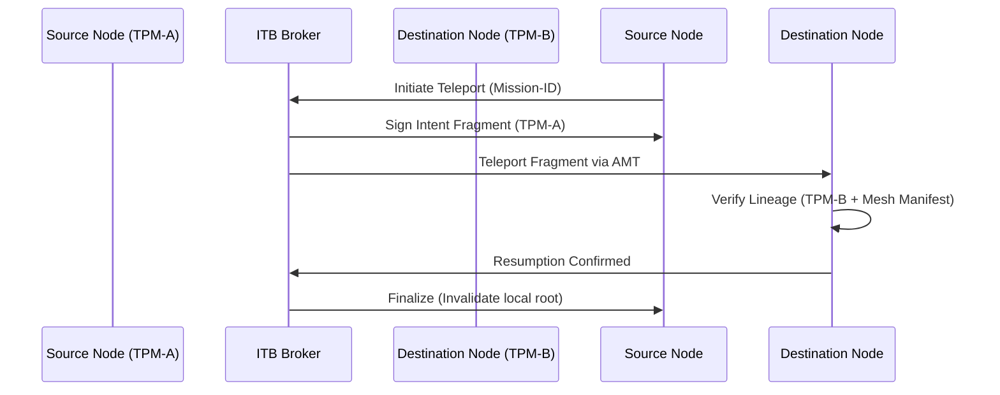

# Design Doc: Cross-Mesh Intent Teleportation (CMIT)
**Status:** Draft
**Created:** 2026-07-25

## 1. Context and Scope
As AI agent swarms scale horizontally across distributed physical nodes (Edge, Local, and Cloud), the Model Context Protocol (MCP) faces a critical performance and security bottleneck: **Handshake Fatigue**. Currently, every time a mission-root migrates to a new node or delegates to a remote subagent, a full hardware-attested handshake is required. In deep meshes, this adds hundreds of milliseconds of latency, often exceeding the time required for the actual reasoning step.

MCP Any needs to solve this by decoupling **Intent Identity** from the **Physical Node**. CMIT enables sub-millisecond mission migration by "teleporting" cryptographically signed intent fragments across a pre-verified TPM mesh, allowing missions to resume on new nodes with hardware-locked continuity without repeated full re-authentication.

## 2. Goals & Non-Goals
* **Goals:**
    * Reduce inter-node mission migration latency to <10ms.
    * Maintain hardware-attested continuity across physical node boundaries.
    * Implement "Teleportation Receipts" to prevent mission duplication (double-spending intent).
    * Bind intent fragments to monotonic hardware counters to prevent replay attacks.
* **Non-Goals:**
    * Teleporting the full raw context window (handled by existing sharding/streaming).
    * Supporting nodes without a compatible Trusted Platform Module (TPM) or Secure Enclave.
    * Replacing the A2A protocol (CMIT is a transport-layer optimization for A2A).

## 3. Critical User Journey (CUJ)
* **User Persona:** Multi-Cloud Swarm Architect
* **Primary Goal:** Migrate a high-stakes security auditing mission from a local workstation to an air-gapped cloud enclave without dropping mission-root authority or triggering manual re-approval.
* **The Happy Path (Tasks):**
    1. The primary agent initiates a `teleport_intent` signal to the local MCP Any ITB (Intent Teleportation Broker).
    2. The ITB generates a TPM-signed **Intent Fragment** containing the current mission-root signature and monotonic counter.
    3. The ITB establishes an **Attested Mesh Tunnel (AMT)** to the destination node.
    4. The Intent Fragment is "teleported" via the AMT.
    5. The destination node's ITB verifies the fragment against the global TPM mesh manifest and resumes the mission.
    6. The source node issues a "Teleportation Receipt" and purges the local mission authority to prevent ghost-reasoning.

## 4. Design & Architecture
* **System Flow:**

* **APIs / Interfaces:**
    * `POST /v1/intent/teleport`: Initiates the migration sequence.
    * `GET /v1/intent/fragments/{id}`: Retrieves a cryptographically sealed fragment for peering nodes.
    * `rpc TeleportFragment(IntentFragment) returns (Ack)`: Internal gRPC mesh interface.
* **Data Storage/State:**
    * **Intent Registry**: A distributed, in-memory KV store (backed by the Mesh Blackboard) tracking the active "Home Node" of every mission-ID.

## 5. Alternatives Considered
* **Persistent mTLS Tunnels**: Rejected due to the overhead of maintaining thousands of open sockets in large swarms. CMIT is connectionless and event-driven.
* **Global JWT Session Tokens**: Rejected because standard JWTs lack hardware-enclave binding, making them vulnerable to token exfiltration if a single node is compromised.

## 6. Cross-Cutting Concerns
* **Security (Zero Trust):**
    * CMIT utilizes **Recursive Mission-Bound Identity (RMBI)** to ensure a teleported fragment cannot be used to initiate an unauthorized mission.
    * **Double-Resumption Prevention**: Only one node can hold the "Active" bit for a mission-root at any time.
* **Observability:**
    * Teleportation events are logged in the **Command Traceability Provider (CTP)** with millisecond timestamps and node-affinity metadata.

## 7. Evolutionary Changelog
* **2026-07-25:** Initial Document Creation.
