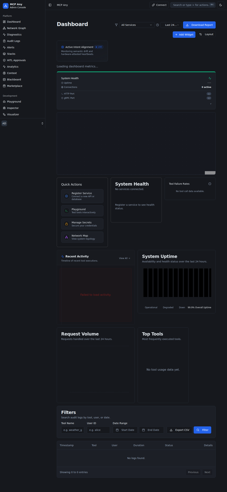

# Design Doc: Local Listener Origin Enforcement
**Status:** Draft
**Created:** 2026-03-18

## 1. Context and Scope
The OpenClaw security crisis (CVE-2026-25253) highlighted a critical flaw in "local-only" AI infrastructure: the assumption that `localhost` connections are implicitly trusted. Malicious websites can use JavaScript to initiate WebSocket or HTTP requests to local ports, bypassing browser isolation and compromising the agent gateway. MCP Any must implement strict origin validation to close this loopback loophole.

## 2. Goals & Non-Goals
* **Goals:**
    * Mandatory validation of `Origin` and `Sec-Fetch-Site` headers for all local API and WebSocket listeners.
    * Configurable allow-list for trusted local applications (e.g., specific IDE extensions, CLI tools).
    * Integration with the HITL Middleware to alert users of blocked cross-site attempts.
* **Non-Goals:**
    * Implementing a full Web Application Firewall (WAF).
    * Managing SSL/TLS for local listeners (handled by other security layers).

## 3. Critical User Journey (CUJ)
* **User Persona:** Security-Conscious Developer
* **Primary Goal:** Prevent malicious websites from controlling local MCP tools via the browser.
* **The Happy Path (Tasks):**
    1. User starts MCP Any gateway.
    2. A malicious website attempts to open a WebSocket connection to `ws://localhost:3000`.
    3. MCP Any intercepts the request and detects an unauthorized `Origin` (e.g., `https://evil-attacker.com`).
    4. MCP Any blocks the connection and logs a "High Severity" security event.
    5. The user is notified via the UI/CLI and can choose to permanently block or allow the origin.

## 4. Design & Architecture
* **System Flow:**
    `Request` -> `Origin Middleware` -> `Allow-List Check` -> `Sec-Fetch-Site Validation` -> `Controller`
* **APIs / Interfaces:**
    * `OriginValidator` Interface: `Validate(req *http.Request) error`
    * Configuration: `security.allowed_origins: ["vscode-insiders://*", "http://localhost:5173"]`
* **Data Storage/State:**
    * Allowed origins are stored in the primary `config.yaml`.
    * Violation logs are stored in the Local Security Audit Log (SQLite).

## 5. Alternatives Considered
* **Token-only Authentication**: Rejected because tokens can be exfiltrated via the same loopback vulnerability if the origin isn't verified.
* **Custom Auth Headers**: Browsers don't allow setting custom headers on `EventSource` or `WebSocket` initial handshakes without complex workarounds.

## 6. Cross-Cutting Concerns
* **Security (Zero Trust):** Treating every local request as potentially hostile unless the origin is proven.
* **Observability:** Real-time logging of origin violations to the Security Dashboard.

## 7. Evolutionary Changelog
* **2026-03-18:** Initial Document Creation.
* **2026-03-19:** **Update: Enterprise-Managed Origin Policies**.
    * **Context**: Recent shifts in Claude Code toward "Enterprise Managed Settings" demand that local security policies can be governed centrally.
    * **Architecture Adjustment**: Introducing a "Policy Sync Hook" in the `Origin Middleware` that allows the gateway to fetch and cache an organization-wide `allowed_origins` list from a remote governance server.
    * **Security Impact**: Ensures consistent "Zero-Trust" enforcement across large developer fleets, preventing individual users from accidentally weakening the origin-validation guardrails.

* **2026-04-08: Update: Origin-Locked Session Binding**
    * **Context**: Recent reports of CSWSH (CVE-2026-25253) indicate that "Origin Check" alone is insufficient if session tokens can be reused across disparate local listeners.
    * **Architecture Adjustment**: We are introducing "Origin-Locked Session Binding." Every issued agent session token is now cryptographically bound to the `Origin` header used during its creation.
    * **Security Impact**: Mitigates "Cross-Origin Token Reuse," ensuring that even if a token is exfiltrated to a malicious local listener, it cannot be used unless the request originates from the same verified origin as the initial handshake.

### Update: 2026-04-09 - Cross-Origin Session Hardening
**Context**: Today's findings show that attackers are now using "Delayed Origin Spoofing" where a trusted origin is hijacked via an XSS before the agent session expires.
**Architecture Adjustment**:
* **Continuous Origin Re-Verification**: The `Origin Middleware` (Section 4) will now perform a "heartbeat" origin check for long-lived WebSocket sessions. If the `Sec-Fetch-Site` or `Origin` deviates from the initial handshake without a re-attestation, the session is terminated.
* **Origin-Bound JWTs**: Session tokens will now include an `org` claim (Origin Hash) that is validated by the `Controller` for every API call.
