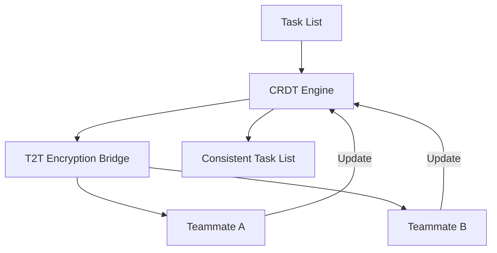

<!-- markdownlint-disable -->
# Design Doc: Lock-Free Mesh Coordination (LFMC)

**Status:** Draft | In Review | Approved
**Created:** [2026-06-18]

## 1. Context and Scope
Traditional multi-agent coordination often relies on centralized state locks (e.g., in the Shared KV Blackboard), leading to significant latency and "Coordination Stall" in high-density swarms. As teams move toward horizontal, peer-to-peer teammate messaging (as seen in Claude Code and OpenClaw), the need for a non-blocking, lock-free coordination layer is paramount. MCP Any must implement **Lock-Free Mesh Coordination (LFMC)** using CRDT-based task list synchronization to ensure sub-millisecond coordination between teammates without global locks.

## 2. Goals & Non-Goals
*   **Goals:**
    *   Implement CRDT-based (Conflict-Free Replicated Data Type) task list synchronization for teammates.
    *   Eliminate global state locks for task claiming and status updates.
    *   Support hardware-attested identity rotation (HAIR) within the mesh transport.
    *   Neutralize "Mailbox Lock" bottlenecks during high-frequency teammate messaging.
*   **Non-Goals:**
    *   Replacing the Blackboard for persistent, cross-mission state (LFMC is for *active* coordination).
    *   Providing absolute consensus for all operations (LFMC provides *eventual consistency* for task lists).

## 3. Critical User Journey (CUJ)
*   **User Persona:** Local LLM Swarm Orchestrator
*   **Primary Goal:** Coordinate 5+ specialist agents working in parallel on a single mission root without encountering "Resource Contention" or "State Stall."
*   **The Happy Path (Tasks):**
    1.  The Lead Agent initializes a task list within the LFMC Hub.
    2.  Specialist teammates claim tasks asynchronously via local CRDT updates.
    3.  The LFMC Hub synchronizes the task list across all teammates using the **T2T Encryption Bridge**.
    4.  Hardware-attested identity tokens (HAIR) are rotated periodically to ensure session-bound coordination integrity.
    5.  Teammates complete tasks and update the global state without ever waiting for a centralized lock.

## 4. Design & Architecture
*   **System Flow:**

*   **APIs / Interfaces:**
    *   `POST /v1/mesh/task/claim`: Asynchronously claim a task using a CRDT operation.
    *   `GET /v1/mesh/state`: Retrieve the current eventually-consistent task mesh.
*   **Data Storage/State:**
    *   Active task lists are stored in memory-mapped "Sovereign Shards" within the LFMC Hub.

## 5. Alternatives Considered
*   **Centralized Redis Locking**: Rejected due to excessive latency in local loopback environments and the risk of "Lock-Owner Death" stalling the entire swarm.
*   **Wait-Graph Deadlock Resolution**: Rejected because it addresses the *symptom* (deadlock) rather than the *cause* (blocking locks).

## 6. Cross-Cutting Concerns
*   **Security (Zero Trust)**: All CRDT operations must be signed with a hardware-attested session token; unauthorized updates are discarded.
*   **Observability**: The "Mesh Coordination Waterfall" in the UI will visualize real-time task claim latency and CRDT synchronization events.

## 7. Evolutionary Changelog
*   **[2026-06-18]:** Initial Document Creation.

### Update: [2026-06-19] - Integration with Sovereign Sharding
**Context:** Today's research identified "Semantic Smearing" risks in sharded teammate meshes.
**Architecture Adjustment:**
*   Integrating **Sovereign Shard Controller** requirements into Section 4 to ensure intent-bound isolation for CRDT buffers.
*   Mandating **HAIR-rotation** for all cross-shard claim requests.
**Security Impact:** Prevents malicious teammates from using lock-free coordination to smear mission-root state across unauthorized shards.
