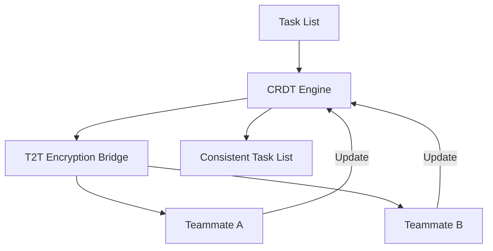

<!-- markdownlint-disable -->
# Design Doc: Lock-Free Mesh Coordination (LFMC)

**Status:** Draft
**Created:** [2026-06-18]

## 1. Context and Scope

Traditional multi-agent coordination often relies on centralized state locks, leading to significant latency and "Coordination Stall" in high-density swarms. As teams move toward peer-to-peer teammate messaging (Claude Code), the need for a non-blocking layer is paramount. MCP Any must implement **Lock-Free Mesh Coordination (LFMC)** using CRDT-based task list synchronization to ensure sub-millisecond coordination without global locks.

## 2. Goals & Non-Goals

* **Goals:**
  * Implement CRDT-based (Conflict-Free Replicated Data Type) task list synchronization.
  * Eliminate global state locks for task claiming and status updates.
  * Support hardware-attested identity rotation (HAIR) within the mesh.
* **Non-Goals:**
  * Replacing the Blackboard for persistent, cross-mission state.
  * Providing absolute consensus for all operations (eventual consistency).

## 3. Critical User Journey (CUJ)

* **User Persona:** Local LLM Swarm Orchestrator
* **Primary Goal:** Coordinate 5+ specialist agents working in parallel on a single mission root without encountering "Resource Contention."
* **The Happy Path (Tasks):**
  1. The Lead Agent initializes a task list within the LFMC Hub.
  2. Specialist teammates claim tasks asynchronously via local CRDT updates.
  3. The LFMC Hub synchronizes the task list across all teammates.
  4. Teammates complete tasks and update the global state without waiting for a centralized lock.

## 4. Design & Architecture

* **System Flow:**

## 5. Alternatives Considered

* **Centralized Redis Locking**: Rejected due to excessive latency in local loopback environments and risk of "Lock-Owner Death."

## 6. Cross-Cutting Concerns

* **Security (Zero Trust)**: All CRDT operations must be signed with a hardware-attested session token.
* **Observability**: The "Mesh Coordination Waterfall" in the UI will visualize real-time task claim latency.

## 7. Evolutionary Changelog

* **[2026-06-18]:** Initial Document Creation.

### Update: [2026-06-19] - Integration with Sovereign Sharding

**Context:** Today's research identified "Semantic Smearing" risks in sharded teammate meshes.
**Architecture Adjustment:**
* Integrating **Sovereign Shard Controller** requirements into Section 4 to ensure intent-bound isolation for CRDT buffers.
* Mandating **HAIR-rotation** for all cross-shard claim requests.
